# GenHealth AI DME Order Management — High-Level Design

## 1. Overview

A monolithic Flask API with a co-hosted React/TypeScript frontend for managing Durable Medical Equipment (DME) orders. The system's distinguishing capability is AI-powered document extraction: users upload faxed PDF intake forms, and Anthropic Claude extracts structured patient data (name, DOB, insurance, equipment details) to auto-populate order records. All data persists in SQLite via SQLAlchemy, all user activity is logged at the request level, and the entire application deploys as a single unit to Azure App Service via GitHub Actions.

**Key technology choices at a glance:** Python/Flask (API), React/TypeScript (frontend), SQLite (database), Anthropic Claude (LLM extraction), JWT (authentication), Azure App Service (hosting), GitHub Actions (CI/CD), Azure Application Insights (observability).

> **Disclaimer:** This system processes patient demographic data for demonstration purposes. It is **not HIPAA-compliant** and must not be used with real Protected Health Information (PHI) in production. This is a conscious design decision appropriate for an assessment MVP — a production healthcare system would require a HIPAA Business Associate Agreement (BAA) with Azure, formal risk assessment, and additional technical and administrative safeguards.

## 2. Architecture Summary

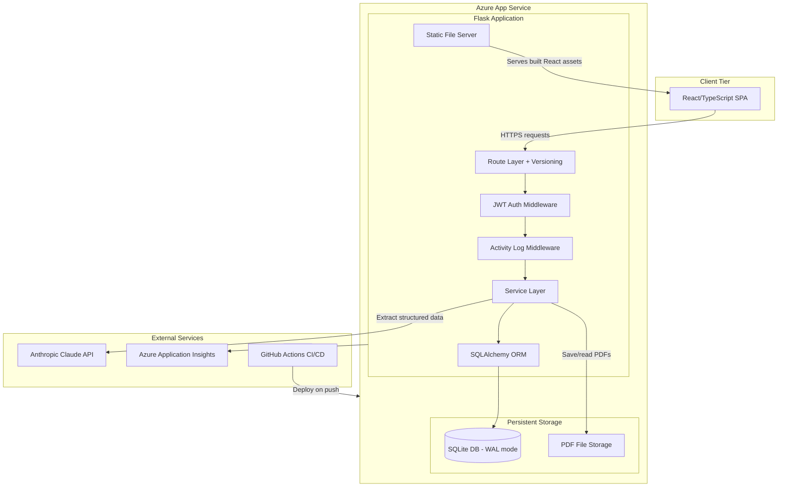

## 3. Core Components

### 3.1 Flask API Application

The central component — a single Flask process serving both the REST API and the built React frontend as static files.

| Subcomponent | Responsibility | Communicates With |
|-------------|----------------|-------------------|
| **Route Layer** | Receives HTTP requests, delegates to services, returns responses. Versioned under `/api/v1/`. | Auth Middleware, Services |
| **JWT Auth Middleware** | Validates Bearer tokens on protected routes. Rejects missing/expired/invalid tokens. | Route Layer, User Service |
| **Activity Log Middleware** | Captures request metadata (endpoint, method, user, status code, IP) after each response. | SQLite via ORM |
| **Service Layer** | Business logic: order CRUD, document processing, user management, extraction orchestration. | ORM, Anthropic Claude, File Storage |
| **SQLAlchemy ORM** | Maps Python objects to SQLite tables. Handles queries, transactions, migrations. | SQLite Database |
| **Static File Server** | Serves the production React build (`index.html`, JS bundles, CSS) for all non-API routes. | Client browser |

**Why a monolith?**
- A single deployment unit drastically simplifies the Azure App Service setup, CI/CD pipeline, and CORS configuration.
- The assessment scope does not justify microservice complexity — a well-structured monolith with clear separation of concerns (routes/services/models) provides the same logical boundaries.
- Upgrading to a separate frontend deployment (Azure Static Web Apps) later requires only changing the build/deploy pipeline, not refactoring code.

### 3.2 React/TypeScript Frontend

A single-page application built with React, bundled into static assets and served by Flask in production.

| Subcomponent | Responsibility | Communicates With |
|-------------|----------------|-------------------|
| **Auth Pages** | Login and registration forms. Stores JWT in memory/localStorage. | Flask Auth API |
| **Order Dashboard** | Paginated order table with filtering, sorting, and status indicators. | Flask Order API |
| **Order Detail/Edit** | Full view and edit form for all DME order fields. | Flask Order API |
| **Document Upload** | File picker, upload progress, loading state during synchronous extraction. | Flask Upload API |
| **API Client** | Axios/fetch wrapper with JWT interceptor for automatic token attachment. | All Flask endpoints |

**Why co-hosted with Flask?**
- Single origin eliminates CORS complexity entirely in production.
- One deployment artifact simplifies the CI/CD pipeline.
- Flask's `send_from_directory` or a catch-all route handles SPA routing (all non-API paths serve `index.html`).

### 3.3 SQLite Database

The persistence layer for all application data — users, orders, documents, and activity logs.

| Aspect | Details |
|--------|---------|
| **Mode** | WAL (Write-Ahead Logging) for concurrent read performance |
| **Location** | Local filesystem on Azure App Service (`/home/site/data/app.db`) |
| **Access** | Exclusively through SQLAlchemy ORM — no raw SQL |
| **Migrations** | Flask-Migrate (Alembic) for schema versioning |

**Why SQLite?**
- Zero-configuration — no external database server to provision or manage.
- The `/home` directory on Azure App Service is persistent across restarts and deployments.
- SQLAlchemy abstraction means switching to PostgreSQL requires only changing the `DATABASE_URL` connection string — no code changes.
- Adequate for a single-instance assessment MVP with modest concurrency.

### 3.4 Anthropic Claude Integration

The AI engine for extracting structured patient data from unstructured PDF text.

| Aspect | Details |
|--------|---------|
| **Model** | claude-sonnet-4-20250514 (configurable via `ANTHROPIC_MODEL`) |
| **Input** | Raw text extracted from PDF via pdfplumber |
| **Output** | Structured JSON conforming to a defined extraction schema |
| **Error handling** | Exponential backoff retry (3 attempts) for 429/5xx, 30s timeout |
| **Cost control** | Max tokens capped at 1024 per response |

**Why Anthropic Claude?**
- Strong structured output capability via system prompts and JSON mode.
- Handles messy, inconsistent fax document formats better than rule-based extraction.
- The requirements specify Claude specifically (user choice).

### 3.5 Azure Application Insights

Observability layer providing request tracing, exception logging, performance monitoring, and availability alerts.

| Aspect | Details |
|--------|---------|
| **Integration** | `azure-monitor-opentelemetry` Python SDK (OpenTelemetry-based; opencensus is deprecated) |
| **Data captured** | Request traces, dependency calls (Claude API), exceptions, custom metrics |
| **Dashboard** | Azure Portal out-of-the-box application map, failure analysis, performance |
| **Cost** | Free tier (5 GB/month ingestion) sufficient for assessment |

## 4. Data Models

### 4.1 Entity Relationships

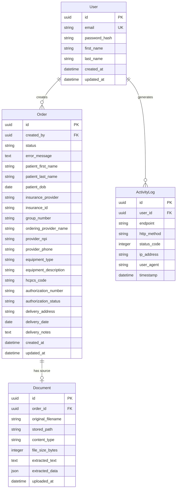

### 4.2 Key Entities

| Entity | Purpose | Key Attributes | Relationships |
|--------|---------|----------------|---------------|
| **User** | Authenticated system user who creates/manages orders | email (unique), password_hash | Creates Orders, generates ActivityLogs |
| **Order** | DME order with patient demographics, insurance, provider, equipment details | status (lifecycle), error_message (nullable — stores sanitized extraction failure reason), patient_first_name, patient_last_name, patient_dob, insurance_provider, equipment_type | Created by User, optionally has a Document |
| **Document** | Uploaded PDF and its extraction results | original_filename, stored_path, extracted_text, extracted_data (JSON) | Belongs to Order |
| **ActivityLog** | Audit record of every API request | endpoint, http_method, status_code, ip_address, timestamp | Generated by User (nullable for unauthenticated requests) |

### 4.3 Data Lifecycle

**Orders** progress through a 4-state lifecycle: `pending` (created, no document) → `processing` (document uploaded, extraction running) → `completed` (extraction succeeded) or `failed` (extraction error). Failed orders can be retried, transitioning back to `processing`.

**Documents** are immutable once created — a new upload replaces the existing document record. The original PDF file is retained on disk.

**Extraction Data Ownership:** `Document.extracted_data` (JSON) stores the **raw LLM response** — an archival copy of exactly what Claude returned, used for debugging and audit. The individual Order fields (`patient_first_name`, `insurance_provider`, etc.) are the **validated, persisted values** and the **source of truth** for the application. After extraction, Order fields may be manually edited by the user; `extracted_data` is never mutated. If they diverge, Order fields take precedence.

**Activity Logs** are append-only. No update or delete operations. Retention is governed by database size constraints (SQLite); for production, a log rotation or archival strategy would be needed.

**Users** are soft-persistent — no deletion endpoint in v1. Password changes would be a future feature.

### 4.4 Order Status State Machine

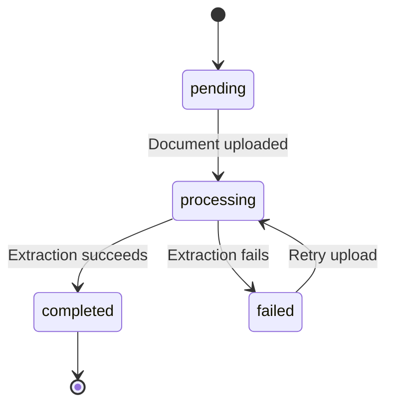

## 5. Data Flows

### 5.1 User Registration and Login

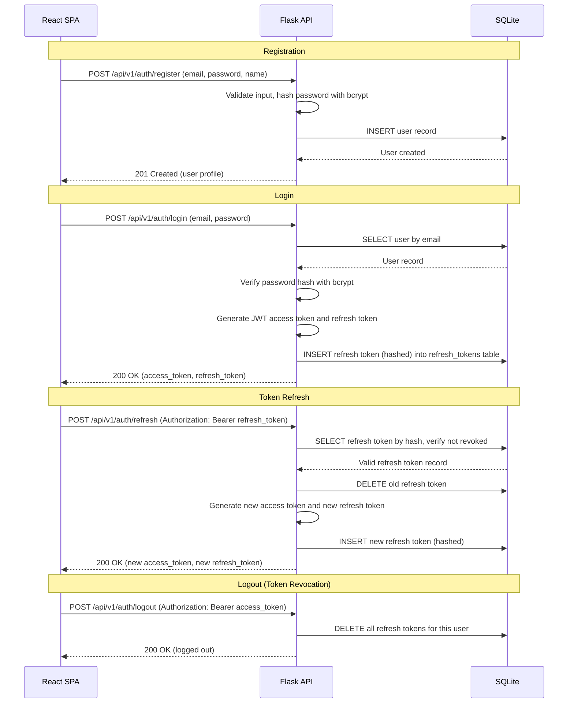

### 5.2 Order CRUD Operations

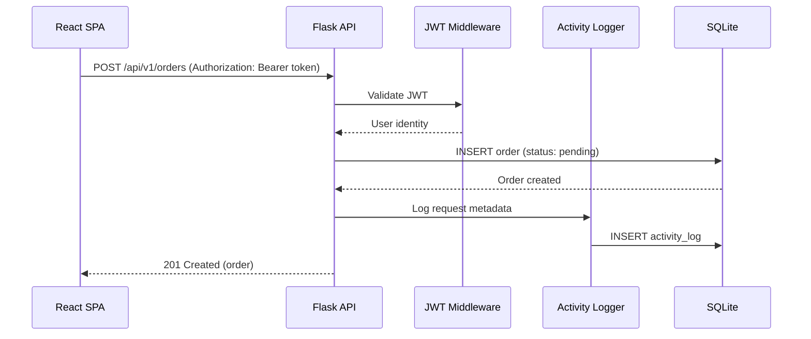

### 5.3 Document Upload and AI Extraction (Primary Flow)

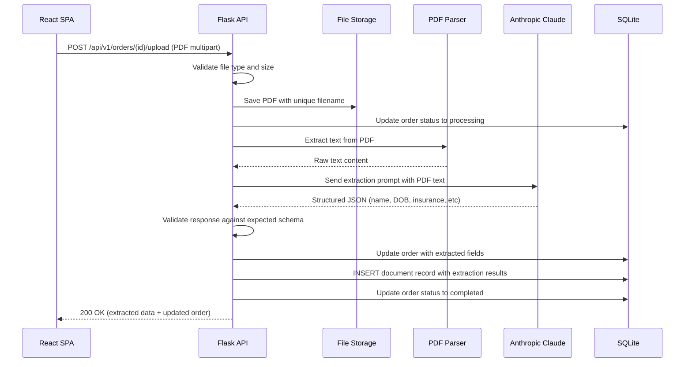

### 5.4 Extraction Failure Path

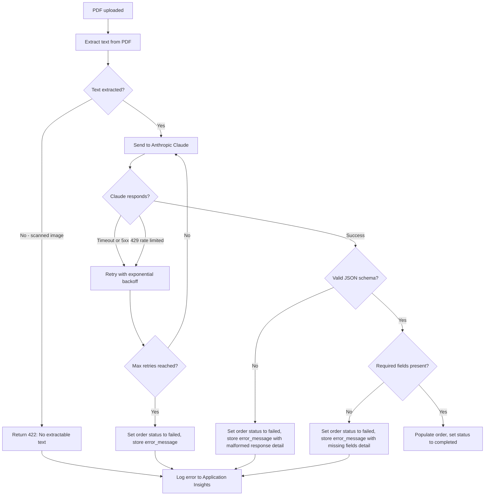

### 5.5 Activity Logging Flow

Activity logging is implemented as Flask middleware (using `after_request` hook), completely decoupled from business logic.

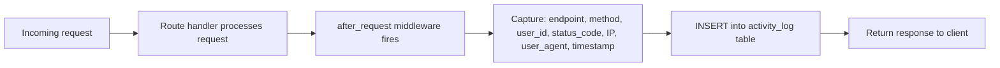

Logging failures are non-blocking — if the activity log INSERT fails, the original response is still returned to the client. The failure is logged to Application Insights.

### 5.6 Order Deletion Cascade

When an order is deleted, all associated resources must be cleaned up to prevent orphaned records and files.

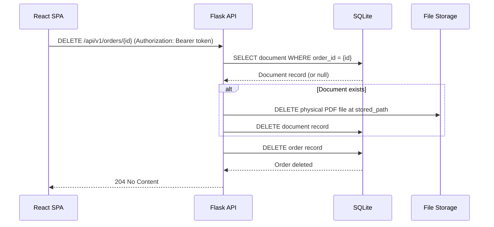

**Cascade order:** Document file on disk → Document DB record → Order DB record. The physical file is deleted first so that if the DB deletion fails, no orphaned file exists without a record pointing to it. If the file deletion fails (file already missing), the cascade continues — the file is treated as best-effort cleanup.

## 6. Key Design Decisions

### 6.1 Monolithic Architecture

**Decision:** A single Flask application serves both the API and the React frontend, deployed as one unit.

**Rationale:**
- Eliminates CORS configuration entirely in production (same-origin).
- Single deployment artifact simplifies Azure App Service setup and CI/CD.
- The system's scope (4 entities, ~15 endpoints) does not justify microservice overhead.
- Clear internal separation (routes/services/models) provides the same logical boundaries without network hops.

**Alternatives considered:**

| Alternative | Why Not |
|-------------|---------|
| Separate frontend on Azure Static Web Apps | Adds deployment complexity, CORS config, and a second CI/CD pipeline for a small assessment project |
| Microservices (extraction service, order service, etc.) | Massive over-engineering for the scope — adds service discovery, inter-service auth, and operational burden |

### 6.2 SQLite with WAL Mode

**Decision:** Use SQLite as the primary database, stored on Azure App Service's persistent `/home` filesystem.

**Rationale:**
- Zero provisioning — no managed database service to configure, no connection strings to manage, no firewall rules.
- The `/home` directory on Azure App Service survives restarts and deployments.
- WAL mode enables concurrent reads while a write is in progress.
- SQLAlchemy abstraction means the switch to PostgreSQL is a one-line config change.

**Alternatives considered:**

| Alternative | Why Not |
|-------------|---------|
| Azure Database for PostgreSQL | Adds cost ($15+/month minimum), provisioning time, firewall rules, and connection management for an assessment |
| Azure Cosmos DB | Non-relational, poor fit for the structured entity relationships, significantly more expensive |

**Known limitations:**
- Single-writer concurrency — only one write transaction at a time.
- No horizontal scaling — if the app runs multiple instances, they'd need a shared database.
- Azure App Service filesystem I/O is slower than a dedicated database server.
- **No backup mechanism** — SQLite on the Azure filesystem has no built-in backup or replication. For production, either (a) implement periodic file copy/backup of the `.db` file via a scheduled task, or (b) migrate to a managed database with built-in backups (e.g., Azure Database for PostgreSQL). For the assessment MVP, this risk is accepted.

### 6.3 Synchronous LLM Extraction

**Decision:** Document extraction happens synchronously within the upload HTTP request — the client waits for the full extraction result.

**Rationale:**
- Dramatically simpler implementation — no background workers, no task queues, no polling infrastructure.
- For a single-user assessment demo, a 10-30 second request is acceptable.
- The frontend can show a loading spinner during the upload+extraction.

**Alternatives considered:**

| Alternative | Why Not |
|-------------|---------|
| Celery + Redis background workers | Requires Redis infrastructure, worker process management, and result polling — exceeds the 4-hour timebox |
| Azure Functions for async extraction | Adds another compute service, deployment pipeline, and inter-service communication |

**Mitigation:** A 30-second timeout prevents indefinite hangs. The frontend receives clear status feedback.

### 6.4 Anthropic Claude for Data Extraction

**Decision:** Use Anthropic Claude API with a structured extraction prompt to parse patient data from PDF text.

**Rationale:**
- Handles messy, inconsistent fax document formats (varying layouts, handwriting transcriptions, different form templates).
- Structured output via system prompts produces reliable JSON.
- More accurate than regex/rule-based parsing for documents "you have never seen."
- The assessment explicitly mentions LLM error handling as a consideration.

**Alternatives considered:**

| Alternative | Why Not |
|-------------|---------|
| Regex and pattern matching | Brittle — breaks on any layout variation. The assessment states they will test with "a PDF you have never seen" |
| AWS Textract or Azure Form Recognizer | Good for forms, but requires training custom models for each document type. Claude generalizes better out-of-the-box |
| OpenAI GPT | Viable alternative. Claude was the user's explicit preference |

### 6.5 JWT Authentication

**Decision:** JWT access tokens (stateless, 60 min) with database-backed refresh tokens (revocable, 7 days).

**Rationale:**
- Access tokens are stateless — no server-side lookup needed for most API requests.
- Refresh tokens are stored (hashed) in a `refresh_tokens` table — this enables explicit revocation on logout or password change, closing the security gap of irrevocable long-lived tokens.
- Well-supported by Flask-JWT-Extended library.
- The React frontend can store and attach tokens easily via an Axios interceptor.
- Access token revocation (blacklist) is deferred to v2 — the 60-minute TTL limits blast radius.

**Alternatives considered:**

| Alternative | Why Not |
|-------------|---------|
| Server-side sessions (Flask-Login) | Requires session storage — either database or Redis — adding complexity |
| API keys | Not user-friendly for a frontend application. No login/registration UX |
| OAuth2 with Azure AD | Over-engineered for an assessment — no existing identity provider to integrate with |

### 6.6 Flask over FastAPI or Django

**Decision:** Use Flask as the web framework.

**Rationale:**
- Explicit user preference.
- Lightweight and flexible — easy to add exactly the extensions needed.
- Large ecosystem: Flask-SQLAlchemy, Flask-JWT-Extended, Flask-CORS, Flask-Migrate, Flask-Limiter.
- Well-suited for a monolith with Jinja-served static files.

**Alternatives considered:**

| Alternative | Why Not |
|-------------|---------|
| FastAPI | Better async support and auto-docs, but the user explicitly chose Flask |
| Django REST Framework | Heavier, more opinionated — the batteries-included model adds complexity the project doesn't need |

### 6.7 Co-Hosted Frontend

**Decision:** The production React build is served by Flask using a catch-all route that serves `index.html` for all non-API paths.

**Rationale:**
- Single deployment unit — one App Service, one CI/CD pipeline.
- Same origin — no CORS configuration needed.
- React Router handles client-side routing; Flask's catch-all ensures deep links work after refresh.

**URL routing strategy:**
- `/api/v1/*` — handled by Flask API blueprints. Unknown routes under `/api/*` return a **JSON 404 error** (e.g., `{"error": "Not found"}`), never the SPA HTML.
- `/health` — health check endpoint (also JSON).
- `/*` (everything else) — serves the React SPA's `index.html`. React Router handles client-side routing; 404 pages for unknown frontend routes are handled by the React app itself.

## 7. Security Architecture

### 7.1 Authentication and Authorization

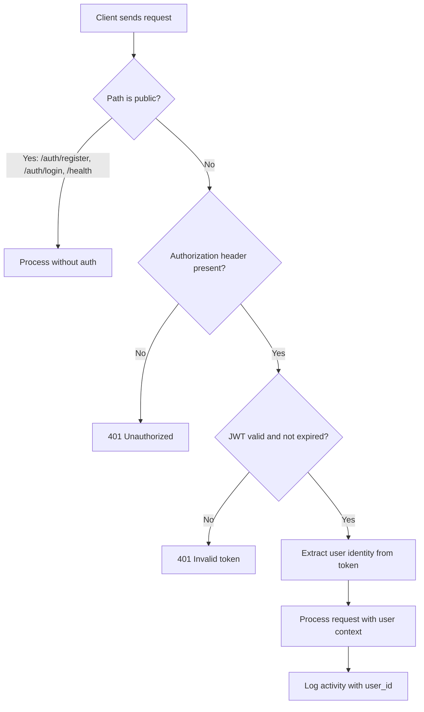

| Auth Aspect | Implementation |
|-------------|----------------|
| **Password storage** | bcrypt with cost factor 12+ |
| **Token format** | JWT (HS256 signed with `JWT_SECRET_KEY`) |
| **Access token TTL** | 60 minutes (configurable) |
| **Refresh token TTL** | 7 days (configurable) |
| **Refresh token storage** | Database-backed — stored as a hashed value in a `refresh_tokens` table, enabling revocation on logout or password change. Access tokens remain stateless (short-lived, no revocation). |
| **Token transport** | `Authorization: Bearer <token>` header |
| **Authorization model** | All authenticated users have equal access (no role-based restrictions in v1) |

### 7.2 Trust Boundaries

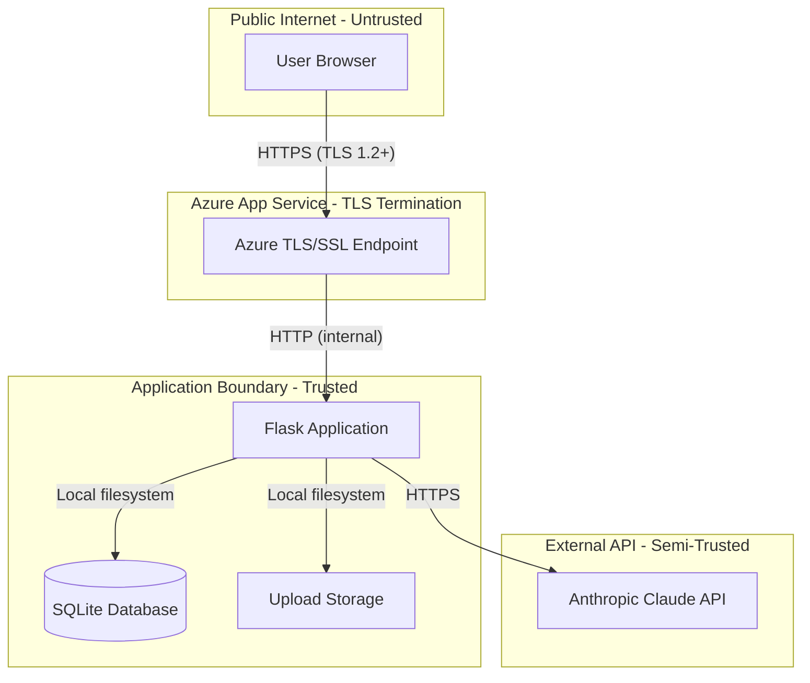

**Boundary enforcement:**
- **Public to App Service:** Azure handles TLS termination. All traffic is HTTPS.
- **App to SQLite:** Local filesystem access — no network boundary. Protected by OS-level permissions.
- **App to Claude:** Outbound HTTPS with API key in `x-api-key` header. Key stored in environment variable, never logged.
- **Uploaded files:** Stored outside the web-accessible directory. Served only through authenticated API endpoints.

### 7.3 Data Protection

| Data Category | At Rest | In Transit | Access Control |
|---------------|---------|------------|----------------|
| User passwords | bcrypt hashed (never stored plain) | HTTPS | Not readable, only verifiable |
| JWT secret key | Environment variable | N/A (server-side only) | App Service config only |
| Anthropic API key | Environment variable | HTTPS to Anthropic | App Service config only |
| Patient demographics (name, DOB) | SQLite file on Azure persistent storage | HTTPS | Authenticated users only |
| Insurance/provider details | SQLite file on Azure persistent storage | HTTPS | Authenticated users only |
| Uploaded PDFs | Filesystem on Azure persistent storage | HTTPS (upload), local (storage) | Authenticated users only |
| Activity logs | SQLite file on Azure persistent storage | N/A (server-side only) | Admin endpoint only |

### 7.4 Input Validation and Sanitization

| Threat | Mitigation |
|--------|------------|
| SQL Injection | SQLAlchemy ORM with parameterized queries — no raw SQL |
| XSS | React auto-escapes rendered content; API returns JSON, not HTML |
| CSRF | JWT-based auth (no cookies for API auth) — CSRF not applicable |
| File upload attacks | Server-side MIME type validation, file size limits, storage outside web root |
| Brute force login | Rate limiting on `/auth/login` and `/auth/register` via Flask-Limiter |
| LLM cost/resource abuse | Per-user rate limiting on `/api/v1/orders/{id}/upload` (e.g., 5 extractions/minute/user) via Flask-Limiter. Prevents cost spikes and resource exhaustion from concurrent extraction requests. |
| Path traversal | Unique filenames generated server-side for uploads — user-supplied filenames not used for storage paths |

### 7.5 Non-HIPAA Disclaimer

> **Important:** This system is designed as a technical assessment MVP and is **not HIPAA-compliant**. It should not process real Protected Health Information (PHI). A production healthcare application would require: Azure HIPAA BAA, data encryption at rest (Azure-managed keys minimum), formal access audit trails, breach notification procedures, and administrative safeguards including staff training and risk assessments.

## 8. Deployment Model

### 8.1 Production (Azure App Service)

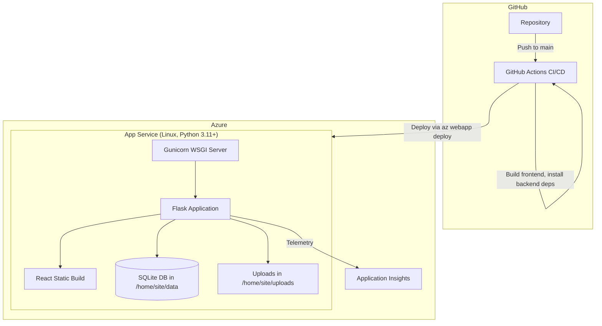

**Azure App Service configuration:**

| Setting | Value |
|---------|-------|
| Runtime | Python 3.11+ |
| WSGI server | Gunicorn with 2-4 workers |
| Startup command | `gunicorn --bind=0.0.0.0:8000 --workers=2 app:create_app()` |
| Plan | B1 (Basic) or Free tier for assessment |
| Persistent storage | `/home` directory (survives restarts) |
| SQLite location | `/home/site/data/app.db` |
| Upload storage | `/home/site/uploads/` |
| Environment variables | Set via App Service Configuration (not committed to code) |

### 8.2 CI/CD Pipeline (GitHub Actions)

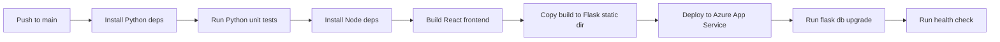

**Pipeline stages:**
1. **Checkout** — Clone repository.
2. **Backend setup** — Install Python 3.11+, `pip install -r requirements.txt`.
3. **Backend tests** — Run `pytest` suite. Fail the pipeline on test failures.
4. **Frontend setup** — Install Node 20+, `npm ci` in frontend directory.
5. **Frontend build** — `npm run build`, output to `frontend/build/`.
6. **Package** — Copy `frontend/build/` into `backend/app/static/` (or equivalent path Flask serves).
7. **Deploy** — Use `azure/webapps-deploy@v3` GitHub Action to push to Azure App Service.
8. **Run migrations** — Execute `flask db upgrade` on the deployed instance via SSH or a startup script. For SQLite, the first run auto-creates the database file. Subsequent runs apply pending schema migrations. This runs **after** deploy so the new code's migration scripts are available.
9. **Smoke test** — Hit `/api/v1/health` endpoint, verify 200 response.

### 8.3 Local Development

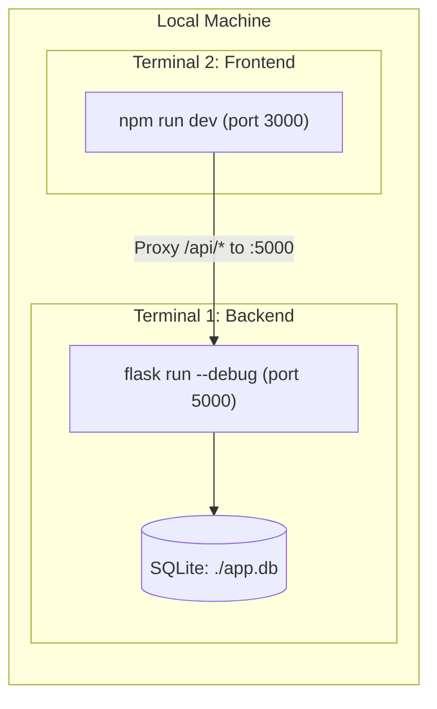

**Local setup:**
1. Clone repository.
2. Create `.env` file from `.env.example` with development values.
3. `pip install -r requirements.txt` — install Python dependencies.
4. `flask db upgrade` — run database migrations.
5. `flask run --debug` — start Flask dev server on port 5000.
6. In a separate terminal: `cd frontend && npm install && npm run dev` — start Vite dev server on port 3000.
7. Vite proxies `/api/*` requests to Flask on port 5000.

### 8.4 Infrastructure Requirements

| Resource | Purpose | Sizing |
|----------|---------|--------|
| Azure App Service | Host Flask + React | B1 (1 core, 1.75 GB RAM) or Free tier |
| Azure Application Insights | Observability and logging | Free tier (5 GB/month) |
| GitHub repository | Source control and CI/CD | Free tier |
| Anthropic API account | Claude API access for extraction | Pay-per-use |
| Custom domain (optional) | Friendly URL | Azure-provided `*.azurewebsites.net` is sufficient |

## 9. Technology Choices

| Category | Choice | Rationale |
|----------|--------|-----------|
| **Backend language** | Python 3.11+ | Assessment requirement. Strong ecosystem for PDF parsing and LLM integration |
| **Web framework** | Flask | User preference. Lightweight, flexible, extensive extension ecosystem |
| **ORM** | SQLAlchemy + Flask-SQLAlchemy | Industry-standard Python ORM. Database-agnostic. Supports migrations via Alembic |
| **Database** | SQLite (WAL mode) | Zero-config, persistent on Azure App Service /home, trivially swappable to PostgreSQL |
| **Authentication** | JWT via Flask-JWT-Extended | Stateless auth, no server-side session storage, first-class Flask integration |
| **PDF parsing** | pdfplumber | Reliable text and table extraction from PDFs. Better structured output for tabular DME forms than PyMuPDF |
| **LLM extraction** | Anthropic Claude (via anthropic Python SDK) | User preference. Strong structured output, handles diverse document formats |
| **Request validation** | Marshmallow (via Flask-Smorest) | Schema-first request/response validation, native Flask integration, auto-generates OpenAPI schemas |
| **API documentation** | Flask-Smorest | Auto-generates OpenAPI 3.0 spec with Swagger UI at `/api/v1/docs`. Integrates with Marshmallow schemas for request/response documentation. |
| **Rate limiting** | Flask-Limiter | Protect auth and LLM extraction endpoints from abuse. Simple decorator-based API |
| **Frontend framework** | React 18+ with TypeScript | Assessment requirement (JS/TS). Type safety, mature ecosystem |
| **Frontend build** | Vite | Fast HMR for development, optimized production builds |
| **UI component library** | TBD (Material UI, Ant Design, or Tailwind CSS) | Consistent styling with minimal custom CSS |
| **API client** | Axios | Interceptor support for JWT attachment, request/response transformation |
| **Hosting** | Azure App Service (Linux) | User preference. Native GitHub Actions integration, persistent filesystem |
| **WSGI server** | Gunicorn | Production-grade Python WSGI server, multi-worker support |
| **CI/CD** | GitHub Actions | Native Azure integration, free tier for public repos, familiar workflow syntax |
| **Observability** | Azure Application Insights (via `azure-monitor-opentelemetry`) | Zero-config with App Service, free tier, built-in dashboards. Uses OpenTelemetry standard (opencensus is deprecated) |
| **Security headers** | Flask-Talisman or manual middleware | HSTS, X-Content-Type-Options, X-Frame-Options, CSP |
| **CORS** | Flask-CORS | Required for local development (Vite proxy handles most, but direct API testing needs it) |
| **Migrations** | Flask-Migrate (Alembic) | Versioned schema changes, up/down migration support |

## 10. What This Design Defers

The following are explicitly out of scope for the initial implementation:

- [ ] **Asynchronous extraction** — Background workers (Celery/RQ) for non-blocking document processing. Current: synchronous in-request.
- [ ] **Managed database** — Azure Database for PostgreSQL. Current: SQLite on filesystem.
- [ ] **Blob storage** — Azure Blob Storage for uploaded PDFs. Current: local filesystem.
- [ ] **OCR capability** — Image-based PDF text extraction via Tesseract or Azure AI Vision. Current: text-layer PDFs only.
- [ ] **Role-based access control** — Admin vs. standard user permissions. Current: flat authentication (all users equal). Re-add `role` field to User entity when implementing RBAC.
- [ ] **Multi-instance scaling** — Horizontal scaling requires moving off SQLite and local file storage.
- [ ] **Caching layer** — Redis for session caching, query result caching, or LLM response caching.
- [ ] **Batch upload** — Processing multiple documents in a single request.
- [ ] **WebSocket updates** — Real-time extraction status. Current: synchronous HTTP request with loading spinner.
- [ ] **Mobile-responsive frontend** — Desktop-only in v1.
- [ ] **HIPAA compliance** — BAA, formal encryption at rest, audit procedures. Explicit disclaimer included.
- [ ] **Email notifications** — No notification system for order status changes.
- [ ] **Data export/reporting** — No CSV/PDF export or analytics dashboards.

## 11. Open Questions

1. **UI component library:** Material UI, Ant Design, or Tailwind CSS? Decision deferred to low-level design based on team preference and assessment aesthetics.
2. **SQLite database location on Azure:** `/home/site/data/` is the recommended persistent path, but should be validated during deployment testing.
3. **Gunicorn worker count:** Starting with 2 workers. Should be tuned based on App Service plan and observed performance. Too many workers with SQLite can cause write contention.

---

*This is a high-level architecture document. Code structure, class design, and implementation details belong in the low-level design document.*
