# GenHealth AI DME Order Management — Low-Level Design

## 1. Overview

This document specifies the code-level architecture for the GenHealth AI DME Order Management system. It bridges the [high-level design](assessment-high-level-design.md) and actual implementation, defining package structure, class diagrams, class interactions, data access patterns, error handling, configuration wiring, and a comprehensive testing strategy.

**Key implementation decisions (from Phase 2 clarification):**

| Decision | Choice | Rationale |
|----------|--------|-----------|
| Code organization | Flat package structure per requirements Section 8.1 | Follows assessment structure; no over-engineering |
| Data access | Repository pattern | Testable abstractions; services never call SQLAlchemy directly |
| Dependency injection | Flask extensions pattern | Standard Flask idiom; extensions initialized in app factory |
| Error handling | Custom exception hierarchy + Flask error handlers | Clean separation; routes never catch raw exceptions |
| Frontend state | React Context (auth) + TanStack Query v5 (server state) | Auth is global state; TanStack Query handles caching/pagination |
| Frontend routing | React Router v6 | Standard; supports route guards for protected pages |
| UI component library | Material UI (MUI) | Full pre-built component set; fast to prototype |
| Testing | pytest + Flask test client + mocked Anthropic | In-memory SQLite for tests; no external dependencies |

**Prerequisites:**
- [Requirements Document](assessment-requirements.md)
- [High-Level Design](assessment-high-level-design.md)

---

## 2. Package/Module Structure

### 2.1 Backend Package Dependency Graph

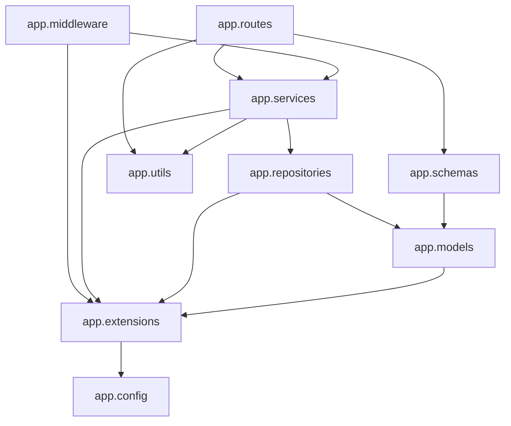

### 2.2 Backend Package Details

| Package | Purpose | Public Exports | Internal Dependencies |
|---------|---------|---------------|----------------------|
| `app` | Flask application factory, top-level wiring | `create_app()` | config, extensions, routes, middleware, models |
| `app.config` | Configuration classes loaded from env vars | `Config`, `DevelopmentConfig`, `TestingConfig`, `ProductionConfig` | None |
| `app.extensions` | Flask extension singletons | `db`, `jwt`, `migrate`, `limiter`, `smorest_api`, `cors`, `talisman` | config |
| `app.models` | SQLAlchemy ORM model classes | `User`, `Order`, `Document`, `ActivityLog`, `RefreshToken` | extensions |
| `app.schemas` | Marshmallow request/response schemas | All schema classes for each endpoint | models |
| `app.repositories` | Data access abstractions over SQLAlchemy | `UserRepository`, `OrderRepository`, `DocumentRepository`, `ActivityLogRepository`, `RefreshTokenRepository` | models, extensions |
| `app.services` | Business logic orchestration | `AuthService`, `OrderService`, `ExtractionService`, `ActivityService` | repositories, utils, extensions |
| `app.routes` | Flask-Smorest MethodView blueprints | `auth_blp`, `orders_blp`, `admin_blp`, `system_blp` | schemas, services, utils |
| `app.middleware` | Request lifecycle hooks | `register_middleware()` | services, extensions |
| `app.utils` | Cross-cutting utilities | `errors` module (exception classes + handlers), `pdf_parser` module | None |

### 2.3 Backend File Structure

```
backend/
├── app/
│   ├── __init__.py              # create_app() factory
│   ├── config.py                # Configuration classes
│   ├── extensions.py            # Extension singletons
│   ├── models/
│   │   ├── __init__.py          # Re-exports all models
│   │   ├── user.py              # User model
│   │   ├── order.py             # Order model + OrderStatus enum
│   │   ├── document.py          # Document model
│   │   ├── activity_log.py      # ActivityLog model
│   │   └── refresh_token.py     # RefreshToken model
│   ├── schemas/
│   │   ├── __init__.py          # Re-exports all schemas
│   │   ├── auth.py              # Register, Login, Token, User schemas
│   │   ├── order.py             # Order CRUD schemas, query/filter schemas
│   │   ├── document.py          # Document response schema
│   │   ├── activity_log.py      # ActivityLog query/response schemas
│   │   └── common.py            # Error envelope, pagination schemas
│   ├── repositories/
│   │   ├── __init__.py          # Re-exports all repositories
│   │   ├── user_repository.py
│   │   ├── order_repository.py
│   │   ├── document_repository.py
│   │   ├── activity_log_repository.py
│   │   └── refresh_token_repository.py
│   ├── routes/
│   │   ├── __init__.py          # Blueprint registration helper
│   │   ├── auth.py              # Auth blueprint (register, login, refresh, me, logout)
│   │   ├── orders.py            # Orders blueprint (CRUD + upload)
│   │   ├── admin.py             # Admin blueprint (activity logs)
│   │   └── system.py            # System blueprint (health check)
│   ├── services/
│   │   ├── __init__.py
│   │   ├── auth_service.py      # Registration, login, refresh, logout logic
│   │   ├── order_service.py     # Order CRUD + deletion cascade
│   │   ├── extraction_service.py # PDF parsing + Claude extraction orchestration
│   │   └── activity_service.py  # Activity log query service
│   ├── middleware/
│   │   ├── __init__.py          # register_middleware() entry point
│   │   └── logging_middleware.py # after_request activity logging hook
│   └── utils/
│       ├── __init__.py
│       ├── errors.py            # Exception hierarchy + Flask error handlers
│       └── pdf_parser.py        # pdfplumber text extraction wrapper
├── tests/
│   ├── __init__.py
│   ├── conftest.py              # App factory, test client, DB fixtures
│   ├── factories.py             # Test data factories (User, Order, Document)
│   ├── test_auth.py
│   ├── test_orders.py
│   ├── test_extraction.py
│   ├── test_activity_log.py
│   ├── test_repositories.py
│   └── test_health.py
├── migrations/                  # Alembic migration versions
├── .env.example
├── requirements.txt
├── pyproject.toml
└── README.md
```

### 2.4 Frontend Package Structure

```
frontend/
├── public/
│   └── index.html
├── src/
│   ├── api/
│   │   ├── client.ts            # Axios instance with JWT interceptor
│   │   ├── auth.ts              # Auth API functions
│   │   └── orders.ts            # Order + upload API functions
│   ├── components/
│   │   ├── common/
│   │   │   ├── LoadingSpinner.tsx
│   │   │   ├── ErrorAlert.tsx
│   │   │   ├── ConfirmDialog.tsx
│   │   │   └── PageLayout.tsx
│   │   ├── auth/
│   │   │   ├── LoginForm.tsx
│   │   │   ├── RegisterForm.tsx
│   │   │   └── ProtectedRoute.tsx
│   │   └── orders/
│   │       ├── OrderTable.tsx
│   │       ├── OrderForm.tsx
│   │       ├── OrderDetail.tsx
│   │       ├── OrderStatusChip.tsx
│   │       └── DocumentUpload.tsx
│   ├── pages/
│   │   ├── LoginPage.tsx
│   │   ├── RegisterPage.tsx
│   │   ├── OrderListPage.tsx
│   │   ├── OrderDetailPage.tsx
│   │   └── CreateOrderPage.tsx
│   ├── hooks/
│   │   ├── useAuth.ts           # Wraps AuthContext for convenience
│   │   ├── useOrders.ts         # TanStack Query hooks for order CRUD
│   │   └── useDocumentUpload.ts # TanStack mutation for upload + extraction
│   ├── context/
│   │   └── AuthContext.tsx       # Auth state + token management
│   ├── types/
│   │   └── index.ts             # Shared TypeScript interfaces
│   ├── utils/
│   │   └── validators.ts        # Form validation helpers
│   ├── App.tsx                  # Router + QueryClientProvider + AuthProvider
│   ├── main.tsx                 # Entry point
│   └── routes.tsx               # React Router v6 route definitions
├── .env.example
├── package.json
├── tsconfig.json
├── vite.config.ts
└── README.md
```

### 2.5 Frontend Package Dependency Graph

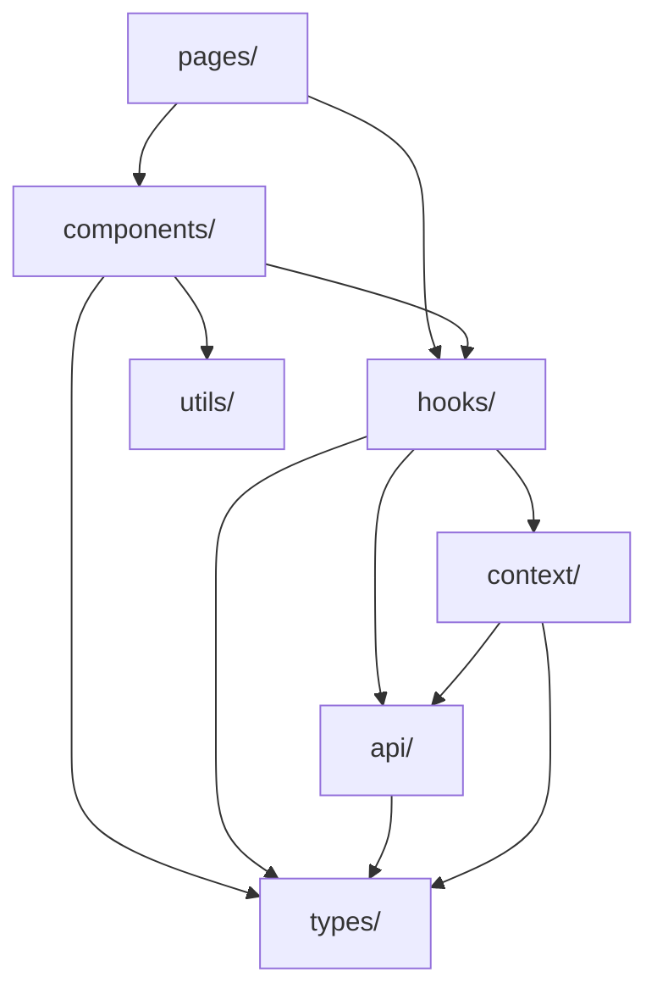

---

## 3. Class Diagrams

### 3.1 Models

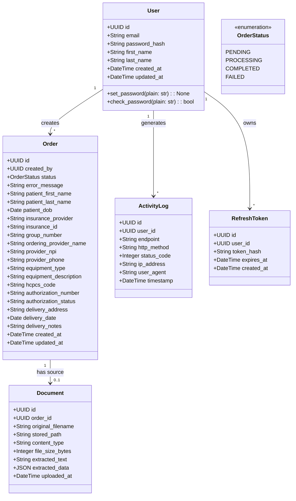

**Model conventions:**
- All models inherit from `db.Model` (SQLAlchemy declarative base).
- UUIDs are stored as `String(36)` in SQLite (no native UUID type) and generated via `uuid.uuid4()` as defaults.
- `created_at` / `updated_at` use `func.now()` defaults with `onupdate` for `updated_at`.
- `OrderStatus` is a Python `enum.Enum` mapped to a `String` column. The ORM stores the enum value string (e.g., `"pending"`), not the name.
- `User.set_password()` hashes with bcrypt (cost factor 12). `User.check_password()` verifies via `bcrypt.checkpw()`.
- `RefreshToken.token_hash` stores the SHA-256 hash of the raw refresh token string. The raw token is returned to the client but never stored.

### 3.2 Repositories

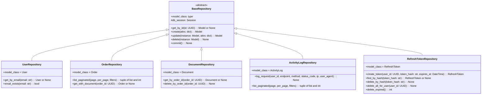

**Repository conventions:**
- `BaseRepository` provides generic CRUD. Subclasses add domain-specific queries.
- Each subclass **must** set `model_class` to its corresponding SQLAlchemy model (e.g., `model_class = User`). `BaseRepository.create(attrs)` uses `self.model_class(**attrs)` to instantiate the correct model.
- All repositories accept the SQLAlchemy `db.session` from the Flask application context — they do not create their own sessions.
- `list_paginated()` returns a tuple of `(items: list, total_count: int)`. The caller (service or route) constructs the pagination envelope.
- Repositories raise no custom exceptions — they return `None` for not-found lookups. Services interpret `None` and raise `NotFoundError`.
- `commit()` is called explicitly by services after completing a unit of work, never implicitly by repositories.

### 3.3 Services

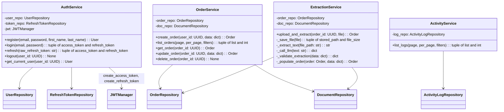

**Service conventions:**
- Services are instantiated per-request using repository instances created from the current `db.session`.
- `AuthService` additionally receives the Flask-JWT-Extended `jwt` extension (via `from app.extensions import jwt`) to call `create_access_token()` and `create_refresh_token()`. These are Flask-JWT-Extended functions that require the application context but are not methods on the extension object — AuthService imports them directly from `flask_jwt_extended`.
- Services own transaction boundaries — they call `repo.commit()` after successful operations.
- Services raise custom exceptions (see Section 6) for all error conditions. Routes never see raw SQLAlchemy or Anthropic errors.
- `ExtractionService._call_llm()` uses the `anthropic` Python SDK with retry logic (exponential backoff, 3 attempts) for 429/5xx errors and a 30-second timeout.

#### 3.3.1 LLM Prompt and Response Specification

**System prompt** (set once per call via `system` parameter):

```
You are a medical document data extraction assistant. Your task is to extract
structured data from Durable Medical Equipment (DME) order documents. Extract
only information that is explicitly present in the document text. If a field
is not found in the document, set its value to null. Respond ONLY with a valid
JSON object matching the specified schema — no markdown, no explanation, no
additional text.
```

**User prompt template** (formatted with the extracted PDF text):

```
Extract the following fields from this DME order document and return them as
a JSON object:

{extracted_text}

Return a JSON object with these exact keys:
- patient_first_name (string or null)
- patient_last_name (string or null)
- patient_dob (string in YYYY-MM-DD format, or null)
- insurance_provider (string or null)
- insurance_id (string or null)
- group_number (string or null)
- ordering_provider_name (string or null)
- provider_npi (string or null)
- provider_phone (string or null)
- equipment_type (string or null)
- equipment_description (string or null)
- hcpcs_code (string or null)
- authorization_number (string or null)
- authorization_status (string or null)
- delivery_address (string or null)
- delivery_date (string in YYYY-MM-DD format, or null)
- delivery_notes (string or null)
```

**Expected JSON response schema:**

```json
{
  "patient_first_name": "string | null",
  "patient_last_name": "string | null",
  "patient_dob": "YYYY-MM-DD | null",
  "insurance_provider": "string | null",
  "insurance_id": "string | null",
  "group_number": "string | null",
  "ordering_provider_name": "string | null",
  "provider_npi": "string | null",
  "provider_phone": "string | null",
  "equipment_type": "string | null",
  "equipment_description": "string | null",
  "hcpcs_code": "string | null",
  "authorization_number": "string | null",
  "authorization_status": "string | null",
  "delivery_address": "string | null",
  "delivery_date": "YYYY-MM-DD | null",
  "delivery_notes": "string | null"
}
```

**Response parsing and validation (`_validate_extraction`):**
1. Parse the Claude response text as JSON. If parsing fails, raise `ExtractionError`.
2. Verify the response is a JSON object (dict). If not, raise `ExtractionError`.
3. Accept only the keys listed above — ignore any extra keys returned by the LLM.
4. For each expected key: if present and non-null, keep the string value. If missing or null, set to `None`.
5. Date fields (`patient_dob`, `delivery_date`): validate format matches `YYYY-MM-DD`. If the format is invalid, set the field to `None` (do not fail extraction over a single malformed date).

**Field population (`_populate_order`):**
- For each extracted field with a non-null value: only overwrite the corresponding Order field if the Order field is currently `None` or empty string. This preserves manually-entered values (FR-3.3.4).

### 3.4 Schemas (Marshmallow)

```mermaid
classDiagram
    class RegisterSchema {
        +email: Email, required
        +password: String, required, load_only
        +first_name: String, required
        +last_name: String, required
    }

    class LoginSchema {
        +email: Email, required
        +password: String, required, load_only
    }

    class TokenSchema {
        +access_token: String, dump_only
        +refresh_token: String, dump_only
    }

    class UserSchema {
        +id: UUID, dump_only
        +email: Email, dump_only
        +first_name: String, dump_only
        +last_name: String, dump_only
        +created_at: DateTime, dump_only
    }

    class OrderCreateSchema {
        +patient_first_name: String
        +patient_last_name: String
        +patient_dob: Date
        +insurance_provider: String
        +insurance_id: String
        +group_number: String
        +ordering_provider_name: String
        +provider_npi: String
        +provider_phone: String
        +equipment_type: String
        +equipment_description: String
        +hcpcs_code: String
        +authorization_number: String
        +authorization_status: String
        +delivery_address: String
        +delivery_date: Date
        +delivery_notes: String
    }

    class OrderUpdateSchema {
        +patient_first_name: String
        +patient_last_name: String
        +patient_dob: Date
        +plus all fields from OrderCreateSchema
    }

    class OrderResponseSchema {
        +id: UUID, dump_only
        +created_by: UUID, dump_only
        +status: String, dump_only
        +error_message: String, dump_only
        +all patient and DME fields
        +created_at: DateTime, dump_only
        +updated_at: DateTime, dump_only
        +document: DocumentSchema, dump_only, nested
    }

    class OrderQuerySchema {
        +page: Integer, default 1
        +per_page: Integer, default 20, max 100
        +status: String, optional
        +patient_last_name: String, optional
        +created_after: DateTime, optional
        +created_before: DateTime, optional
        +sort_by: String, default created_at
        +sort_order: String, default desc
    }

    class DocumentSchema {
        +id: UUID, dump_only
        +original_filename: String, dump_only
        +content_type: String, dump_only
        +file_size_bytes: Integer, dump_only
        +extracted_data: Dict, dump_only
        +uploaded_at: DateTime, dump_only
    }

    class ActivityLogSchema {
        +id: UUID, dump_only
        +user_id: UUID, dump_only
        +endpoint: String, dump_only
        +http_method: String, dump_only
        +status_code: Integer, dump_only
        +ip_address: String, dump_only
        +timestamp: DateTime, dump_only
    }

    class ActivityLogQuerySchema {
        +page: Integer, default 1
        +per_page: Integer, default 20, max 100
        +user_id: UUID, optional
        +endpoint: String, optional
        +method: String, optional
        +status_code: Integer, optional
        +date_from: DateTime, optional
        +date_to: DateTime, optional
    }

    class ErrorSchema {
        +code: String
        +message: String
        +details: List of Dict
    }

    OrderResponseSchema --> DocumentSchema : nests
```

**Schema conventions:**
- All schemas inherit from `marshmallow.Schema` (not `ma.SQLAlchemyAutoSchema` — we control the serialization explicitly).
- `load_only` fields (e.g., `password`) are accepted on input but never serialized on output.
- `dump_only` fields (e.g., `id`, `created_at`) are serialized on output but rejected on input.
- `OrderCreateSchema` and `OrderUpdateSchema` share field definitions. `OrderUpdateSchema` marks all fields as optional (partial update semantics via `partial=True`).
- The standard error envelope (`ErrorSchema`) is produced by Flask error handlers, not by individual routes.
- Flask-Smorest's `Blueprint.paginate()` handles the pagination header. Routes add the pagination body envelope in a custom wrapper to match the requirements spec format (Section 4.5 of requirements).

### 3.5 Routes (Flask-Smorest Blueprints)

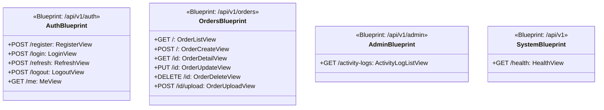

**Route conventions:**
- Each resource is a Flask-Smorest `Blueprint` with `MethodView` classes.
- `@blp.arguments(Schema)` deserializes and validates request body. `@blp.response(status, Schema)` serializes response.
- Routes do not contain business logic — they instantiate services, call a single method, and return the result.
- JWT protection is applied via `@jwt_required()` decorator from Flask-JWT-Extended on each view method (except public endpoints).
- File upload (`OrderUploadView.post`) uses `location="files"` for the multipart form data argument.
- The `HealthView` returns `{"status": "healthy", "database": "connected"}` after a trivial DB query (`SELECT 1`).

### 3.6 Frontend Components

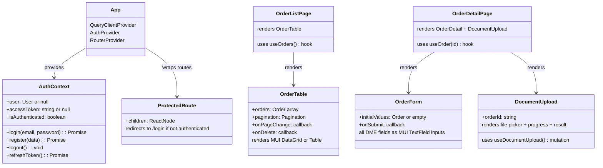

**Frontend conventions:**
- `AuthContext` stores `accessToken` in memory (not localStorage) and `refreshToken` in localStorage. The Axios interceptor attaches the access token to every request and auto-refreshes on 401.
- TanStack Query `useQuery` hooks handle caching, refetching, and pagination state. Mutations invalidate relevant query keys on success.
- MUI `ThemeProvider` wraps the app for consistent theming. `Snackbar` + `Alert` provide toast notifications.
- All API calls go through `src/api/client.ts` which exports the configured Axios instance.

---

## 4. Class Interactions

### 4.1 User Registration

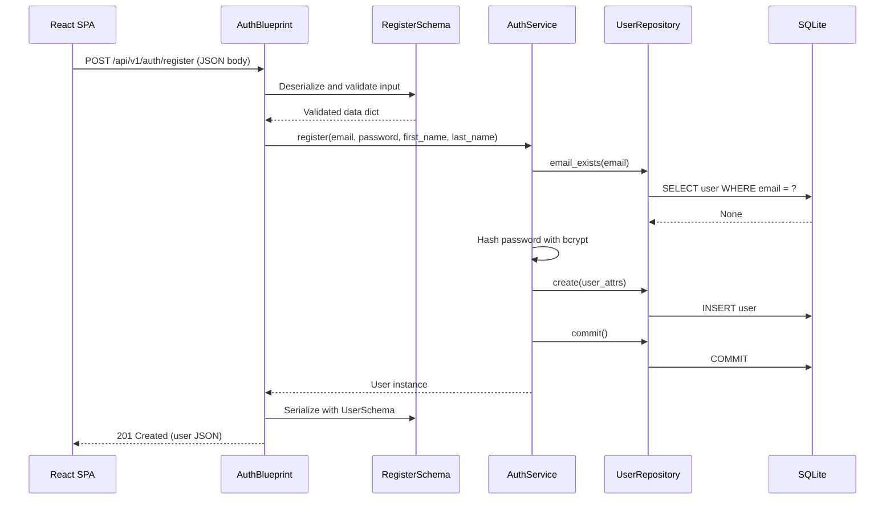

**Covers:** FR-3.1.1

**Error paths:**
- Schema validation fails (missing/invalid fields) → Flask-Smorest returns 422 with error details
- Email already exists → `AuthService.register()` raises `ConflictError` → 409
- Password complexity fails → `AuthService.register()` raises `BusinessValidationError` → 422

### 4.2 User Login + Token Generation

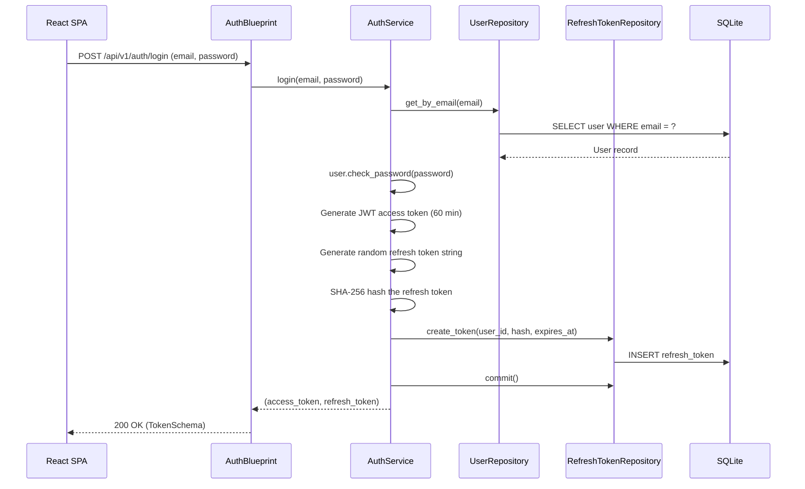

**Covers:** FR-3.1.2, FR-3.1.3

**Error paths:**
- User not found → `AuthenticationError` → 401
- Wrong password → `AuthenticationError` → 401

### 4.3 Token Refresh

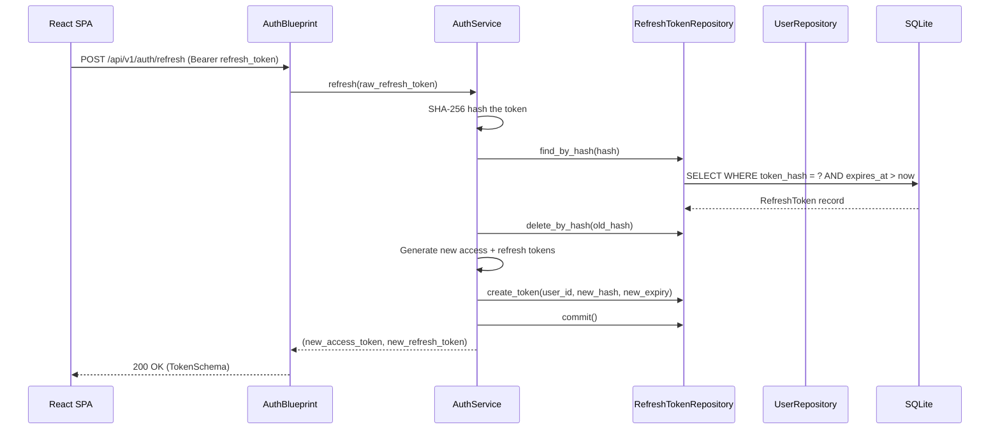

**Covers:** FR-3.1.3

**Key design:** Refresh token rotation — each use issues a new refresh token and invalidates the old one. This limits the window of token reuse attacks.

### 4.4 Order CRUD — Create

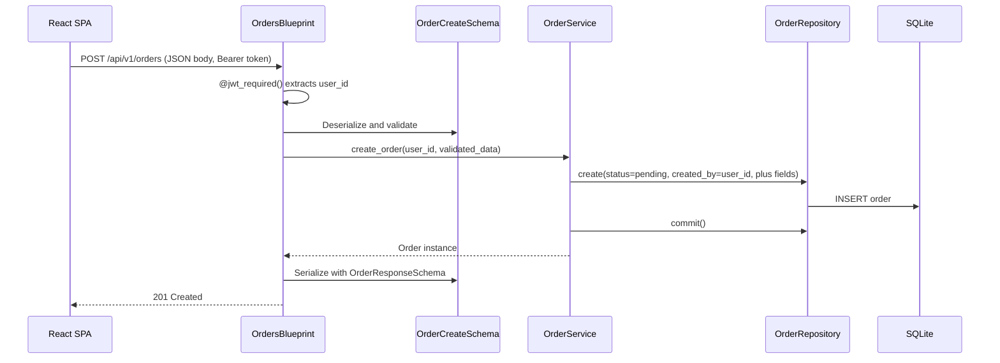

**Covers:** FR-3.2.1

### 4.5 Order List with Pagination and Filtering

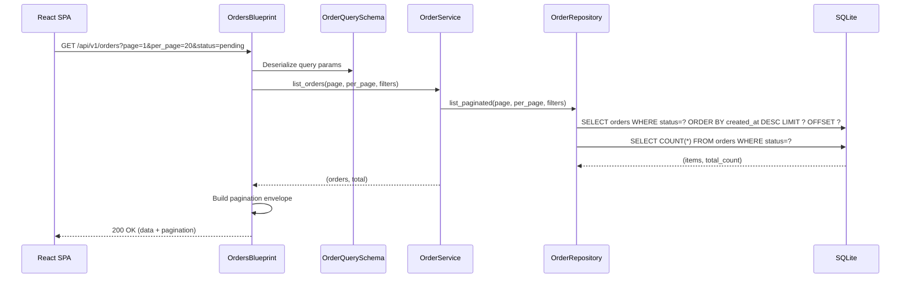

**Covers:** FR-3.2.2

**Pagination envelope:** The route constructs the response body with `data` and `pagination` keys per the requirements spec (Section 4.5). Flask-Smorest's built-in pagination header is also emitted.

### 4.6 Document Upload and AI Extraction

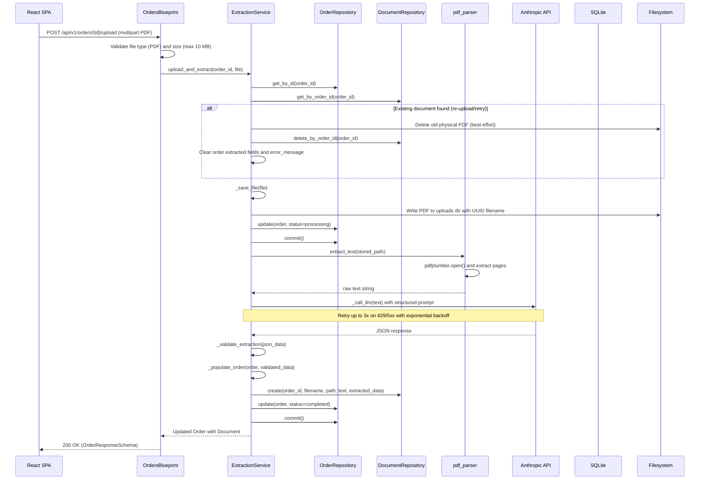

**Covers:** FR-3.3.1, FR-3.3.2, FR-3.3.3, FR-3.3.4, FR-3.3.5

**Re-upload/retry behavior:** When an order already has a document (e.g., the order is in `failed` status and the user retries), the upload flow first deletes the existing document record and physical file, then proceeds with the new upload as normal. This mirrors the deletion cascade logic from Section 4.7 and prevents orphaned documents and files.

**Failure handling within `upload_and_extract()`:**
- PDF has no extractable text → set `order.status = failed`, `order.error_message = "PDF contains no extractable text"`, commit, raise `ExtractionError`
- Claude API timeout/5xx after 3 retries → set `order.status = failed`, `order.error_message = "AI extraction service unavailable"`, commit, raise `ExtractionError`
- Claude returns invalid JSON schema → set `order.status = failed`, `order.error_message = "AI extraction returned invalid data"`, commit, raise `ExtractionError`
- All Claude errors are logged to Application Insights with full context (token counts, latency, error type).

### 4.7 Order Deletion Cascade

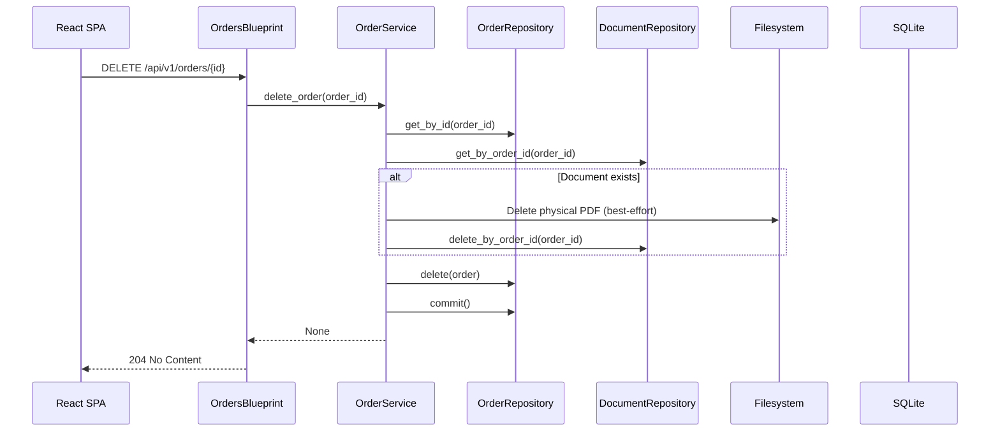

**Covers:** FR-3.2.5

### 4.8 Activity Logging (Middleware)

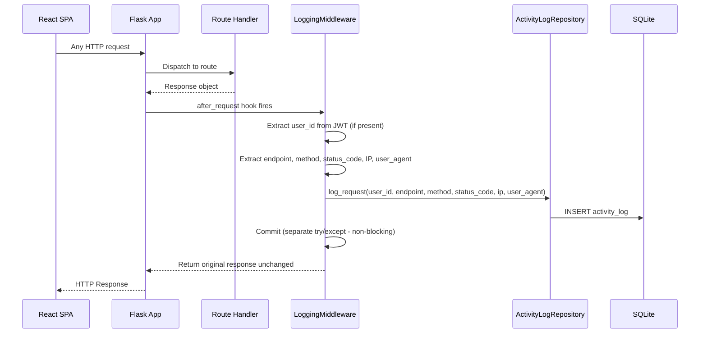

**Covers:** FR-3.4.1

**Key design:** Logging failures are caught and swallowed (logged to Application Insights). They never affect the user's response.

---

## 5. Data Access Layer

### 5.1 Repository Interfaces

#### BaseRepository

| Method | Parameters | Returns | Errors | Notes |
|--------|-----------|---------|--------|-------|
| `get_by_id` | `id: UUID` | `Model` or `None` | — | Does not raise on not found |
| `create` | `attrs: dict` | `Model` | — | Adds to session, does NOT commit |
| `update` | `instance: Model, attrs: dict` | `Model` | — | Sets attributes, does NOT commit |
| `delete` | `instance: Model` | `None` | — | Marks for deletion, does NOT commit |
| `commit` | — | `None` | `DatabaseError` | Flushes session and commits transaction |

#### UserRepository (extends BaseRepository)

| Method | Parameters | Returns | Notes |
|--------|-----------|---------|-------|
| `get_by_email` | `email: str` | `User` or `None` | Case-insensitive lookup |
| `email_exists` | `email: str` | `bool` | Optimized existence check |

#### OrderRepository (extends BaseRepository)

| Method | Parameters | Returns | Notes |
|--------|-----------|---------|-------|
| `list_paginated` | `page: int, per_page: int, filters: dict` | `(list[Order], int)` | Returns (items, total_count). Filters: status, patient_last_name (LIKE), created_after, created_before. Sort by created_at or patient_last_name. |
| `get_with_document` | `order_id: UUID` | `Order` or `None` | Eager-loads the associated Document via `joinedload` |

#### DocumentRepository (extends BaseRepository)

| Method | Parameters | Returns | Notes |
|--------|-----------|---------|-------|
| `get_by_order_id` | `order_id: UUID` | `Document` or `None` | |
| `delete_by_order_id` | `order_id: UUID` | `None` | Deletes all documents for an order |

#### ActivityLogRepository (extends BaseRepository)

| Method | Parameters | Returns | Notes |
|--------|-----------|---------|-------|
| `log_request` | `user_id, endpoint, method, status_code, ip, user_agent` | `None` | Creates and immediately commits using a **savepoint** (`db.session.begin_nested()`) wrapped in try/except. On success, the savepoint is committed (the INSERT becomes part of the outer transaction and is flushed to DB). On failure, only the savepoint is rolled back — the caller's pending transaction is unaffected. This is the non-blocking guarantee: a logging failure never causes a request's business transaction to roll back. The outer `after_request` handler does **not** call `db.session.commit()` for the main transaction — services are responsible for their own commits. |
| `list_paginated` | `page: int, per_page: int, filters: dict` | `(list[ActivityLog], int)` | Filters: user_id, endpoint, method, status_code, date_from, date_to |

#### RefreshTokenRepository (extends BaseRepository)

| Method | Parameters | Returns | Notes |
|--------|-----------|---------|-------|
| `create_token` | `user_id: UUID, token_hash: str, expires_at: DateTime` | `RefreshToken` | |
| `find_by_hash` | `token_hash: str` | `RefreshToken` or `None` | Also checks `expires_at > now` |
| `delete_by_hash` | `token_hash: str` | `None` | |
| `delete_all_for_user` | `user_id: UUID` | `None` | Used on logout — revokes all sessions |
| `delete_expired` | — | `int` | Cleanup; returns count deleted |

### 5.2 Query Patterns

| Operation | Query Pattern | Transaction? | Notes |
|-----------|--------------|-------------|-------|
| Register user | INSERT user | Yes | Single insert, committed by service |
| Login | SELECT user by email | Read-only | No write transaction needed for the lookup |
| Create refresh token | INSERT refresh_token | Yes | Same transaction as login commit |
| List orders | SELECT + COUNT with filters | Read-only | Two queries: data page + total count |
| Get order with document | SELECT order JOIN document | Read-only | Eager load via SQLAlchemy `joinedload` |
| Upload + extract | UPDATE order (processing) → INSERT document → UPDATE order (completed) | Yes | Single transaction wrapping the full operation |
| Delete order cascade | DELETE document → DELETE order | Yes | Single transaction, file deletion is pre-commit |
| Log activity | INSERT activity_log | Yes | Savepoint (`begin_nested()`) within the request session — rolled back independently on failure |

### 5.3 Connection Management

- SQLAlchemy is configured with `SQLALCHEMY_ENGINE_OPTIONS` including:
  - `pool_pre_ping: True` — validates connections before use
  - `connect_args: {"check_same_thread": False}` — required for SQLite with multiple threads (Gunicorn workers)
- WAL mode is enabled via a `@event.listens_for(engine, "connect")` handler that executes `PRAGMA journal_mode=WAL` and `PRAGMA foreign_keys=ON` on each new connection.
- The Flask-SQLAlchemy scoped session is tied to the Flask request context — one session per request, automatically closed at request teardown.

### 5.4 Migration Strategy

- Flask-Migrate (Alembic) manages all schema changes.
- Migrations are stored in `migrations/versions/` and committed to the repository.
- The initial migration creates all five tables: `user`, `order`, `document`, `activity_log`, `refresh_token`.
- Indexes are created in the initial migration on: `user.email` (UNIQUE), `order.status`, `order.created_at`, `order.patient_last_name`, `activity_log.timestamp`, `activity_log.user_id`, `refresh_token.token_hash`, `refresh_token.expires_at`.
- On deploy, the CI/CD pipeline runs `flask db upgrade` (see HLD Section 8.2, stage 8).
- For local development, `flask db upgrade` is run after cloning the repository.

---

## 6. Error Handling Strategy

### 6.1 Error Type Hierarchy

| Error Class | Parent | Conditions | HTTP Status |
|------------|--------|------------|-------------|
| `AppError` | `Exception` | Base class for all application errors | — |
| `BusinessValidationError` | `AppError` | Password complexity, business rule violations (e.g., invalid state transitions) | 422 |
| `AuthenticationError` | `AppError` | Invalid credentials, expired/invalid tokens, missing auth | 401 |
| `NotFoundError` | `AppError` | Resource not found (order, user, document) | 404 |
| `ConflictError` | `AppError` | Duplicate resource (email already registered) | 409 |
| `ExtractionError` | `AppError` | PDF parsing failure, LLM API errors, invalid extraction results | 422 |
| `RateLimitError` | `AppError` | Rate limit exceeded (handled by Flask-Limiter, mapped to this type) | 429 |
| `DatabaseError` | `AppError` | Unexpected SQLAlchemy/SQLite errors | 500 |

Each error class carries:
- `code: str` — machine-readable error code (e.g., `"BUSINESS_VALIDATION_ERROR"`, `"NOT_FOUND"`, `"EXTRACTION_FAILED"`)
- `message: str` — human-readable description
- `details: list[dict]` — optional field-level errors (used for validation)

**Distinction from Marshmallow's `ValidationError`:** Flask-Smorest internally catches `marshmallow.ValidationError` and returns 422 responses with field-level error details for schema deserialization failures (missing required fields, wrong types, format violations). The custom `BusinessValidationError` is a separate class in `app.utils.errors` that handles **service-layer business rule violations** (e.g., password complexity, invalid state transitions). These two error types are intentionally distinct — they originate at different layers and have different error code values (`marshmallow.ValidationError` produces Flask-Smorest's default error format; `BusinessValidationError` produces the custom error envelope with code `"BUSINESS_VALIDATION_ERROR"`).

### 6.2 Error Mapping

| Internal Error | Error Code | User-Facing Message | HTTP Status | Log Level |
|---------------|------------|---------------------|-------------|-----------|
| `BusinessValidationError` | `BUSINESS_VALIDATION_ERROR` | Field-specific messages | 422 | WARNING |
| `AuthenticationError` | `AUTHENTICATION_ERROR` | "Invalid credentials" / "Token expired" | 401 | WARNING |
| `NotFoundError` | `NOT_FOUND` | "Order not found" / "User not found" | 404 | INFO |
| `ConflictError` | `CONFLICT` | "Email already registered" | 409 | WARNING |
| `ExtractionError` | `EXTRACTION_FAILED` | Sanitized message (never raw LLM errors) | 422 | ERROR |
| `RateLimitError` | `RATE_LIMIT_EXCEEDED` | "Too many requests" | 429 | WARNING |
| `DatabaseError` | `INTERNAL_ERROR` | "An internal error occurred" | 500 | CRITICAL |
| Unhandled `Exception` | `INTERNAL_ERROR` | "An internal error occurred" | 500 | CRITICAL |
| `werkzeug.exceptions.RequestEntityTooLarge` | `FILE_TOO_LARGE` | "File exceeds maximum allowed size" | 413 | WARNING |

**Error handler registration:** The `utils/errors.py` module exports a `register_error_handlers(app)` function called by `create_app()`. It registers handlers for each `AppError` subclass, a handler for `werkzeug.exceptions.RequestEntityTooLarge` (triggered when `MAX_CONTENT_LENGTH` is exceeded), and a catch-all for unhandled exceptions. All handlers produce the standard error envelope format defined in Section 4.5 of the requirements:

```
{
  "error": {
    "code": "...",
    "message": "...",
    "details": [...]
  }
}
```

### 6.3 Retry and Recovery

| Operation | Retryable? | Strategy | Max Attempts | Backoff |
|-----------|-----------|----------|-------------|---------|
| Anthropic Claude API call | Yes (429, 5xx, timeout) | Exponential backoff | 3 | 1s, 2s, 4s |
| SQLite write (SQLITE_BUSY) | Yes | Fixed delay | 3 | 100ms |
| PDF text extraction | No | — | 1 | — |
| File system write | No | — | 1 | — |

---

## 7. Configuration and Wiring

### 7.1 Startup Sequence

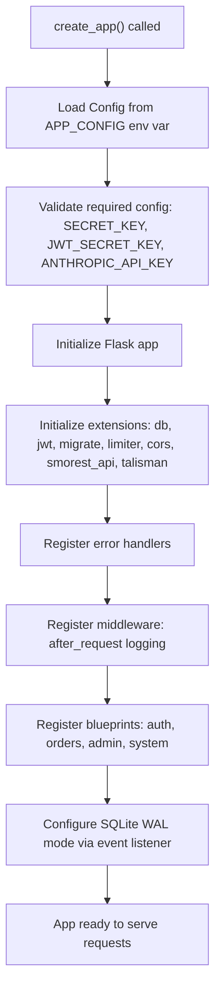

### 7.2 Dependency Wiring

The `create_app(config_name=None)` factory function in `app/__init__.py` is the composition root:

1. **Config loading:** Determines config class from `APP_CONFIG` env var (values: `development`, `testing`, `production`; defaults to `production`). Testing code passes `"testing"` to get `TestingConfig`. Note: `FLASK_ENV` is deprecated since Flask 2.3 — `APP_CONFIG` is a custom env var used solely for config class selection.
2. **Startup validation:** After loading the config, `create_app()` validates that all required configuration parameters are present: `SECRET_KEY`, `JWT_SECRET_KEY`, and `ANTHROPIC_API_KEY`. If any are missing, it raises a `ConfigurationError` (a simple `RuntimeError` subclass) listing the names of the missing variables. This fail-fast behavior prevents confusing runtime errors (e.g., JWT creation failure, extraction call failure) that would otherwise occur on the first request requiring the missing value.
3. **Extension initialization:** Each extension singleton (`db`, `jwt`, `migrate`, `limiter`, `cors`, `smorest_api`, `talisman`) is created in `extensions.py` without an app. `create_app()` calls `ext.init_app(app)` for each. Flask-Talisman is configured with security headers (HSTS, X-Content-Type-Options, X-Frame-Options) and a Content Security Policy that allows the React SPA's inline scripts and styles (see `TALISMAN_CSP` configuration parameter).
4. **Error handlers:** `register_error_handlers(app)` binds custom exception classes to JSON error responses.
5. **Middleware:** `register_middleware(app)` attaches the `after_request` activity logging hook.
6. **Blueprints:** Each route module exports a Flask-Smorest `Blueprint`. The `routes/__init__.py` module provides `register_blueprints(api)` which registers all four blueprints with the `smorest_api` instance.
7. **WAL mode:** A SQLAlchemy engine event listener sets `PRAGMA journal_mode=WAL` and `PRAGMA foreign_keys=ON` on connection.

Services are **not** pre-instantiated at startup. They are created per-request inside route handlers, receiving repository instances that use the current request's `db.session`. This avoids thread-safety issues with SQLite.

**Service instantiation pattern:** Each route module provides thin factory functions that construct service instances with their repository dependencies. Route handlers call these factories at the start of each request. Concrete example from `app/routes/orders.py`:

```python
from app.extensions import db
from app.repositories import OrderRepository, DocumentRepository
from app.services import OrderService, ExtractionService

def get_order_service() -> OrderService:
    return OrderService(
        order_repo=OrderRepository(db.session),
        doc_repo=DocumentRepository(db.session),
    )

def get_extraction_service() -> ExtractionService:
    return ExtractionService(
        order_repo=OrderRepository(db.session),
        doc_repo=DocumentRepository(db.session),
    )

class OrderDetailView(MethodView):
    @jwt_required()
    @blp.response(200, OrderResponseSchema)
    def get(self, order_id):
        svc = get_order_service()
        return svc.get_order(order_id)
```

This pattern is repeated in each route module: `auth.py` defines `get_auth_service()`, `admin.py` defines `get_activity_service()`, and `system.py` queries the database directly for the health check (no service needed). Factory functions live in the same file as the blueprint that uses them.

### 7.3 Configuration Parameters

| Parameter | Type | Default | Required | Loaded From |
|-----------|------|---------|----------|-------------|
| `APP_CONFIG` | str | `production` | No | Env var (values: `development`, `testing`, `production`) |
| `SECRET_KEY` | str | — | Yes | Env var |
| `JWT_SECRET_KEY` | str | — | Yes | Env var |
| `JWT_ACCESS_TOKEN_EXPIRES` | timedelta | 60 minutes | No | Env var (minutes) |
| `JWT_REFRESH_TOKEN_EXPIRES` | timedelta | 7 days | No | Env var (days) |
| `SQLALCHEMY_DATABASE_URI` | str | `sqlite:///app.db` | No | Env var `DATABASE_URL` |
| `ANTHROPIC_API_KEY` | str | — | Yes | Env var |
| `ANTHROPIC_MODEL` | str | `claude-sonnet-4-20250514` | No | Env var |
| `ANTHROPIC_MAX_TOKENS` | int | 1024 | No | Env var |
| `ANTHROPIC_TIMEOUT` | int | 30 | No | Env var (seconds) |
| `ANTHROPIC_MAX_RETRIES` | int | 3 | No | Env var |
| `MAX_UPLOAD_SIZE_MB` | int | 10 | No | Env var |
| `UPLOAD_FOLDER` | str | `./uploads` | No | Env var |
| `CORS_ORIGINS` | list[str] | `["http://localhost:3000"]` | No | Env var (comma-separated) |
| `TALISMAN_FORCE_HTTPS` | bool | `True` (production), `False` (development/testing) | No | Config class |
| `TALISMAN_CSP` | dict | `{"default-src": "'self'", "script-src": "'self'", "style-src": "'self' 'unsafe-inline'"}` | No | Config class (development disables CSP entirely for hot-reload compatibility) |
| `LOG_LEVEL` | str | `INFO` | No | Env var |
| `API_TITLE` | str | `GenHealth AI DME API` | No | Hardcoded |
| `API_VERSION` | str | `v1` | No | Hardcoded |
| `OPENAPI_VERSION` | str | `3.0.2` | No | Hardcoded |
| `OPENAPI_URL_PREFIX` | str | `/api/v1` | No | Hardcoded |
| `OPENAPI_SWAGGER_UI_PATH` | str | `/docs` | No | Hardcoded |
| `OPENAPI_SWAGGER_UI_URL` | str | CDN URL | No | Hardcoded |

---

## 8. Testing Strategy

### 8.1 Unit Tests — Per Class/Module

#### Model Tests

| Class | Test | Verifies | Description |
|-------|------|----------|-------------|
| `User` | `test_set_password_hashes` | FR-3.1.1 | Calling `set_password("plain")` produces a bcrypt hash that is not equal to the plaintext |
| `User` | `test_check_password_correct` | FR-3.1.2 | `check_password()` returns `True` for the correct password |
| `User` | `test_check_password_wrong` | FR-3.1.2 | `check_password()` returns `False` for an incorrect password |
| `OrderStatus` | `test_enum_values` | FR-3.2.1 | Enum has exactly: PENDING, PROCESSING, COMPLETED, FAILED |
| `Order` | `test_default_status_pending` | FR-3.2.1 | New orders default to `pending` status |

#### Repository Tests

| Class | Test | Verifies | Description |
|-------|------|----------|-------------|
| `UserRepository` | `test_get_by_email_found` | FR-3.1.2 | Returns user when email exists |
| `UserRepository` | `test_get_by_email_not_found` | FR-3.1.2 | Returns `None` when email does not exist |
| `UserRepository` | `test_email_exists_true` | FR-3.1.1 | Returns `True` for existing email |
| `UserRepository` | `test_email_exists_false` | FR-3.1.1 | Returns `False` for non-existing email |
| `OrderRepository` | `test_list_paginated_basic` | FR-3.2.2 | Returns correct page of orders and total count |
| `OrderRepository` | `test_list_paginated_filter_status` | FR-3.2.2 | Filters by status correctly |
| `OrderRepository` | `test_list_paginated_filter_patient_name` | FR-3.2.2 | Filters by patient_last_name (LIKE) |
| `OrderRepository` | `test_list_paginated_filter_date_range` | FR-3.2.2 | Filters by created_after/created_before |
| `OrderRepository` | `test_list_paginated_sorting` | FR-3.2.2 | Sorts by created_at desc by default, supports patient_last_name |
| `OrderRepository` | `test_get_with_document_has_doc` | FR-3.2.3 | Eager-loads document when it exists |
| `OrderRepository` | `test_get_with_document_no_doc` | FR-3.2.3 | Returns order with no document (None) |
| `DocumentRepository` | `test_get_by_order_id` | FR-3.3.1 | Returns document for given order |
| `DocumentRepository` | `test_delete_by_order_id` | FR-3.2.5 | Deletes document by order_id |
| `RefreshTokenRepository` | `test_create_and_find` | FR-3.1.3 | Creates token, finds it by hash |
| `RefreshTokenRepository` | `test_find_expired_returns_none` | FR-3.1.3 | Does not return expired tokens |
| `RefreshTokenRepository` | `test_delete_all_for_user` | FR-3.1.3 | Revokes all tokens for a user |
| `ActivityLogRepository` | `test_log_request` | FR-3.4.1 | Inserts a log entry with all fields |
| `ActivityLogRepository` | `test_log_request_independent_commit` | FR-3.4.1 | Starts a service-level transaction (e.g., inserts an Order), calls `log_request()`, forces the log commit to fail (e.g., by passing an invalid value that violates a NOT NULL constraint), then asserts the service's pending Order insert is unaffected and can still be committed successfully. Validates the savepoint isolation guarantee. |
| `ActivityLogRepository` | `test_list_paginated_filters` | FR-3.4.2 | Filters by user_id, endpoint, date range |

#### Service Tests

| Class | Test | Verifies | Description |
|-------|------|----------|-------------|
| `AuthService` | `test_register_success` | FR-3.1.1 | Creates user with hashed password |
| `AuthService` | `test_register_duplicate_email` | FR-3.1.1 | Raises `ConflictError` |
| `AuthService` | `test_register_weak_password` | FR-3.1.1 | Raises `BusinessValidationError` for weak passwords |
| `AuthService` | `test_login_success` | FR-3.1.2 | Returns access + refresh tokens |
| `AuthService` | `test_login_wrong_password` | FR-3.1.2 | Raises `AuthenticationError` |
| `AuthService` | `test_login_unknown_email` | FR-3.1.2 | Raises `AuthenticationError` |
| `AuthService` | `test_refresh_success` | FR-3.1.3 | Rotates tokens (old deleted, new created) |
| `AuthService` | `test_refresh_expired_token` | FR-3.1.3 | Raises `AuthenticationError` |
| `AuthService` | `test_refresh_invalid_token` | FR-3.1.3 | Raises `AuthenticationError` |
| `AuthService` | `test_logout_revokes_all_tokens` | FR-3.1.3 | Deletes all refresh tokens for user |
| `OrderService` | `test_create_order` | FR-3.2.1 | Creates order with pending status |
| `OrderService` | `test_get_order_found` | FR-3.2.3 | Returns order with document |
| `OrderService` | `test_get_order_not_found` | FR-3.2.3 | Raises `NotFoundError` |
| `OrderService` | `test_update_order` | FR-3.2.4 | Updates fields, sets updated_at |
| `OrderService` | `test_update_order_immutable_fields` | FR-3.2.4 | Ignores id, created_by, created_at in update data |
| `OrderService` | `test_delete_order_with_document` | FR-3.2.5 | Deletes document file, document record, and order |
| `OrderService` | `test_delete_order_without_document` | FR-3.2.5 | Deletes order only |
| `OrderService` | `test_delete_order_file_missing` | FR-3.2.5 | Cascade continues if physical file is already gone |
| `ExtractionService` | `test_upload_and_extract_success` | FR-3.3.1–FR-3.3.4 | Full happy path: saves file, extracts text, calls LLM, populates order |
| `ExtractionService` | `test_extract_no_text` | FR-3.3.2 | Sets order to failed when PDF has no text |
| `ExtractionService` | `test_extract_llm_timeout` | FR-3.3.5 | Sets order to failed after retries exhausted |
| `ExtractionService` | `test_extract_llm_invalid_json` | FR-3.3.3 | Sets order to failed on malformed response |
| `ExtractionService` | `test_extract_preserves_manual_fields` | FR-3.3.4 | Only overwrites empty fields, preserves manually-entered values |
| `ExtractionService` | `test_extract_retries_on_429` | FR-3.3.5 | Retries up to 3 times on rate limit errors |

#### Utility Tests

| Class | Test | Verifies | Description |
|-------|------|----------|-------------|
| `pdf_parser` | `test_extract_text_valid_pdf` | FR-3.3.2 | Extracts text from a valid PDF |
| `pdf_parser` | `test_extract_text_multipage` | FR-3.3.2 | Concatenates text from all pages |
| `pdf_parser` | `test_extract_text_no_text` | FR-3.3.2 | Returns empty string for image-only PDFs |
| `pdf_parser` | `test_extract_text_corrupt_file` | FR-3.3.2 | Raises appropriate error for corrupt files |

### 8.2 Integration Tests

| Test | Requirements Covered | Setup | Exercise | Assert |
|------|---------------------|-------|----------|--------|
| `test_register_and_login_flow` | FR-3.1.1, FR-3.1.2 | Empty database | POST register, POST login | User created, JWT returned, JWT contains correct claims |
| `test_register_duplicate_email` | FR-3.1.1 | Existing user in DB | POST register with same email | 409 Conflict with error envelope |
| `test_register_validation_errors` | FR-3.1.1 | Empty database | POST register with missing fields | 422 with field-level error details |
| `test_login_invalid_credentials` | FR-3.1.2 | Existing user | POST login with wrong password | 401 with error envelope |
| `test_token_refresh_flow` | FR-3.1.3 | Logged-in user with refresh token | POST refresh | New access + refresh tokens, old refresh token invalidated |
| `test_token_refresh_invalidates_old_token` | FR-3.1.3 | Logged-in user with refresh token | POST refresh with token A → receive token B → POST refresh with token A again | Second refresh attempt returns 401 Unauthorized, confirming the old refresh token was revoked by the rotation |
| `test_token_refresh_expired` | FR-3.1.3 | Expired refresh token in DB | POST refresh | 401 Unauthorized |
| `test_logout_revokes_tokens` | FR-3.1.3 | Logged-in user | POST logout, then POST refresh with old token | Logout succeeds (200), subsequent refresh fails (401) |
| `test_protected_route_no_token` | FR-3.1.4 | — | GET /api/v1/orders without Authorization header | 401 Unauthorized |
| `test_get_current_user` | FR-3.1.2 | Authenticated user | GET /api/v1/auth/me with valid Bearer token | 200 OK with UserSchema response matching the authenticated user's id, email, first_name, last_name |
| `test_protected_route_expired_token` | FR-3.1.4 | — | GET /api/v1/orders with expired JWT | 401 Unauthorized |
| `test_create_order` | FR-3.2.1 | Authenticated user | POST /api/v1/orders with valid data | 201, order has pending status, created_by matches |
| `test_list_orders_pagination` | FR-3.2.2 | 25 orders in DB | GET /api/v1/orders?page=2&per_page=10 | 200, data has 10 items, pagination shows total=25, page=2 |
| `test_list_orders_filter_status` | FR-3.2.2 | Mixed-status orders | GET /api/v1/orders?status=completed | 200, all returned orders have completed status |
| `test_get_order_by_id` | FR-3.2.3 | Order with document | GET /api/v1/orders/{id} | 200, response includes document metadata |
| `test_get_order_not_found` | FR-3.2.3 | — | GET /api/v1/orders/{random-uuid} | 404 with error envelope |
| `test_update_order` | FR-3.2.4 | Existing order | PUT /api/v1/orders/{id} with updated fields | 200, fields updated, updated_at changed |
| `test_update_order_immutable_fields` | FR-3.2.4 | Existing order | PUT with id, created_by in body | 200, immutable fields unchanged |
| `test_delete_order` | FR-3.2.5 | Order with document | DELETE /api/v1/orders/{id} | 204, order gone, document gone, PDF file deleted |
| `test_upload_and_extract_success` | FR-3.3.1–FR-3.3.4 | Pending order, mocked Claude response | POST /api/v1/orders/{id}/upload with PDF | 200, order status=completed, fields populated, document created |
| `test_upload_invalid_file_type` | FR-3.3.1 | Pending order | POST upload with .txt file | 422 error |
| `test_upload_file_too_large` | FR-3.3.1 | Pending order | POST upload with oversized file | 413 error |
| `test_upload_extraction_failure` | FR-3.3.4, FR-3.3.5 | Pending order, mocked Claude failure | POST upload | 422, order status=failed, error_message set |
| `test_upload_no_extractable_text` | FR-3.3.2 | Pending order, image-only PDF | POST upload | 422, order status=failed, error_message set |
| `test_activity_log_created_on_request` | FR-3.4.1 | Authenticated user | Any API request | activity_log table has a matching entry |
| `test_activity_log_unauthenticated` | FR-3.4.1 | — | POST /api/v1/auth/login | activity_log entry with user_id=null |
| `test_list_activity_logs` | FR-3.4.2 | Multiple log entries | GET /api/v1/admin/activity-logs | 200, paginated list of logs |
| `test_list_activity_logs_filter` | FR-3.4.2 | Multiple log entries | GET with user_id and date filters | 200, filtered results |
| `test_health_check` | NFR-6.3 | Running app with DB | GET /api/v1/health | 200, `{"status": "healthy", "database": "connected"}` |
| `test_health_check_db_down` | NFR-6.3 | App with broken DB connection | GET /api/v1/health | 503, `{"status": "unhealthy"}` |
| `test_rate_limit_login` | NFR-6.1 | — | Rapid POST /api/v1/auth/login exceeding limit | 429 Too Many Requests |
| `test_rate_limit_upload` | NFR-6.1 | Authenticated user | Rapid POST upload exceeding limit | 429 Too Many Requests |
| `test_cors_headers` | Section 4.6 | — | OPTIONS preflight request | Correct CORS headers present |
| `test_swagger_docs_accessible` | NFR-6.5 | Running app | GET /api/v1/docs | 200, Swagger UI HTML |

### 8.3 Requirements Traceability Matrix

| Requirement | Unit Tests | Integration Tests | Notes |
|-------------|-----------|------------------|-------|
| FR-3.1.1 | `test_register_*`, `test_set_password_*`, `test_email_exists_*` | `test_register_and_login_flow`, `test_register_duplicate_email`, `test_register_validation_errors` | |
| FR-3.1.2 | `test_login_*`, `test_check_password_*` | `test_register_and_login_flow`, `test_login_invalid_credentials`, `test_get_current_user` | |
| FR-3.1.3 | `test_refresh_*`, `test_logout_*`, `test_create_and_find_*`, `test_find_expired_*`, `test_delete_all_for_user` | `test_token_refresh_flow`, `test_token_refresh_invalidates_old_token`, `test_token_refresh_expired`, `test_logout_revokes_tokens` | |
| FR-3.1.4 | — | `test_protected_route_no_token`, `test_protected_route_expired_token` | Integration-only |
| FR-3.2.1 | `test_create_order`, `test_default_status_pending` | `test_create_order` | |
| FR-3.2.2 | `test_list_paginated_*` | `test_list_orders_pagination`, `test_list_orders_filter_status` | |
| FR-3.2.3 | `test_get_order_*`, `test_get_with_document_*` | `test_get_order_by_id`, `test_get_order_not_found` | |
| FR-3.2.4 | `test_update_order`, `test_update_order_immutable_fields` | `test_update_order`, `test_update_order_immutable_fields` | |
| FR-3.2.5 | `test_delete_order_*`, `test_delete_by_order_id` | `test_delete_order` | |
| FR-3.3.1 | `test_upload_and_extract_success` | `test_upload_and_extract_success`, `test_upload_invalid_file_type`, `test_upload_file_too_large` | |
| FR-3.3.2 | `test_extract_text_*` | `test_upload_no_extractable_text` | |
| FR-3.3.3 | `test_extract_llm_invalid_json` | `test_upload_and_extract_success` | |
| FR-3.3.4 | `test_extract_preserves_manual_fields`, `test_extract_no_text` | `test_upload_extraction_failure` | |
| FR-3.3.5 | `test_extract_llm_timeout`, `test_extract_retries_on_429` | `test_upload_extraction_failure` | |
| FR-3.4.1 | `test_log_request` | `test_activity_log_created_on_request`, `test_activity_log_unauthenticated` | |
| FR-3.4.2 | `test_list_paginated_filters` | `test_list_activity_logs`, `test_list_activity_logs_filter` | |
| FR-3.5.1 | — | — | Frontend; tested via manual/E2E |
| FR-3.5.2 | — | — | Frontend; tested via manual/E2E |
| FR-3.5.3 | — | — | Frontend; tested via manual/E2E |
| NFR-6.1 | — | `test_rate_limit_login`, `test_rate_limit_upload` | |
| NFR-6.3 | — | `test_health_check`, `test_health_check_db_down` | |
| NFR-6.5 | — | `test_swagger_docs_accessible` | |

### 8.4 Test Infrastructure

**Test Doubles:**

| Interface/Dependency | Double Type | Purpose |
|---------------------|-----------|---------|
| Anthropic Claude API | Mock (unittest.mock.patch) | Returns canned JSON responses; simulates timeouts, 429s, invalid JSON |
| Filesystem (uploads) | Temp directory (pytest `tmp_path`) | Isolated file storage per test, auto-cleaned |
| SQLite database | In-memory SQLite (`sqlite:///:memory:`) | Fast, isolated, destroyed after each test |
| Application Insights | Not mocked | SDK is not initialized in test config; telemetry calls are no-ops |

**Test Utilities:**

- **`conftest.py` fixtures:**
  - `app` — Flask app with `TestingConfig` (in-memory SQLite, disabled rate limiting)
  - `client` — Flask test client bound to the app
  - `db_session` — Fresh database with all tables created, rolled back after each test
  - `auth_headers(user)` — Helper that creates a user, logs in, and returns `Authorization: Bearer <token>` headers
  - `sample_pdf` — Returns a path to a small valid PDF fixture file

- **`factories.py`:**
  - `UserFactory` — Creates users with sensible defaults (unique emails, pre-hashed passwords)
  - `OrderFactory` — Creates orders in any status with realistic DME data
  - `DocumentFactory` — Creates document records with sample extracted data

**Test Configuration:**
- Rate limiting is disabled in `TestingConfig` (set limits to very high values) to avoid false failures in non-rate-limit tests.
- `ANTHROPIC_API_KEY` is set to a dummy value in test config — all Claude calls are mocked.
- `UPLOAD_FOLDER` points to a pytest `tmp_path` fixture.

---

## 9. Open Questions

1. **Pagination response format:** Flask-Smorest returns pagination in the `X-Pagination` response header. The requirements specify a response body envelope with `data` and `pagination` keys. The LLD assumes both are provided — header for standard clients, body for the React frontend. The implementation should wrap Flask-Smorest's response in a custom paginated response helper. The exact approach (custom decorator, response hook, or manual construction) is left to implementation.

2. **Axios interceptor refresh race condition:** When multiple concurrent requests receive 401s simultaneously, each may attempt a token refresh. The implementation should use a token refresh queue/mutex pattern where the first 401 triggers a refresh and subsequent requests wait for it to complete. Specific implementation is deferred.

3. **Frontend form validation vs. API validation:** MUI form fields should validate on the client side for UX (instant feedback), but all validation is also enforced server-side. The implementation should decide whether to duplicate Marshmallow schema rules in TypeScript validators or rely primarily on server-side errors with a thin client-side layer.

---

*This low-level design is detailed enough for an implementer to create a task breakdown and begin coding without architectural ambiguity. All class designs and test plans trace back to the [requirements document](assessment-requirements.md) and are consistent with the [high-level design](assessment-high-level-design.md).*
