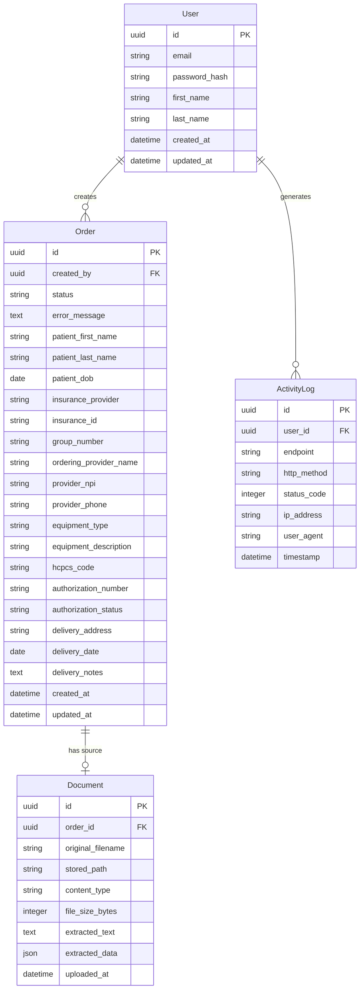
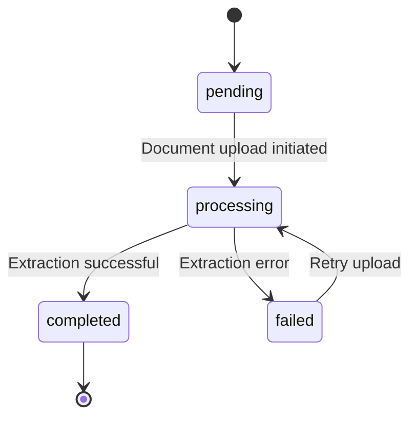
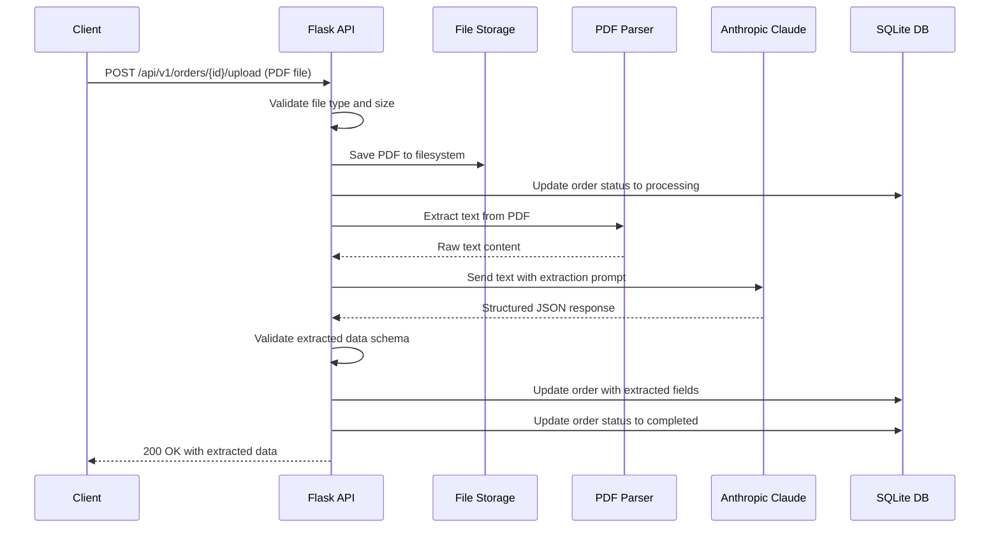
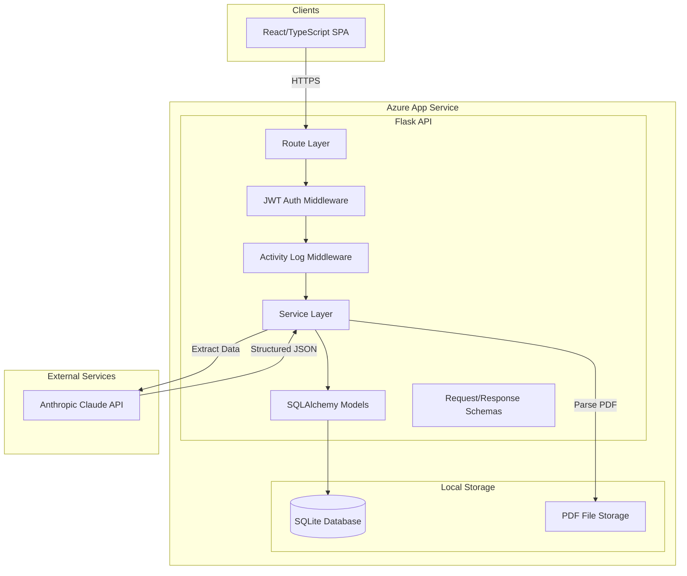

# GenHealth AI Assessment - Requirements

## 1. Overview

A production-grade REST API and React frontend for managing Durable Medical Equipment (DME) orders. The system accepts uploaded PDF documents (e.g., faxed patient intake forms), uses Anthropic Claude to extract structured patient data (first name, last name, date of birth), and persists orders with full DME metadata to a database. All user activity is logged at the request level. The API is built in Python/Flask, the frontend in React/TypeScript, and deployed to Azure App Service via GitHub integration.

## 2. Core Concepts

### 2.1 Terminology

| Term | Definition |
|------|------------|
| **Order** | A DME order record containing patient demographics, insurance details, provider information, equipment requested, authorization status, and delivery details. |
| **Document Upload** | A PDF file (typically a faxed patient intake or prescription form) submitted via the API for AI-powered data extraction. |
| **Extraction** | The process of parsing a PDF document and using Anthropic Claude to identify and return structured patient data (first name, last name, DOB). |
| **Activity Log** | A database record capturing each API request: endpoint, HTTP method, authenticated user, timestamp, and response status code. |
| **DME** | Durable Medical Equipment — devices prescribed by healthcare providers (e.g., CPAP machines, wheelchairs, oxygen supplies). |
| **HCPCS Code** | Healthcare Common Procedure Coding System code used to identify specific medical equipment and supplies for billing. |
| **NPI** | National Provider Identifier — a unique 10-digit identification number for healthcare providers. |
| **JWT** | JSON Web Token — a compact, URL-safe token format used for stateless authentication between the frontend and API. |

### 2.2 Entity Relationships



## 3. Functional Requirements

### 3.1 User Management & Authentication

#### FR-3.1.1 User Registration
- System SHALL allow new users to register with email, password, first name, and last name.
- System SHALL hash passwords using a secure algorithm (e.g., bcrypt) before storing.
- System SHALL validate email uniqueness at registration time.
- System SHALL enforce minimum password complexity (8+ characters, at least one uppercase, one lowercase, one digit).

#### FR-3.1.2 User Login
- System SHALL authenticate users via email and password, returning a JWT access token on success.
- System SHALL return a 401 Unauthorized response for invalid credentials.
- JWT tokens SHALL include the user ID and email in the payload. (Role field removed from v1 — no role-based restrictions. Re-add when RBAC is implemented.)
- JWT tokens SHALL expire after a configurable duration (default: 60 minutes).

#### FR-3.1.3 Token Refresh
- System SHOULD provide a refresh token mechanism to allow sessions to persist without re-authentication.
- Refresh tokens SHALL have a longer expiry (default: 7 days).

#### FR-3.1.4 Protected Routes
- All endpoints except registration, login, and health check SHALL require a valid JWT in the `Authorization: Bearer <token>` header.
- System SHALL return 401 for missing tokens and 403 for insufficient permissions.

### 3.2 Order CRUD Operations

#### FR-3.2.1 Create Order
- System SHALL allow authenticated users to create a new Order via `POST /api/v1/orders`.
- System SHALL validate all required fields before persisting.
- System SHALL set the initial order status to `pending`.
- System SHALL record `created_by` as the authenticated user's ID.
- System SHALL auto-generate a UUID for the order ID.

#### FR-3.2.2 List Orders
- System SHALL allow authenticated users to retrieve a paginated list of orders via `GET /api/v1/orders`.
- System SHALL support query parameters for pagination: `page` (default: 1) and `per_page` (default: 20, max: 100).
- System SHOULD support filtering by `status`, `patient_last_name`, and date range (`created_after`, `created_before`).
- System SHOULD support sorting by `created_at` (default: descending) and `patient_last_name`.

#### FR-3.2.3 Get Order by ID
- System SHALL allow authenticated users to retrieve a single order by ID via `GET /api/v1/orders/{id}`.
- System SHALL return 404 if the order does not exist.
- Response SHALL include the associated document metadata if a document has been uploaded.

#### FR-3.2.4 Update Order
- System SHALL allow authenticated users to update an existing order via `PUT /api/v1/orders/{id}`.
- System SHALL validate all provided fields.
- System SHALL update the `updated_at` timestamp on successful modification.
- System SHALL return 404 if the order does not exist.
- System SHALL NOT allow updates to `id`, `created_by`, or `created_at` fields.

#### FR-3.2.5 Delete Order
- System SHALL allow authenticated users to delete an order via `DELETE /api/v1/orders/{id}`.
- System SHALL return 404 if the order does not exist.
- System SHALL cascade-delete associated Document records when an order is deleted.

#### Order Status Lifecycle



| Status | Description |
|--------|-------------|
| `pending` | Order created, no document uploaded yet |
| `processing` | Document uploaded, extraction in progress |
| `completed` | Extraction successful, patient data populated |
| `failed` | Extraction failed (LLM error, unreadable PDF, etc.) |

### 3.3 Document Upload & Data Extraction

#### FR-3.3.1 Document Upload
- System SHALL accept a PDF file upload via `POST /api/v1/orders/{id}/upload`.
- System SHALL validate that the uploaded file is a PDF (check MIME type and file extension).
- System SHALL enforce a maximum file size (default: 10 MB).
- System SHALL store the uploaded file on the server filesystem (or cloud storage) with a unique name to prevent collisions.
- System SHALL transition the order status to `processing` upon successful upload.

#### FR-3.3.2 PDF Text Extraction
- System SHALL extract raw text content from the uploaded PDF using a PDF parsing library (e.g., PyMuPDF, pdfplumber).
- System SHALL handle multi-page PDFs.
- System SHALL gracefully handle PDFs with no extractable text (scanned images) by returning an appropriate error.

#### FR-3.3.3 LLM-Based Structured Extraction
- System SHALL send the extracted PDF text to Anthropic Claude API for structured data extraction.
- System SHALL request extraction of at minimum: patient first name, patient last name, and patient date of birth.
- System SHOULD also attempt to extract: insurance provider, insurance ID, ordering provider name, provider NPI, equipment type, HCPCS code, and any other DME-relevant fields present in the document.
- System SHALL use a structured prompt with explicit JSON output formatting instructions.
- System SHALL validate the LLM response against an expected schema before persisting.

#### FR-3.3.4 Auto-Population of Order Fields
- System SHALL automatically populate the Order entity fields with successfully extracted data.
- System SHALL transition the order status to `completed` after successful extraction and population.
- System SHALL transition the order status to `failed` if extraction fails, with an error description stored.
- System SHALL preserve any manually-entered order fields and only overwrite fields that were empty or explicitly marked for auto-fill.

#### FR-3.3.5 LLM Error Handling
- System SHALL implement retry logic for transient Anthropic API failures (timeout, 429, 5xx) with exponential backoff (max 3 retries).
- System SHALL return a meaningful error message when the LLM cannot extract required fields.
- System SHALL log all LLM API interactions (request token count, response token count, latency, success/failure).
- System SHALL enforce a per-request timeout for LLM calls (default: 30 seconds).
- System SHALL NOT expose raw LLM error details to the client; return sanitized error messages.

#### Document Upload Flow



### 3.4 Activity Logging

#### FR-3.4.1 Request Logging
- System SHALL log every API request to the ActivityLog database table.
- Each log entry SHALL include: user ID (if authenticated), endpoint path, HTTP method, response status code, client IP address, user agent string, and timestamp.
- System SHALL implement logging as middleware to avoid polluting business logic.
- System SHALL NOT log sensitive data (passwords, tokens, full request bodies) in activity logs.

#### FR-3.4.2 Log Retrieval
- System SHOULD provide an admin endpoint `GET /api/v1/admin/activity-logs` to query activity logs.
- System SHOULD support pagination and filtering by user ID, endpoint, method, status code, and date range.

### 3.5 Frontend Application (React/TypeScript)

#### FR-3.5.1 Authentication Pages
- Frontend SHALL provide a login page with email and password fields.
- Frontend SHALL provide a registration page with email, password, first name, and last name.
- Frontend SHALL store JWT tokens securely (httpOnly cookies preferred, or secure localStorage with XSS mitigations).
- Frontend SHALL redirect unauthenticated users to the login page.
- Frontend SHALL display the authenticated user's name in the navigation.

#### FR-3.5.2 Order Management Dashboard
- Frontend SHALL display a paginated table of orders with columns: Order ID (truncated), Patient Name, DOB, Status, Equipment Type, Created Date.
- Frontend SHALL provide a "Create Order" button that opens a form with all DME fields.
- Frontend SHALL provide an "Upload Document" button on each order row/detail page that triggers a file picker for PDF upload.
- Frontend SHALL display upload progress and extraction status in real-time or via polling.
- Frontend SHALL provide an order detail view showing all fields and associated document metadata.
- Frontend SHALL provide inline editing or an edit form for updating order fields.
- Frontend SHALL provide a delete confirmation dialog before removing orders.

#### FR-3.5.3 UI/UX Requirements
- Frontend SHALL use a component library or design system for consistent styling (e.g., Material UI, Tailwind CSS, Ant Design).
- Frontend SHALL display toast notifications for success and error states.
- Frontend SHALL show loading spinners/skeletons during API calls.
- Frontend SHALL be responsive for desktop viewports (mobile optimization is out of scope for v1).
- Frontend SHALL display meaningful validation errors inline on forms.

## 4. API Requirements

### 4.1 Authentication APIs

| Method | Endpoint | Description | Auth Required |
|--------|----------|-------------|---------------|
| POST | `/api/v1/auth/register` | Register a new user | No |
| POST | `/api/v1/auth/login` | Login and receive JWT | No |
| POST | `/api/v1/auth/refresh` | Refresh access token | Yes (refresh token) |
| GET | `/api/v1/auth/me` | Get current user profile | Yes |

### 4.2 Order APIs

| Method | Endpoint | Description | Auth Required |
|--------|----------|-------------|---------------|
| POST | `/api/v1/orders` | Create a new order | Yes |
| GET | `/api/v1/orders` | List orders (paginated) | Yes |
| GET | `/api/v1/orders/{id}` | Get order by ID | Yes |
| PUT | `/api/v1/orders/{id}` | Update an order | Yes |
| DELETE | `/api/v1/orders/{id}` | Delete an order | Yes |
| POST | `/api/v1/orders/{id}/upload` | Upload document and extract data | Yes |

### 4.3 Activity Log APIs

| Method | Endpoint | Description | Auth Required |
|--------|----------|-------------|---------------|
| GET | `/api/v1/admin/activity-logs` | List activity logs (admin) | Yes |

### 4.4 System APIs

| Method | Endpoint | Description | Auth Required |
|--------|----------|-------------|---------------|
| GET | `/api/v1/health` | Health check | No |

### 4.5 API Conventions

- All endpoints SHALL be prefixed with `/api/v1/` for versioning.
- All request and response bodies SHALL use JSON format (except file uploads which use `multipart/form-data`).
- All successful responses SHALL return appropriate HTTP status codes: 200 (OK), 201 (Created), 204 (No Content for deletes).
- All error responses SHALL return a consistent error envelope:
  ```json
  {
    "error": {
      "code": "VALIDATION_ERROR",
      "message": "Human-readable error description",
      "details": [
        {"field": "email", "message": "Email is required"}
      ]
    }
  }
  ```
- All list endpoints SHALL return a pagination envelope:
  ```json
  {
    "data": [...],
    "pagination": {
      "page": 1,
      "per_page": 20,
      "total": 150,
      "total_pages": 8
    }
  }
  ```

### 4.6 CORS Configuration

- API SHALL configure CORS to allow the frontend origin.
- API SHALL allow `Authorization` header in CORS preflight.
- In production, CORS origins SHALL be restricted to the deployed frontend domain.

## 5. Configuration Parameters

### 5.1 System-Level Configuration

| Parameter | Description | Default | Required |
|-----------|-------------|---------|----------|
| `SECRET_KEY` | Flask secret key for session/JWT signing | — | Yes |
| `JWT_SECRET_KEY` | Secret key for JWT token generation | — | Yes |
| `JWT_ACCESS_TOKEN_EXPIRES` | Access token expiry in minutes | `60` | No |
| `JWT_REFRESH_TOKEN_EXPIRES` | Refresh token expiry in days | `7` | No |
| `DATABASE_URL` | SQLite connection string | `sqlite:///app.db` | No |
| `ANTHROPIC_API_KEY` | Anthropic API key for Claude | — | Yes |
| `ANTHROPIC_MODEL` | Claude model identifier | `claude-sonnet-4-20250514` | No |
| `ANTHROPIC_MAX_TOKENS` | Max tokens for Claude response | `1024` | No |
| `ANTHROPIC_TIMEOUT` | LLM request timeout in seconds | `30` | No |
| `ANTHROPIC_MAX_RETRIES` | Max retry attempts for LLM calls | `3` | No |
| `MAX_UPLOAD_SIZE_MB` | Maximum PDF upload file size in MB | `10` | No |
| `UPLOAD_FOLDER` | Directory path for stored uploads | `./uploads` | No |
| `CORS_ORIGINS` | Allowed CORS origins (comma-separated) | `http://localhost:3000` | No |
| `LOG_LEVEL` | Application log level | `INFO` | No |
| `FLASK_ENV` | Flask environment (development/production) | `production` | No |

### 5.2 Environment-Specific Overrides

All configuration SHALL be loaded from environment variables with a `.env` file fallback for local development. The system SHALL use `python-dotenv` or equivalent for `.env` loading. Sensitive values (API keys, secrets) SHALL NEVER be committed to source control.

## 6. Non-Functional Requirements

### 6.1 Security
- System SHALL hash all passwords with bcrypt (cost factor >= 12).
- System SHALL validate and sanitize all user inputs to prevent injection attacks.
- System SHALL use parameterized queries via ORM to prevent SQL injection.
- System SHALL set security headers (X-Content-Type-Options, X-Frame-Options, X-XSS-Protection, Strict-Transport-Security in production).
- System SHALL validate uploaded file types server-side (not just by extension).
- System SHALL store uploaded files outside the web-accessible directory.
- System SHALL NOT expose stack traces or internal error details in production API responses.
- System SHALL rate-limit authentication endpoints (login, register) to prevent brute-force attacks.

### 6.2 Performance
- API response time for CRUD operations SHALL be under 200ms (excluding LLM calls).
- LLM extraction calls SHOULD complete within 30 seconds.
- Database queries SHALL use appropriate indexes on frequently queried columns (status, created_at, patient_last_name).

### 6.3 Reliability
- System SHALL handle LLM API outages gracefully without crashing.
- System SHALL return meaningful error codes and messages for all failure scenarios.
- Health check endpoint SHALL verify database connectivity.
- System SHALL handle concurrent requests without data corruption (SQLite WAL mode).

### 6.4 Code Quality
- Code SHALL follow PEP 8 style guidelines for Python.
- Code SHALL use type hints for all function signatures.
- Code SHALL use an ORM (SQLAlchemy) for all database operations.
- Code SHALL maintain separation of concerns: routes, services, models, and schemas in separate modules.
- Code SHALL include unit tests for critical paths (extraction, order CRUD, authentication).
- Code coverage SHOULD be at least 70% for core business logic.

### 6.5 Documentation
- API SHALL include OpenAPI/Swagger documentation accessible at `/api/v1/docs` or similar.
- Project SHALL include a README.md with setup instructions, environment variable documentation, and deployment guide.
- Code SHALL include docstrings for all public modules, classes, and functions.

### 6.6 Deployment
- Application SHALL be deployable to Azure App Service via GitHub Actions CI/CD.
- Application SHALL include a `requirements.txt` or `pyproject.toml` for Python dependencies.
- Frontend SHALL be buildable to static assets and served alongside or separately from the API.
- Application SHALL include appropriate Azure App Service configuration (startup command, Python version).

## 7. Out of Scope (v1)

- **Batch Processing**: Bulk upload of multiple documents simultaneously.
- **Asynchronous Processing**: Background job queue for extraction (synchronous in v1).
- **Caching**: Redis or in-memory caching layer.
- **User Roles/Permissions**: All authenticated users have equal access (no admin vs. user roles beyond activity log access).
- **Mobile Responsive Design**: Frontend optimized for desktop only.
- **OCR for Scanned PDFs**: System will not perform OCR on image-based PDFs without extractable text.
- **Audit Trail with Payloads**: Full request/response body logging.
- **Rate Limiting on All Endpoints**: Only auth endpoints are rate-limited in v1.
- **Multi-Tenancy**: No organization-level data isolation.
- **Notification Systems**: No email or webhook notifications.
- **File Versioning**: No support for uploading multiple documents per order.
- **Advanced Search**: Full-text search across patient records.
- **Export/Reporting**: No data export or analytics dashboards.
- **WebSocket Real-Time Updates**: Polling-based status updates only.

## 8. System Architecture Overview



### 8.1 Project Structure (Backend)

```
backend/
├── app/
│   ├── __init__.py              # Flask app factory
│   ├── config.py                # Configuration classes
│   ├── extensions.py            # SQLAlchemy, JWT, etc. init
│   ├── models/
│   │   ├── __init__.py
│   │   ├── user.py              # User model
│   │   ├── order.py             # Order model
│   │   ├── document.py          # Document model
│   │   └── activity_log.py      # ActivityLog model
│   ├── schemas/
│   │   ├── __init__.py
│   │   ├── user.py              # User request/response schemas
│   │   ├── order.py             # Order request/response schemas
│   │   └── document.py          # Document schemas
│   ├── routes/
│   │   ├── __init__.py          # Blueprint registration
│   │   ├── auth.py              # Auth endpoints
│   │   ├── orders.py            # Order CRUD endpoints
│   │   └── admin.py             # Admin endpoints (activity logs)
│   ├── services/
│   │   ├── __init__.py
│   │   ├── auth_service.py      # Authentication logic
│   │   ├── order_service.py     # Order business logic
│   │   ├── extraction_service.py # PDF parsing + Claude extraction
│   │   └── activity_service.py  # Activity logging
│   ├── middleware/
│   │   ├── __init__.py
│   │   ├── auth_middleware.py   # JWT verification
│   │   └── logging_middleware.py # Request activity logging
│   └── utils/
│       ├── __init__.py
│       ├── errors.py            # Custom error classes + handlers
│       └── pdf_parser.py        # PDF text extraction utility
├── tests/
│   ├── __init__.py
│   ├── conftest.py              # Test fixtures
│   ├── test_auth.py             # Auth endpoint tests
│   ├── test_orders.py           # Order CRUD tests
│   ├── test_extraction.py       # Extraction service tests
│   └── test_activity_log.py     # Activity logging tests
├── migrations/                  # DB migrations (if using Flask-Migrate)
├── .env.example                 # Environment variable template
├── .gitignore
├── requirements.txt
├── pyproject.toml
└── README.md
```

### 8.2 Project Structure (Frontend)

```
frontend/
├── public/
│   └── index.html
├── src/
│   ├── api/
│   │   ├── client.ts            # Axios/fetch wrapper with JWT interceptor
│   │   ├── auth.ts              # Auth API calls
│   │   └── orders.ts            # Order API calls
│   ├── components/
│   │   ├── common/              # Shared UI components
│   │   ├── auth/                # Login, Register forms
│   │   └── orders/              # Order table, form, detail, upload
│   ├── pages/
│   │   ├── LoginPage.tsx
│   │   ├── RegisterPage.tsx
│   │   ├── OrderListPage.tsx
│   │   ├── OrderDetailPage.tsx
│   │   └── CreateOrderPage.tsx
│   ├── hooks/
│   │   ├── useAuth.ts           # Auth state management
│   │   └── useOrders.ts         # Order data fetching
│   ├── context/
│   │   └── AuthContext.tsx       # Authentication context provider
│   ├── types/
│   │   └── index.ts             # TypeScript interfaces
│   ├── utils/
│   │   └── validators.ts        # Form validation helpers
│   ├── App.tsx
│   ├── index.tsx
│   └── routes.tsx               # React Router config
├── .env.example
├── package.json
├── tsconfig.json
└── README.md
```

## 9. Glossary

| Term | Definition |
|------|------------|
| CPAP | Continuous Positive Airway Pressure — a DME device used to treat sleep apnea |
| DME | Durable Medical Equipment — medical devices prescribed for home use |
| HCPCS | Healthcare Common Procedure Coding System — standardized codes for medical supplies |
| JWT | JSON Web Token — a compact token format for stateless authentication |
| NPI | National Provider Identifier — unique 10-digit ID for healthcare providers |
| ORM | Object-Relational Mapping — a technique for mapping database tables to programming objects |
| SPA | Single Page Application — a web app that dynamically rewrites a single page |
| WAL | Write-Ahead Logging — SQLite journaling mode for better concurrent read performance |

---

## Assumptions Made

- **SQLite is sufficient for MVP**: Given the assessment context, SQLite with WAL mode provides adequate performance. The system is designed with SQLAlchemy ORM so migrating to PostgreSQL requires only a connection string change.
- **Synchronous extraction is acceptable**: For v1, document upload and extraction happen synchronously in the request lifecycle. This means upload requests may take 10-30 seconds. A future iteration could offload to a background task queue (Celery, RQ).
- **Single-user deployment is primary use case**: While auth is implemented, the system is not designed for high-concurrency multi-tenant usage in v1.
- **PDF documents contain extractable text**: The system will not perform OCR. It assumes PDFs have embedded text layers (not scanned images without text).
- **Claude claude-sonnet-4-20250514 (or latest) is suitable**: The extraction prompt will be designed for Claude's capabilities. Model can be swapped via configuration.
- **Azure App Service support for SQLite**: SQLite file will persist on the App Service filesystem. For production beyond MVP, a managed database should be used.
- **Frontend served separately or as static build**: The React frontend will be built to static assets. It can be hosted on the same Azure App Service or a separate static hosting service.
- **File upload storage is local**: Uploaded PDFs are stored on the server filesystem. For production scale, Azure Blob Storage would be preferred.
