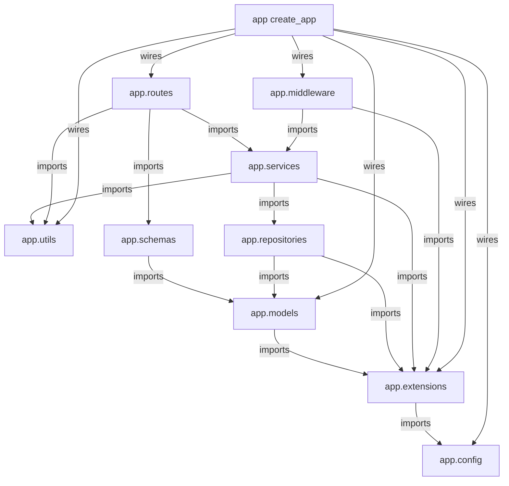
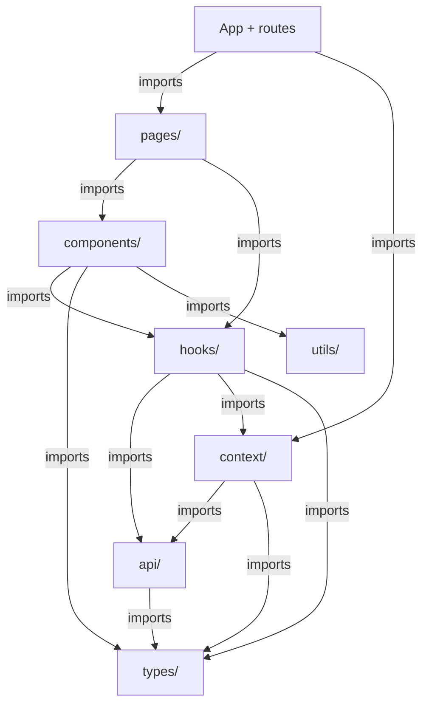

# GenHealth AI DME Order Management — Implementation Plan

This plan breaks the low-level design into implementable tasks organized by execution batch. Tasks within a batch can be worked on according to their track assignments. All tasks in a batch must complete before committing and moving to the next batch.

**Total Tasks:** 34
**Batches:** 8
**Critical Path Length:** 21 tasks
**Max Parallel Tracks:** 3 (in Batches 3, 4, 5, 6)

---

## Package Dependency Graph

### Backend



### Frontend



---

## Batch Execution Overview

```
Batch 1: Project Scaffolding
  Track A (serial): Task 1.1                           [backend/]
  Track B (serial): Task 1.2                           [frontend/]
  ─── Tracks A, B: PARALLEL ───
  >>> Commit checkpoint: Both project directories exist with package configs

Batch 2: Foundation Layer
  Track A (serial): Task 2.1 → Task 2.3               [backend app/, config, extensions]
  Track B (serial): Task 2.2                           [backend app/utils/]
  Track C (serial): Task 2.4                           [frontend src/types/, src/utils/]
  ─── Tracks A, B, C: PARALLEL ───
  >>> Commit checkpoint: Config, extensions, error types, PDF parser, frontend types all exist

Batch 3: Data Models + Frontend API
  Track A (serial): Task 3.1                           [backend app/models/]
  Track B (serial): Task 3.2                           [frontend src/api/]
  Track C (serial): Task 3.3                           [frontend src/components/common/]
  ─── Tracks A, B, C: PARALLEL ───
  >>> Commit checkpoint: All ORM models defined, frontend API layer + common components ready

Batch 4: Data Access Layer + Frontend State
  Track A (serial): Task 4.1                           [backend app/schemas/]
  Track B (serial): Task 4.2                           [backend app/repositories/]
  Track C (serial): Task 4.3                           [frontend src/context/, src/hooks/]
  ─── Tracks A, B, C: PARALLEL ───
  >>> Commit checkpoint: Schemas, repositories, frontend auth context + hooks ready

Batch 5: Business Logic + Frontend Auth UI
  Track A (serial): Task 5.1 → Task 5.2 → Task 5.3 → Task 5.4  [backend app/services/]
  Track B (serial): Task 5.5                                      [frontend src/components/auth/]
  ─── Tracks A, B: PARALLEL ───
  ─── Tasks 5.1-5.4: CONFLICT (shared services/__init__.py) ───
  >>> Commit checkpoint: All services implemented, frontend auth UI ready

Batch 6: API Routes + Frontend Order UI
  Track A (serial): Task 6.1 → Task 6.2 → Task 6.3   [backend app/routes/]
  Track B (serial): Task 6.4                           [backend app/middleware/]
  Track C (serial): Task 6.5                           [frontend src/components/orders/]
  ─── Tracks A, B, C: PARALLEL ───
  ─── Tasks 6.1-6.3: CONFLICT (shared routes/__init__.py) ───
  >>> Commit checkpoint: All routes, middleware, frontend order UI ready

Batch 7: App Assembly + Frontend Pages
  Track A (serial): Task 7.1 → Task 7.2               [backend app/__init__.py, migrations/]
  Track B (serial): Task 7.3 → Task 7.4               [frontend src/pages/, src/App.tsx]
  ─── Tracks A, B: PARALLEL ───
  >>> Commit checkpoint: Full backend runnable with create_app(), frontend fully assembled

Batch 8: Test Suite
  Track A (serial): Task 8.1 → Task 8.2 → Task 8.3 → Task 8.4 → Task 8.5 → Task 8.6 → Task 8.7  [backend tests/]
  ─── Tasks 8.2-8.7: CONFLICT (shared conftest.py, factories.py) ───
  >>> Commit checkpoint: All unit and integration tests pass
```

---

## Batch 1: Project Scaffolding

### Track A: Backend Project Setup [backend/]

#### Task 1.1: Backend Project Scaffolding

**Prerequisites:** None
**Conflicts with:** None
**Parallel with:** Task 1.2 (Track B)
**Package:** `backend/`

**Objective:** Create the backend project directory with dependency management, environment template, and documentation.

**Instructions:**
1. Create `backend/` directory.
2. Create `backend/pyproject.toml` with project metadata:
   - Python >= 3.11
   - Dependencies: flask, flask-sqlalchemy, flask-migrate, flask-jwt-extended, flask-smorest, flask-cors, flask-limiter, flask-talisman, marshmallow, anthropic, pdfplumber, bcrypt, python-dotenv, gunicorn
   - Dev dependencies: pytest, pytest-cov
3. Create `backend/requirements.txt` with pinned versions of all dependencies listed above.
4. Create `backend/.env.example` with all configuration parameters from LLD Section 7.3:
   ```
   APP_CONFIG=development
   SECRET_KEY=change-me-in-production
   JWT_SECRET_KEY=change-me-in-production
   ANTHROPIC_API_KEY=your-api-key-here
   ANTHROPIC_MODEL=claude-sonnet-4-20250514
   ANTHROPIC_MAX_TOKENS=1024
   ANTHROPIC_TIMEOUT=30
   ANTHROPIC_MAX_RETRIES=3
   MAX_UPLOAD_SIZE_MB=10
   UPLOAD_FOLDER=./uploads
   CORS_ORIGINS=http://localhost:3000
   LOG_LEVEL=INFO
   DATABASE_URL=sqlite:///app.db
   ```
5. Create `backend/.gitignore` (Python-standard: `__pycache__/`, `*.pyc`, `.env`, `*.db`, `uploads/`, `.pytest_cache/`, `htmlcov/`, `dist/`, `*.egg-info/`).
6. Create `backend/README.md` with setup instructions skeleton.
7. Create empty `backend/migrations/` directory with a `.gitkeep`.
8. Create empty `backend/uploads/` directory with a `.gitkeep`.
9. Reference: LLD Section 2.3, HLD Section 8.3.

**Verification:**
- Directory structure exists: `ls backend/`
- `requirements.txt` and `pyproject.toml` are valid

**Requirements covered:** —

---

### Track B: Frontend Project Setup [frontend/]

#### Task 1.2: Frontend Project Scaffolding

**Prerequisites:** None
**Conflicts with:** None
**Parallel with:** Task 1.1 (Track A)
**Package:** `frontend/`

**Objective:** Create the frontend React/TypeScript project with Vite, MUI, TanStack Query, and React Router.

**Instructions:**
1. Create `frontend/` directory.
2. Create `frontend/package.json` with:
   - Dependencies: react, react-dom, react-router-dom (v6), @tanstack/react-query (v5), axios, @mui/material, @mui/icons-material, @emotion/react, @emotion/styled
   - Dev dependencies: typescript, @types/react, @types/react-dom, vite, @vitejs/plugin-react
3. Create `frontend/tsconfig.json` with strict TypeScript configuration, JSX support (`react-jsx`), path aliases if desired.
4. Create `frontend/vite.config.ts` with:
   - React plugin
   - Dev server proxy: `/api` → `http://localhost:5000`
   - Build output: `build/`
5. Create `frontend/public/index.html` with basic HTML5 boilerplate and a `<div id="root">`.
6. Create `frontend/src/main.tsx` as a stub entry point that renders a placeholder `<div>App</div>` into the root element.
7. Create `frontend/.env.example`:
   ```
   VITE_API_URL=http://localhost:5000
   ```
8. Create `frontend/.gitignore` (Node-standard: `node_modules/`, `build/`, `dist/`, `.env`).
9. Reference: LLD Section 2.4, HLD Section 8.3.

**Verification:**
- `cd frontend && npm install && npm run build` succeeds (produces build output)
- `npm run dev` starts Vite dev server

**Requirements covered:** —

---

### Batch 1 Commit Checkpoint

After all tracks complete:
- [ ] `backend/` directory exists with `requirements.txt`, `pyproject.toml`, `.env.example`
- [ ] `frontend/` directory exists with `package.json`, `tsconfig.json`, `vite.config.ts`
- [ ] `npm install && npm run build` succeeds in `frontend/`
- [ ] Both directories are ready for code implementation

---

## Batch 2: Foundation Layer

### Track A: Backend Config + Extensions [backend/app/]

#### Task 2.1: Configuration Module + App Package Stub

**Prerequisites:** Task 1.1
**Conflicts with:** None
**Parallel with:** Task 2.2 (Track B), Task 2.4 (Track C)
**Package:** `backend/app`

**Objective:** Create the Flask configuration classes and the app package stub with a minimal `__init__.py`.

**Instructions:**
1. Create `backend/app/__init__.py` with a minimal placeholder:
   ```python
   # Flask application factory — fully implemented in Task 7.1
   ```
2. Create `backend/app/config.py` implementing these configuration classes per LLD Section 7.3:
   - `Config` (base): Loads all parameters from environment variables using `os.environ.get()`. Sets `SECRET_KEY`, `JWT_SECRET_KEY`, `SQLALCHEMY_DATABASE_URI` (from `DATABASE_URL` env var, default `sqlite:///app.db`), `JWT_ACCESS_TOKEN_EXPIRES` (timedelta, default 60 min), `JWT_REFRESH_TOKEN_EXPIRES` (timedelta, default 7 days), `ANTHROPIC_API_KEY`, `ANTHROPIC_MODEL`, `ANTHROPIC_MAX_TOKENS`, `ANTHROPIC_TIMEOUT`, `ANTHROPIC_MAX_RETRIES`, `MAX_UPLOAD_SIZE_MB`, `UPLOAD_FOLDER`, `CORS_ORIGINS` (parsed from comma-separated string to list), `LOG_LEVEL`, `MAX_CONTENT_LENGTH` (derived from `MAX_UPLOAD_SIZE_MB * 1024 * 1024`), OpenAPI settings (`API_TITLE`, `API_VERSION`, `OPENAPI_VERSION`, `OPENAPI_URL_PREFIX`, `OPENAPI_SWAGGER_UI_PATH`, `OPENAPI_SWAGGER_UI_URL`).
   - `DevelopmentConfig(Config)`: `DEBUG = True`, `TALISMAN_FORCE_HTTPS = False`, `TALISMAN_CSP = None` (disabled for hot-reload).
   - `TestingConfig(Config)`: `TESTING = True`, `SQLALCHEMY_DATABASE_URI = "sqlite:///:memory:"`, `TALISMAN_FORCE_HTTPS = False`, `TALISMAN_CSP = None`, `ANTHROPIC_API_KEY = "test-key"`, `SECRET_KEY = "test-secret"`, `JWT_SECRET_KEY = "test-jwt-secret"`.
   - `ProductionConfig(Config)`: `TALISMAN_FORCE_HTTPS = True`, `TALISMAN_CSP` dict per LLD Section 7.3.
   - A `config_map` dict: `{"development": DevelopmentConfig, "testing": TestingConfig, "production": ProductionConfig}`.
3. Use `python-dotenv`'s `load_dotenv()` at module level to load `.env` file.
4. Reference: LLD Section 7.1–7.3, Requirements Section 5.

**Verification:**
- `python -c "from app.config import Config, DevelopmentConfig, TestingConfig, ProductionConfig"` succeeds from `backend/`

**Requirements covered:** —

---

#### Task 2.3: Flask Extensions Module

**Prerequisites:** Task 2.1
**Conflicts with:** None
**Parallel with:** Task 2.2 (Track B), Task 2.4 (Track C)
**Package:** `backend/app`

**Objective:** Create extension singletons that are initialized without an app and later bound via `init_app()`.

**Instructions:**
1. Create `backend/app/extensions.py` with these singletons:
   ```python
   from flask_sqlalchemy import SQLAlchemy
   from flask_migrate import Migrate
   from flask_jwt_extended import JWTManager
   from flask_limiter import Limiter
   from flask_limiter.util import get_remote_address
   from flask_smorest import Api
   from flask_cors import CORS
   from flask_talisman import Talisman

   db = SQLAlchemy()
   migrate = Migrate()
   jwt = JWTManager()
   limiter = Limiter(key_func=get_remote_address)
   smorest_api = Api()
   cors = CORS()
   talisman = Talisman()
   ```
2. None of these extensions call `init_app()` here — that happens in the app factory (Task 7.1).
3. Reference: LLD Section 2.2, Section 7.2.

**Verification:**
- `python -c "from app.extensions import db, jwt, migrate, limiter, smorest_api, cors, talisman"` succeeds from `backend/`

**Requirements covered:** —

---

### Track B: Backend Utilities [backend/app/utils/]

#### Task 2.2: Error Utilities + PDF Parser

**Prerequisites:** Task 1.1
**Conflicts with:** None
**Parallel with:** Task 2.1, Task 2.3 (Track A), Task 2.4 (Track C)
**Package:** `backend/app/utils`

**Objective:** Create the custom exception hierarchy, Flask error handlers, and PDF text extraction utility.

**Instructions:**
1. Create `backend/app/utils/__init__.py` (empty or minimal).
2. Create `backend/app/utils/errors.py` implementing the error hierarchy from LLD Section 6.1:
   ```python
   class AppError(Exception):
       code: str
       message: str
       status_code: int
       details: list[dict]
   ```
   - `BusinessValidationError(AppError)` — code `"BUSINESS_VALIDATION_ERROR"`, status 422
   - `AuthenticationError(AppError)` — code `"AUTHENTICATION_ERROR"`, status 401
   - `NotFoundError(AppError)` — code `"NOT_FOUND"`, status 404
   - `ConflictError(AppError)` — code `"CONFLICT"`, status 409
   - `ExtractionError(AppError)` — code `"EXTRACTION_FAILED"`, status 422
   - `RateLimitError(AppError)` — code `"RATE_LIMIT_EXCEEDED"`, status 429
   - `DatabaseError(AppError)` — code `"INTERNAL_ERROR"`, status 500
   - Each class carries `code`, `message`, `details` (default empty list), and `status_code`.
   - Implement `register_error_handlers(app)` function that registers Flask error handlers for each `AppError` subclass, `werkzeug.exceptions.RequestEntityTooLarge` (mapped to 413 with code `"FILE_TOO_LARGE"`), and a catch-all `Exception` handler (mapped to 500 with code `"INTERNAL_ERROR"`, generic message).
   - All handlers produce the standard error envelope: `{"error": {"code": "...", "message": "...", "details": [...]}}`.
   - The catch-all handler logs the full exception (including traceback) at CRITICAL level but returns only the generic message to the client (per LLD Section 6.2).
3. Create `backend/app/utils/pdf_parser.py`:
   - Implement `extract_text(file_path: str) -> str`:
     - Opens the PDF at `file_path` using `pdfplumber.open()`.
     - Iterates all pages, calls `page.extract_text()`, concatenates results with newlines.
     - Returns the full text string.
     - If no text is extracted (all pages return `None` or empty), returns empty string.
     - Wraps `pdfplumber` exceptions in a descriptive error (e.g., `ExtractionError` for corrupt files).
   - Reference: LLD Section 3.3.1 (LLM Prompt Specification), LLD Section 8.1 (pdf_parser tests).
4. Reference: LLD Section 6.1–6.2, Section 2.2, Section 3.3.

**Verification:**
- `python -c "from app.utils.errors import AppError, NotFoundError, register_error_handlers"` succeeds
- `python -c "from app.utils.pdf_parser import extract_text"` succeeds

**Requirements covered:** FR-3.3.2 (PDF text extraction utility)

---

### Track C: Frontend Foundation [frontend/src/]

#### Task 2.4: TypeScript Types + Form Validators

**Prerequisites:** Task 1.2
**Conflicts with:** None
**Parallel with:** Task 2.1, Task 2.2, Task 2.3 (Tracks A, B)
**Package:** `frontend/src`

**Objective:** Define all shared TypeScript interfaces and form validation helpers.

**Instructions:**
1. Create `frontend/src/types/index.ts` with all interfaces per LLD Section 3.6 and Requirements Section 2.2:
   ```typescript
   export interface User {
     id: string;
     email: string;
     first_name: string;
     last_name: string;
     created_at: string;
   }

   export type OrderStatus = 'pending' | 'processing' | 'completed' | 'failed';

   export interface Order {
     id: string;
     created_by: string;
     status: OrderStatus;
     error_message: string | null;
     patient_first_name: string | null;
     patient_last_name: string | null;
     patient_dob: string | null;
     insurance_provider: string | null;
     insurance_id: string | null;
     group_number: string | null;
     ordering_provider_name: string | null;
     provider_npi: string | null;
     provider_phone: string | null;
     equipment_type: string | null;
     equipment_description: string | null;
     hcpcs_code: string | null;
     authorization_number: string | null;
     authorization_status: string | null;
     delivery_address: string | null;
     delivery_date: string | null;
     delivery_notes: string | null;
     created_at: string;
     updated_at: string;
     document: Document | null;
   }

   export interface Document {
     id: string;
     original_filename: string;
     content_type: string;
     file_size_bytes: number;
     extracted_data: Record<string, string | null> | null;
     uploaded_at: string;
   }

   export interface Pagination {
     page: number;
     per_page: number;
     total: number;
     total_pages: number;
   }

   export interface PaginatedResponse<T> {
     data: T[];
     pagination: Pagination;
   }

   export interface TokenResponse {
     access_token: string;
     refresh_token: string;
   }

   export interface ApiError {
     error: {
       code: string;
       message: string;
       details: Array<{ field: string; message: string }>;
     };
   }

   export interface OrderFilters {
     status?: OrderStatus;
     patient_last_name?: string;
     created_after?: string;
     created_before?: string;
     sort_by?: string;
     sort_order?: 'asc' | 'desc';
   }
   ```
2. Create `frontend/src/utils/validators.ts` with form validation helpers:
   - `validateEmail(email: string): string | null` — returns error message or null.
   - `validatePassword(password: string): string | null` — checks 8+ chars, uppercase, lowercase, digit (per FR-3.1.1).
   - `validateRequired(value: string, fieldName: string): string | null`.
   - `validateNPI(npi: string): string | null` — checks 10-digit format.
3. Reference: LLD Section 3.6, Requirements Section 3.1.1.

**Verification:**
- `cd frontend && npx tsc --noEmit` passes

**Requirements covered:** FR-3.1.1 (password validation rules), FR-3.5.3 (form validation)

---

### Batch 2 Commit Checkpoint

After all tracks complete:
- [ ] `from app.config import Config, DevelopmentConfig, TestingConfig, ProductionConfig` works
- [ ] `from app.extensions import db, jwt, migrate, limiter, smorest_api, cors, talisman` works
- [ ] `from app.utils.errors import AppError, register_error_handlers` works
- [ ] `from app.utils.pdf_parser import extract_text` works
- [ ] `cd frontend && npx tsc --noEmit` passes
- [ ] All foundation types and utilities are ready for the data layer

---

## Batch 3: Data Models + Frontend API

### Track A: ORM Models [backend/app/models/]

#### Task 3.1: All ORM Models

**Prerequisites:** Task 2.3
**Conflicts with:** None
**Parallel with:** Task 3.2 (Track B), Task 3.3 (Track C)
**Package:** `backend/app/models`

**Objective:** Implement all five SQLAlchemy ORM models and the OrderStatus enum.

**Instructions:**
1. Create `backend/app/models/__init__.py` that re-exports all models:
   ```python
   from app.models.user import User
   from app.models.order import Order, OrderStatus
   from app.models.document import Document
   from app.models.activity_log import ActivityLog
   from app.models.refresh_token import RefreshToken
   ```
2. Create `backend/app/models/user.py` implementing `User` model per LLD Section 3.1:
   - Columns: `id` (String(36), PK, default `uuid.uuid4`), `email` (String, unique, not null), `password_hash` (String, not null), `first_name` (String, not null), `last_name` (String, not null), `created_at` (DateTime, default `func.now()`), `updated_at` (DateTime, default `func.now()`, onupdate `func.now()`).
   - `set_password(plain: str) -> None` — hashes with bcrypt (cost factor 12).
   - `check_password(plain: str) -> bool` — verifies via `bcrypt.checkpw()`.
   - Relationships: `orders` (back-populates to Order), `activity_logs` (back-populates to ActivityLog), `refresh_tokens` (back-populates to RefreshToken).
3. Create `backend/app/models/order.py`:
   - `OrderStatus` enum: `PENDING = "pending"`, `PROCESSING = "processing"`, `COMPLETED = "completed"`, `FAILED = "failed"`.
   - `Order` model: `id` (String(36) PK), `created_by` (String(36) FK → user.id), `status` (String, default `OrderStatus.PENDING.value`), `error_message` (Text, nullable), plus all patient/insurance/provider/equipment/delivery fields as nullable Strings (patient_dob and delivery_date as Date type), `created_at`, `updated_at`.
   - Relationship: `document` (uselist=False, back_populates from Document), `creator` (relationship to User).
4. Create `backend/app/models/document.py`:
   - `Document` model: `id` (String(36) PK), `order_id` (String(36) FK → order.id), `original_filename`, `stored_path`, `content_type`, `file_size_bytes` (Integer), `extracted_text` (Text), `extracted_data` (JSON), `uploaded_at` (DateTime, default `func.now()`).
   - Relationship: `order` (back_populates).
5. Create `backend/app/models/activity_log.py`:
   - `ActivityLog` model: `id` (String(36) PK), `user_id` (String(36) FK → user.id, nullable), `endpoint`, `http_method`, `status_code` (Integer), `ip_address`, `user_agent`, `timestamp` (DateTime, default `func.now()`).
6. Create `backend/app/models/refresh_token.py`:
   - `RefreshToken` model: `id` (String(36) PK), `user_id` (String(36) FK → user.id), `token_hash` (String, index), `expires_at` (DateTime), `created_at` (DateTime, default `func.now()`).
7. All UUIDs stored as `String(36)` per LLD model conventions. All models inherit from `db.Model` importing `db` from `app.extensions`.
8. Reference: LLD Section 3.1.

**Verification:**
- `python -c "from app.models import User, Order, OrderStatus, Document, ActivityLog, RefreshToken"` succeeds

**Requirements covered:** FR-3.1.1, FR-3.1.2, FR-3.2.1, FR-3.3.1, FR-3.4.1

---

### Track B: Frontend API Layer [frontend/src/api/]

#### Task 3.2: API Client + Auth/Order API Functions

**Prerequisites:** Task 2.4
**Conflicts with:** None
**Parallel with:** Task 3.1 (Track A), Task 3.3 (Track C)
**Package:** `frontend/src/api`

**Objective:** Create the Axios instance with JWT interceptor and all API function modules.

**Instructions:**
1. Create `frontend/src/api/client.ts`:
   - Create and export an Axios instance with `baseURL` from `import.meta.env.VITE_API_URL` or default `""` (same origin).
   - Add a request interceptor that attaches `Authorization: Bearer <token>` from a module-level `accessToken` variable.
   - Export `setAccessToken(token: string | null)` to update the stored token.
   - Add a response interceptor that, on 401, attempts a token refresh using the refresh token from localStorage, retries the original request with the new token. If refresh fails, clear tokens and redirect to `/login`.
   - Reference: LLD Section 3.6 (frontend conventions — access token in memory, refresh in localStorage).
2. Create `frontend/src/api/auth.ts`:
   - `register(data: { email: string; password: string; first_name: string; last_name: string }): Promise<User>`
   - `login(data: { email: string; password: string }): Promise<TokenResponse>`
   - `refreshToken(refreshToken: string): Promise<TokenResponse>`
   - `getMe(): Promise<User>`
   - `logout(): Promise<void>`
   - All functions call the Axios client instance with the correct endpoints per Requirements Section 4.1.
3. Create `frontend/src/api/orders.ts`:
   - `createOrder(data: Partial<Order>): Promise<Order>`
   - `listOrders(params: { page?: number; per_page?: number } & OrderFilters): Promise<PaginatedResponse<Order>>`
   - `getOrder(id: string): Promise<Order>`
   - `updateOrder(id: string, data: Partial<Order>): Promise<Order>`
   - `deleteOrder(id: string): Promise<void>`
   - `uploadDocument(orderId: string, file: File): Promise<Order>` — uses `FormData` with `multipart/form-data` content type.
   - All functions call the correct endpoints per Requirements Section 4.2.
4. Reference: LLD Section 3.6, Requirements Sections 4.1–4.2.

**Verification:**
- `cd frontend && npx tsc --noEmit` passes

**Requirements covered:** FR-3.5.1 (auth API), FR-3.5.2 (order API)

---

### Track C: Frontend Common Components [frontend/src/components/common/]

#### Task 3.3: Common UI Components

**Prerequisites:** Task 1.2
**Conflicts with:** None
**Parallel with:** Task 3.1 (Track A), Task 3.2 (Track B)
**Package:** `frontend/src/components/common`

**Objective:** Create reusable UI components used across the application.

**Instructions:**
1. Create `frontend/src/components/common/LoadingSpinner.tsx`:
   - MUI `CircularProgress` centered in a container.
   - Accept optional `message` prop.
2. Create `frontend/src/components/common/ErrorAlert.tsx`:
   - MUI `Alert` (severity `error`) displaying an error message.
   - Accept `message: string` and optional `onClose` callback.
3. Create `frontend/src/components/common/ConfirmDialog.tsx`:
   - MUI `Dialog` with title, message, Cancel and Confirm buttons.
   - Props: `open`, `title`, `message`, `onConfirm`, `onCancel`.
4. Create `frontend/src/components/common/PageLayout.tsx`:
   - MUI `Container` + `AppBar` + `Toolbar` layout wrapper.
   - Displays the app title and authenticated user's name in the navigation (from props or via a `user` prop).
   - `children` prop for page content.
5. Reference: LLD Section 3.6, FR-3.5.3.

**Verification:**
- `cd frontend && npx tsc --noEmit` passes

**Requirements covered:** FR-3.5.3 (UI/UX — loading spinners, consistent styling)

---

### Batch 3 Commit Checkpoint

After all tracks complete:
- [ ] `from app.models import User, Order, OrderStatus, Document, ActivityLog, RefreshToken` works
- [ ] `cd frontend && npx tsc --noEmit` passes
- [ ] All ORM models are defined with correct fields and relationships
- [ ] Frontend API client with JWT interceptor is ready
- [ ] Common UI components are implemented

---

## Batch 4: Data Access Layer + Frontend State

### Track A: Marshmallow Schemas [backend/app/schemas/]

#### Task 4.1: All Marshmallow Schemas

**Prerequisites:** Task 3.1
**Conflicts with:** None
**Parallel with:** Task 4.2 (Track B), Task 4.3 (Track C)
**Package:** `backend/app/schemas`

**Objective:** Implement all Marshmallow request/response schemas for API validation and serialization.

**Instructions:**
1. Create `backend/app/schemas/__init__.py` that re-exports all schema classes.
2. Create `backend/app/schemas/common.py`:
   - `ErrorSchema` with fields: `code` (String), `message` (String), `details` (List of Dict).
   - Pagination helper or base schema if needed for response wrapping.
3. Create `backend/app/schemas/auth.py` per LLD Section 3.4:
   - `RegisterSchema`: `email` (Email, required), `password` (String, required, load_only), `first_name` (String, required), `last_name` (String, required).
   - `LoginSchema`: `email` (Email, required), `password` (String, required, load_only).
   - `TokenSchema`: `access_token` (String, dump_only), `refresh_token` (String, dump_only).
   - `UserSchema`: `id` (String, dump_only), `email` (Email, dump_only), `first_name` (String, dump_only), `last_name` (String, dump_only), `created_at` (DateTime, dump_only).
4. Create `backend/app/schemas/order.py`:
   - `OrderCreateSchema`: All DME fields (patient_first_name, patient_last_name, patient_dob as Date, insurance_provider, insurance_id, group_number, ordering_provider_name, provider_npi, provider_phone, equipment_type, equipment_description, hcpcs_code, authorization_number, authorization_status, delivery_address, delivery_date as Date, delivery_notes). All fields optional (an order can be created nearly empty).
   - `OrderUpdateSchema`: Same fields as `OrderCreateSchema`, all optional (partial update).
   - `OrderResponseSchema`: All DME fields plus `id`, `created_by`, `status`, `error_message`, `created_at`, `updated_at` (all dump_only), and nested `document` (DocumentSchema, dump_only).
   - `OrderQuerySchema`: `page` (Integer, default 1), `per_page` (Integer, default 20, validate max 100), `status` (String, optional), `patient_last_name` (String, optional), `created_after` (DateTime, optional), `created_before` (DateTime, optional), `sort_by` (String, default `"created_at"`), `sort_order` (String, default `"desc"`).
5. Create `backend/app/schemas/document.py`:
   - `DocumentSchema`: `id`, `original_filename`, `content_type`, `file_size_bytes`, `extracted_data` (Dict), `uploaded_at` — all dump_only.
6. Create `backend/app/schemas/activity_log.py`:
   - `ActivityLogSchema`: `id`, `user_id`, `endpoint`, `http_method`, `status_code`, `ip_address`, `timestamp` — all dump_only.
   - `ActivityLogQuerySchema`: `page`, `per_page`, `user_id` (String, optional), `endpoint` (String, optional), `method` (String, optional), `status_code` (Integer, optional), `date_from` (DateTime, optional), `date_to` (DateTime, optional).
7. All schemas inherit from `marshmallow.Schema` (not SQLAlchemyAutoSchema) per LLD schema conventions.
8. Reference: LLD Section 3.4.

**Verification:**
- `python -c "from app.schemas import RegisterSchema, LoginSchema, OrderCreateSchema, OrderResponseSchema, OrderQuerySchema, ActivityLogSchema"` succeeds

**Requirements covered:** FR-3.1.1, FR-3.2.1–FR-3.2.5, FR-3.4.2

---

### Track B: Repositories [backend/app/repositories/]

#### Task 4.2: All Repositories

**Prerequisites:** Task 3.1
**Conflicts with:** None
**Parallel with:** Task 4.1 (Track A), Task 4.3 (Track C)
**Package:** `backend/app/repositories`

**Objective:** Implement the base repository and all five specific repositories.

**Instructions:**
1. Create `backend/app/repositories/__init__.py` re-exporting all repository classes.
2. Create `backend/app/repositories/base_repository.py` implementing `BaseRepository` per LLD Section 3.2 and 5.1:
   ```python
   class BaseRepository:
       model_class = None  # Must be set by subclasses

       def __init__(self, session):
           self.session = session

       def get_by_id(self, id):
           return self.session.get(self.model_class, id)

       def create(self, attrs: dict):
           instance = self.model_class(**attrs)
           self.session.add(instance)
           return instance

       def update(self, instance, attrs: dict):
           for key, value in attrs.items():
               setattr(instance, key, value)
           return instance

       def delete(self, instance):
           self.session.delete(instance)

       def commit(self):
           self.session.commit()
   ```
3. Create `backend/app/repositories/user_repository.py`:
   - `model_class = User`
   - `get_by_email(email: str) -> User | None` — case-insensitive lookup (`func.lower`).
   - `email_exists(email: str) -> bool` — optimized existence check.
4. Create `backend/app/repositories/refresh_token_repository.py`:
   - `model_class = RefreshToken`
   - `create_token(user_id, token_hash, expires_at)` → creates and returns.
   - `find_by_hash(token_hash)` → returns token where `expires_at > datetime.utcnow()`.
   - `delete_by_hash(token_hash)` → deletes matching record.
   - `delete_all_for_user(user_id)` → deletes all tokens for user.
   - `delete_expired()` → deletes expired tokens, returns count.
5. Create `backend/app/repositories/order_repository.py`:
   - `model_class = Order`
   - `list_paginated(page, per_page, filters)` → returns `(list[Order], int)`. Applies filters: `status` (exact match), `patient_last_name` (ILIKE), `created_after`/`created_before` (datetime range). Supports sort by `created_at` (default desc) and `patient_last_name`. Uses `offset`/`limit` for pagination and a separate `count()` query.
   - `get_with_document(order_id)` → uses `joinedload(Order.document)` for eager loading.
6. Create `backend/app/repositories/document_repository.py`:
   - `model_class = Document`
   - `get_by_order_id(order_id)` → returns Document or None.
   - `delete_by_order_id(order_id)` → deletes all documents for an order.
7. Create `backend/app/repositories/activity_log_repository.py`:
   - `model_class = ActivityLog`
   - `log_request(user_id, endpoint, method, status_code, ip, user_agent)` → creates a log entry within a **savepoint** (`session.begin_nested()`) wrapped in try/except. On success, the savepoint is committed. On failure, only the savepoint is rolled back — the caller's pending transaction is unaffected. This is the non-blocking guarantee per LLD Section 5.1.
   - `list_paginated(page, per_page, filters)` → returns `(list[ActivityLog], int)`. Filters: `user_id`, `endpoint`, `method`, `status_code`, `date_from`/`date_to`.
8. Reference: LLD Section 3.2, Section 5.1–5.2.

**Verification:**
- `python -c "from app.repositories import UserRepository, OrderRepository, DocumentRepository, ActivityLogRepository, RefreshTokenRepository"` succeeds

**Requirements covered:** FR-3.1.1–FR-3.1.3, FR-3.2.1–FR-3.2.5, FR-3.3.1, FR-3.4.1–FR-3.4.2

---

### Track C: Frontend Auth Context + Hooks [frontend/src/]

#### Task 4.3: Auth Context + All Hooks

**Prerequisites:** Task 3.2
**Conflicts with:** None
**Parallel with:** Task 4.1 (Track A), Task 4.2 (Track B)
**Package:** `frontend/src/context`, `frontend/src/hooks`

**Objective:** Implement the authentication context provider and all custom hooks for data fetching.

**Instructions:**
1. Create `frontend/src/context/AuthContext.tsx` per LLD Section 3.6:
   - Context value: `{ user: User | null, accessToken: string | null, isAuthenticated: boolean, login, register, logout, refreshToken, isLoading }`.
   - On mount, check localStorage for refresh token and attempt silent refresh.
   - `login(email, password)` → calls `auth.login()`, stores access token in memory (via `setAccessToken` from client.ts), stores refresh token in localStorage, fetches user profile via `auth.getMe()`.
   - `register(data)` → calls `auth.register()`.
   - `logout()` → calls `auth.logout()`, clears tokens, resets state.
   - `refreshToken()` → calls `auth.refreshToken()`, updates stored tokens.
   - Export `AuthProvider` component and `useAuthContext` hook.
2. Create `frontend/src/hooks/useAuth.ts`:
   - Convenience wrapper around `useAuthContext()`.
3. Create `frontend/src/hooks/useOrders.ts`:
   - `useOrders(params)` → TanStack Query `useQuery` with key `["orders", params]`, calls `orders.listOrders(params)`.
   - `useOrder(id)` → TanStack Query `useQuery` with key `["orders", id]`, calls `orders.getOrder(id)`.
   - `useCreateOrder()` → TanStack Query `useMutation`, calls `orders.createOrder()`, invalidates `["orders"]` on success.
   - `useUpdateOrder()` → TanStack Query `useMutation`, calls `orders.updateOrder()`, invalidates `["orders"]` on success.
   - `useDeleteOrder()` → TanStack Query `useMutation`, calls `orders.deleteOrder()`, invalidates `["orders"]` on success.
4. Create `frontend/src/hooks/useDocumentUpload.ts`:
   - `useDocumentUpload()` → TanStack Query `useMutation`, calls `orders.uploadDocument()`, invalidates `["orders"]` on success.
5. Reference: LLD Section 3.6.

**Verification:**
- `cd frontend && npx tsc --noEmit` passes

**Requirements covered:** FR-3.5.1 (auth state management), FR-3.5.2 (order data hooks)

---

### Batch 4 Commit Checkpoint

After all tracks complete:
- [ ] All Marshmallow schemas import successfully
- [ ] All repository classes import successfully
- [ ] `cd frontend && npx tsc --noEmit` passes
- [ ] Data access layer is complete — services can be built on top

---

## Batch 5: Business Logic + Frontend Auth UI

### Track A: Services [backend/app/services/]

#### Task 5.1: Auth Service

**Prerequisites:** Task 4.2
**Conflicts with:** Task 5.2, Task 5.3, Task 5.4 (shared `services/__init__.py`)
**Parallel with:** Task 5.5 (Track B)
**Package:** `backend/app/services`

**Objective:** Implement authentication business logic — registration, login, token refresh, and logout.

**Instructions:**
1. Create `backend/app/services/__init__.py` (initially exports only `AuthService`; expanded in subsequent tasks).
2. Create `backend/app/services/auth_service.py` per LLD Section 3.3 and 4.1–4.3:
   ```python
   class AuthService:
       def __init__(self, user_repo: UserRepository, token_repo: RefreshTokenRepository):
           self.user_repo = user_repo
           self.token_repo = token_repo
   ```
   - `register(email, password, first_name, last_name) -> User`:
     - Check `email_exists()` → raise `ConflictError` if true.
     - Validate password complexity (8+ chars, uppercase, lowercase, digit) → raise `BusinessValidationError` if weak.
     - Create user with hashed password via `User.set_password()`.
     - Commit and return user.
   - `login(email, password) -> tuple[str, str]`:
     - Get user by email → raise `AuthenticationError` if not found.
     - Check password → raise `AuthenticationError` if wrong.
     - Generate JWT access token via `flask_jwt_extended.create_access_token(identity=user.id, additional_claims={"email": user.email})`.
     - Generate random refresh token string (`secrets.token_urlsafe(32)`).
     - SHA-256 hash the refresh token, store via `token_repo.create_token()`.
     - Commit and return `(access_token, refresh_token_raw)`.
   - `refresh(raw_refresh_token: str) -> tuple[str, str]`:
     - SHA-256 hash the provided token.
     - Find by hash → raise `AuthenticationError` if not found or expired.
     - Delete old token, generate new pair (rotation), commit.
   - `logout(user_id: str) -> None`:
     - `token_repo.delete_all_for_user(user_id)`, commit.
   - `get_current_user(user_id: str) -> User`:
     - Get by ID → raise `NotFoundError` if not found.
3. Reference: LLD Section 3.3, 4.1–4.3.

**Verification:**
- `python -c "from app.services.auth_service import AuthService"` succeeds

**Requirements covered:** FR-3.1.1, FR-3.1.2, FR-3.1.3

---

#### Task 5.2: Order Service

**Prerequisites:** Task 4.2
**Conflicts with:** Task 5.1, Task 5.3, Task 5.4 (shared `services/__init__.py`)
**Parallel with:** Task 5.5 (Track B)
**Package:** `backend/app/services`

**Objective:** Implement order CRUD business logic with deletion cascade.

**Instructions:**
1. Create `backend/app/services/order_service.py` per LLD Section 3.3 and 4.4–4.7:
   ```python
   class OrderService:
       def __init__(self, order_repo: OrderRepository, doc_repo: DocumentRepository):
           self.order_repo = order_repo
           self.doc_repo = doc_repo
   ```
   - `create_order(user_id: str, data: dict) -> Order`:
     - Set `status="pending"`, `created_by=user_id`.
     - Create via `order_repo.create()`, commit, return.
   - `list_orders(page, per_page, filters) -> tuple[list[Order], int]`:
     - Delegate to `order_repo.list_paginated()`.
   - `get_order(order_id: str) -> Order`:
     - Get via `order_repo.get_with_document()` → raise `NotFoundError` if None.
   - `update_order(order_id: str, data: dict) -> Order`:
     - Get order → raise `NotFoundError` if None.
     - Strip immutable fields (`id`, `created_by`, `created_at`) from data.
     - Update via `order_repo.update()`, commit, return.
   - `delete_order(order_id: str) -> None`:
     - Get order → raise `NotFoundError` if None.
     - Get document by order_id.
     - If document exists: delete physical file (best-effort, catch `FileNotFoundError`), delete document record.
     - Delete order, commit.
     - Cascade order per LLD Section 4.7: file → document record → order record.
2. Update `services/__init__.py` to also export `OrderService`.
3. Reference: LLD Section 3.3, 4.4–4.7.

**Verification:**
- `python -c "from app.services.order_service import OrderService"` succeeds

**Requirements covered:** FR-3.2.1, FR-3.2.2, FR-3.2.3, FR-3.2.4, FR-3.2.5

---

#### Task 5.3: Extraction Service

**Prerequisites:** Task 4.2
**Conflicts with:** Task 5.1, Task 5.2, Task 5.4 (shared `services/__init__.py`)
**Parallel with:** Task 5.5 (Track B)
**Package:** `backend/app/services`

**Objective:** Implement the document upload, PDF text extraction, LLM-based structured extraction, and order field population.

**Instructions:**
1. Create `backend/app/services/extraction_service.py` per LLD Section 3.3, 3.3.1, and 4.6:
   ```python
   class ExtractionService:
       def __init__(self, order_repo: OrderRepository, doc_repo: DocumentRepository):
           self.order_repo = order_repo
           self.doc_repo = doc_repo
   ```
   - `upload_and_extract(order_id: str, file) -> Order`:
     - Get order by ID → raise `NotFoundError` if None.
     - Check for existing document (re-upload/retry): if exists, delete old file (best-effort), delete old document record, clear order extracted fields and error_message.
     - Call `_save_file(file)` → `(stored_path, file_size)`.
     - Set order status to `"processing"`, commit.
     - Call `_extract_text(stored_path)` → raw text string.
     - If text is empty → set status `"failed"`, error_message `"PDF contains no extractable text"`, commit, raise `ExtractionError`.
     - Call `_call_llm(text)` → dict.
     - Call `_validate_extraction(data)` → cleaned dict.
     - Call `_populate_order(order, data)`.
     - Create document record with all metadata.
     - Set order status to `"completed"`, commit, return order.
   - `_save_file(file) -> tuple[str, int]`:
     - Generate UUID filename, save to `UPLOAD_FOLDER`, return `(stored_path, file_size)`.
   - `_extract_text(file_path: str) -> str`:
     - Call `pdf_parser.extract_text(file_path)`.
   - `_call_llm(text: str) -> dict`:
     - Use `anthropic` Python SDK.
     - System prompt and user prompt per LLD Section 3.3.1.
     - Config: model from `ANTHROPIC_MODEL`, max_tokens from `ANTHROPIC_MAX_TOKENS`, timeout from `ANTHROPIC_TIMEOUT`.
     - Retry logic: exponential backoff (1s, 2s, 4s) on 429/5xx, max retries from `ANTHROPIC_MAX_RETRIES`.
     - On failure after retries: set order status `"failed"`, error_message `"AI extraction service unavailable"`, commit, raise `ExtractionError`.
     - Parse response as JSON. On parse failure: set status `"failed"`, error_message `"AI extraction returned invalid data"`, commit, raise `ExtractionError`.
   - `_validate_extraction(data: dict) -> dict`:
     - Accept only the 17 expected keys (LLD Section 3.3.1). Ignore extra keys.
     - For each expected key: keep non-null string value, else set to None.
     - Date fields (`patient_dob`, `delivery_date`): validate `YYYY-MM-DD` format. Invalid → set to None.
   - `_populate_order(order: Order, data: dict) -> Order`:
     - For each field with a non-null value: only overwrite if the Order field is currently None or empty string. Preserves manually-entered values per FR-3.3.4.
2. Update `services/__init__.py` to also export `ExtractionService`.
3. Reference: LLD Section 3.3, 3.3.1, 4.6.

**Verification:**
- `python -c "from app.services.extraction_service import ExtractionService"` succeeds

**Requirements covered:** FR-3.3.1, FR-3.3.2, FR-3.3.3, FR-3.3.4, FR-3.3.5

---

#### Task 5.4: Activity Service

**Prerequisites:** Task 4.2
**Conflicts with:** Task 5.1, Task 5.2, Task 5.3 (shared `services/__init__.py`)
**Parallel with:** Task 5.5 (Track B)
**Package:** `backend/app/services`

**Objective:** Implement the activity log query service.

**Instructions:**
1. Create `backend/app/services/activity_service.py`:
   ```python
   class ActivityService:
       def __init__(self, log_repo: ActivityLogRepository):
           self.log_repo = log_repo

       def list_logs(self, page: int, per_page: int, filters: dict) -> tuple[list, int]:
           return self.log_repo.list_paginated(page, per_page, filters)
   ```
2. Finalize `backend/app/services/__init__.py` to export all four services:
   ```python
   from app.services.auth_service import AuthService
   from app.services.order_service import OrderService
   from app.services.extraction_service import ExtractionService
   from app.services.activity_service import ActivityService
   ```
3. Reference: LLD Section 3.3.

**Verification:**
- `python -c "from app.services import AuthService, OrderService, ExtractionService, ActivityService"` succeeds

**Requirements covered:** FR-3.4.2

---

### Track B: Frontend Auth Components [frontend/src/components/auth/]

#### Task 5.5: Auth Components

**Prerequisites:** Task 4.3
**Conflicts with:** None
**Parallel with:** Tasks 5.1–5.4 (Track A)
**Package:** `frontend/src/components/auth`

**Objective:** Implement login form, registration form, and protected route components.

**Instructions:**
1. Create `frontend/src/components/auth/LoginForm.tsx`:
   - MUI form with `email` and `password` fields.
   - Client-side validation using `validators.ts`.
   - On submit, calls `useAuth().login()`.
   - Displays API error messages inline.
   - Link to registration page.
2. Create `frontend/src/components/auth/RegisterForm.tsx`:
   - MUI form with `email`, `password`, `first_name`, `last_name` fields.
   - Password complexity validation inline (FR-3.1.1).
   - On submit, calls `useAuth().register()`, then redirects to login.
   - Displays API error messages inline.
3. Create `frontend/src/components/auth/ProtectedRoute.tsx`:
   - Wraps children, checks `useAuth().isAuthenticated`.
   - If not authenticated, redirects to `/login` via `Navigate` from react-router-dom.
   - Shows `LoadingSpinner` while auth state is loading.
4. Reference: LLD Section 3.6, FR-3.5.1.

**Verification:**
- `cd frontend && npx tsc --noEmit` passes

**Requirements covered:** FR-3.5.1 (login, registration, protected routes)

---

### Batch 5 Commit Checkpoint

After all tracks complete:
- [ ] `from app.services import AuthService, OrderService, ExtractionService, ActivityService` works
- [ ] `cd frontend && npx tsc --noEmit` passes
- [ ] All business logic is implemented
- [ ] Frontend auth UI components are ready

---

## Batch 6: API Routes + Frontend Order UI

### Track A: Flask Routes [backend/app/routes/]

#### Task 6.1: Auth Routes Blueprint

**Prerequisites:** Task 5.1, Task 4.1
**Conflicts with:** Task 6.2, Task 6.3 (shared `routes/__init__.py`)
**Parallel with:** Task 6.4 (Track B), Task 6.5 (Track C)
**Package:** `backend/app/routes`

**Objective:** Implement the authentication blueprint with register, login, refresh, logout, and me endpoints.

**Instructions:**
1. Create `backend/app/routes/__init__.py` with a `register_blueprints(api)` helper (initially registers only auth_blp; expanded in subsequent tasks).
2. Create `backend/app/routes/auth.py` per LLD Section 3.5 and 4.1–4.3:
   - Create Flask-Smorest `Blueprint("auth", __name__, url_prefix="/api/v1/auth")`.
   - Service factory per LLD Section 7.2:
     ```python
     def get_auth_service() -> AuthService:
         return AuthService(
             user_repo=UserRepository(db.session),
             token_repo=RefreshTokenRepository(db.session),
         )
     ```
   - `RegisterView(MethodView)`:
     - `POST /register`: `@blp.arguments(RegisterSchema)`, `@blp.response(201, UserSchema)`. Calls `svc.register()`.
   - `LoginView(MethodView)`:
     - `POST /login`: `@blp.arguments(LoginSchema)`, `@blp.response(200, TokenSchema)`. Calls `svc.login()`.
   - `RefreshView(MethodView)`:
     - `POST /refresh`: `@jwt_required(refresh=True)`. Gets refresh token from request, calls `svc.refresh()`, returns new `TokenSchema`. Note: The raw refresh token is passed via the Authorization header as a JWT-encoded refresh token. The service receives the token identity and processes accordingly.
   - `LogoutView(MethodView)`:
     - `POST /logout`: `@jwt_required()`. Gets `user_id` from `get_jwt_identity()`, calls `svc.logout()`.
   - `MeView(MethodView)`:
     - `GET /me`: `@jwt_required()`, `@blp.response(200, UserSchema)`. Gets `user_id` from `get_jwt_identity()`, calls `svc.get_current_user()`.
   - Apply `@limiter.limit()` to login and register endpoints per NFR-6.1.
3. Reference: LLD Section 3.5, 4.1–4.3, 7.2.

**Verification:**
- `python -c "from app.routes.auth import auth_blp"` succeeds

**Requirements covered:** FR-3.1.1, FR-3.1.2, FR-3.1.3, FR-3.1.4

---

#### Task 6.2: Orders Routes Blueprint

**Prerequisites:** Task 5.2, Task 5.3, Task 4.1
**Conflicts with:** Task 6.1, Task 6.3 (shared `routes/__init__.py`)
**Parallel with:** Task 6.4 (Track B), Task 6.5 (Track C)
**Package:** `backend/app/routes`

**Objective:** Implement the orders blueprint with CRUD and upload endpoints.

**Instructions:**
1. Create `backend/app/routes/orders.py` per LLD Section 3.5 and 4.4–4.6:
   - Create Flask-Smorest `Blueprint("orders", __name__, url_prefix="/api/v1/orders")`.
   - Service factories:
     ```python
     def get_order_service() -> OrderService:
         return OrderService(
             order_repo=OrderRepository(db.session),
             doc_repo=DocumentRepository(db.session),
         )

     def get_extraction_service() -> ExtractionService:
         return ExtractionService(
             order_repo=OrderRepository(db.session),
             doc_repo=DocumentRepository(db.session),
         )
     ```
   - `OrderListView(MethodView)`:
     - `GET /`: `@jwt_required()`, `@blp.arguments(OrderQuerySchema, location="query")`, `@blp.response(200, OrderResponseSchema(many=True))`. Gets page, per_page, filters from query args. Calls `svc.list_orders()`. Builds pagination envelope per Requirements Section 4.5.
   - `OrderCreateView(MethodView)`:
     - `POST /`: `@jwt_required()`, `@blp.arguments(OrderCreateSchema)`, `@blp.response(201, OrderResponseSchema)`. Gets `user_id` via `get_jwt_identity()`. Calls `svc.create_order()`.
   - `OrderDetailView(MethodView)`:
     - `GET /<order_id>`: `@jwt_required()`, `@blp.response(200, OrderResponseSchema)`. Calls `svc.get_order()`.
   - `OrderUpdateView(MethodView)`:
     - `PUT /<order_id>`: `@jwt_required()`, `@blp.arguments(OrderUpdateSchema)`, `@blp.response(200, OrderResponseSchema)`. Calls `svc.update_order()`.
   - `OrderDeleteView(MethodView)`:
     - `DELETE /<order_id>`: `@jwt_required()`. Calls `svc.delete_order()`. Returns 204.
   - `OrderUploadView(MethodView)`:
     - `POST /<order_id>/upload`: `@jwt_required()`. Validates file is PDF (MIME type + extension), validates file size. Calls `extraction_svc.upload_and_extract()`. Returns `@blp.response(200, OrderResponseSchema)`.
     - Apply `@limiter.limit()` per LLM cost control (NFR-6.1, HLD Section 7.4).
2. Update `routes/__init__.py` to also register `orders_blp`.
3. Reference: LLD Section 3.5, 4.4–4.6, 7.2.

**Verification:**
- `python -c "from app.routes.orders import orders_blp"` succeeds

**Requirements covered:** FR-3.2.1, FR-3.2.2, FR-3.2.3, FR-3.2.4, FR-3.2.5, FR-3.3.1

---

#### Task 6.3: Admin + System Routes + Route Registration

**Prerequisites:** Task 5.4, Task 4.1
**Conflicts with:** Task 6.1, Task 6.2 (shared `routes/__init__.py`)
**Parallel with:** Task 6.4 (Track B), Task 6.5 (Track C)
**Package:** `backend/app/routes`

**Objective:** Implement the admin and system blueprints and finalize route registration.

**Instructions:**
1. Create `backend/app/routes/admin.py`:
   - Create Flask-Smorest `Blueprint("admin", __name__, url_prefix="/api/v1/admin")`.
   - Service factory:
     ```python
     def get_activity_service() -> ActivityService:
         return ActivityService(log_repo=ActivityLogRepository(db.session))
     ```
   - `ActivityLogListView(MethodView)`:
     - `GET /activity-logs`: `@jwt_required()`, `@blp.arguments(ActivityLogQuerySchema, location="query")`, `@blp.response(200, ActivityLogSchema(many=True))`. Calls `svc.list_logs()`. Builds pagination envelope.
2. Create `backend/app/routes/system.py`:
   - Create Flask-Smorest `Blueprint("system", __name__, url_prefix="/api/v1")`.
   - `HealthView(MethodView)`:
     - `GET /health`: No auth required. Performs `db.session.execute(text("SELECT 1"))`. Returns `{"status": "healthy", "database": "connected"}` on success, `{"status": "unhealthy"}` with 503 on failure.
3. Finalize `backend/app/routes/__init__.py`:
   ```python
   from app.routes.auth import auth_blp
   from app.routes.orders import orders_blp
   from app.routes.admin import admin_blp
   from app.routes.system import system_blp

   def register_blueprints(api):
       api.register_blueprint(auth_blp)
       api.register_blueprint(orders_blp)
       api.register_blueprint(admin_blp)
       api.register_blueprint(system_blp)
   ```
4. Reference: LLD Section 3.5.

**Verification:**
- `python -c "from app.routes import register_blueprints"` succeeds

**Requirements covered:** FR-3.4.2, NFR-6.3

---

### Track B: Middleware [backend/app/middleware/]

#### Task 6.4: Activity Logging Middleware

**Prerequisites:** Task 4.2
**Conflicts with:** None
**Parallel with:** Tasks 6.1–6.3 (Track A), Task 6.5 (Track C)
**Package:** `backend/app/middleware`

**Objective:** Implement the after_request middleware that logs every API request to the activity log.

**Instructions:**
1. Create `backend/app/middleware/__init__.py` with `register_middleware(app)` entry point.
2. Create `backend/app/middleware/logging_middleware.py` per LLD Section 4.8:
   - Implement as an `after_request` hook registered via `app.after_request`.
   - Extract: `user_id` from JWT identity (if present, using `get_jwt_identity()` in a try/except since unauthenticated requests won't have a token), `endpoint` (request path), `method` (request method), `status_code` (response status), `ip_address` (request remote_addr), `user_agent` (request user_agent string).
   - Create `ActivityLogRepository(db.session)` and call `log_request()`.
   - The repository's savepoint-based commit ensures logging failures don't affect the response.
   - Return the original response unchanged.
   - Do NOT log sensitive data (per FR-3.4.1).
3. `register_middleware(app)` calls `app.after_request(logging_after_request)`.
4. Reference: LLD Section 4.8.

**Verification:**
- `python -c "from app.middleware import register_middleware"` succeeds

**Requirements covered:** FR-3.4.1

---

### Track C: Frontend Order Components [frontend/src/components/orders/]

#### Task 6.5: Order Components

**Prerequisites:** Task 4.3
**Conflicts with:** None
**Parallel with:** Tasks 6.1–6.4 (Tracks A, B)
**Package:** `frontend/src/components/orders`

**Objective:** Implement all order-related UI components.

**Instructions:**
1. Create `frontend/src/components/orders/OrderStatusChip.tsx`:
   - MUI `Chip` with color-coded status: pending (default/grey), processing (info/blue), completed (success/green), failed (error/red).
   - Props: `status: OrderStatus`.
2. Create `frontend/src/components/orders/OrderTable.tsx`:
   - MUI `Table` (or `DataGrid`) displaying orders.
   - Columns: Order ID (truncated to first 8 chars), Patient Name, DOB, Status (as `OrderStatusChip`), Equipment Type, Created Date.
   - Props: `orders`, `pagination`, `onPageChange`, `onDelete`, `onRowClick`.
   - Include delete button per row with `ConfirmDialog` integration.
   - Show upload button for pending/failed orders.
3. Create `frontend/src/components/orders/OrderForm.tsx`:
   - MUI form with all DME fields as `TextField` inputs.
   - Organized by sections: Patient Info, Insurance, Provider, Equipment, Delivery.
   - Props: `initialValues` (for edit mode), `onSubmit`, `isLoading`.
   - Client-side validation using validators.
4. Create `frontend/src/components/orders/OrderDetail.tsx`:
   - Read-only view displaying all order fields.
   - Shows associated document metadata if present.
   - Edit and Delete action buttons.
   - Props: `order: Order`.
5. Create `frontend/src/components/orders/DocumentUpload.tsx`:
   - File input restricted to `.pdf` files.
   - Uses `useDocumentUpload()` mutation hook.
   - Shows loading spinner during upload+extraction.
   - Displays success or error result.
   - Props: `orderId: string`.
6. Reference: LLD Section 3.6, FR-3.5.2.

**Verification:**
- `cd frontend && npx tsc --noEmit` passes

**Requirements covered:** FR-3.5.2 (order management UI)

---

### Batch 6 Commit Checkpoint

After all tracks complete:
- [ ] All route blueprints import successfully
- [ ] `from app.routes import register_blueprints` works
- [ ] `from app.middleware import register_middleware` works
- [ ] `cd frontend && npx tsc --noEmit` passes
- [ ] All API endpoints are defined, all frontend components exist

---

## Batch 7: App Assembly + Frontend Pages

### Track A: Backend App Factory + Migration [backend/]

#### Task 7.1: App Factory (create_app)

**Prerequisites:** Task 6.1, Task 6.2, Task 6.3, Task 6.4
**Conflicts with:** None
**Parallel with:** Task 7.3 (Track B)
**Package:** `backend/app`

**Objective:** Implement the full Flask application factory that wires all components together.

**Instructions:**
1. Implement `backend/app/__init__.py` with `create_app(config_name=None)` per LLD Section 7.1–7.2:
   ```python
   def create_app(config_name=None):
       # 1. Load config
       config_name = config_name or os.environ.get("APP_CONFIG", "production")
       # 2. Create Flask app
       app = Flask(__name__)
       app.config.from_object(config_map[config_name])
       # 3. Validate required config
       required = ["SECRET_KEY", "JWT_SECRET_KEY", "ANTHROPIC_API_KEY"]
       missing = [k for k in required if not app.config.get(k)]
       if missing:
           raise RuntimeError(f"Missing required config: {', '.join(missing)}")
       # 4. Initialize extensions
       db.init_app(app)
       migrate.init_app(app, db)
       jwt.init_app(app)
       limiter.init_app(app)
       cors.init_app(app, origins=app.config.get("CORS_ORIGINS", []))
       smorest_api.init_app(app)
       talisman.init_app(app, force_https=app.config.get("TALISMAN_FORCE_HTTPS", True),
                         content_security_policy=app.config.get("TALISMAN_CSP"))
       # 5. Register error handlers
       register_error_handlers(app)
       # 6. Register middleware
       register_middleware(app)
       # 7. Register blueprints
       register_blueprints(smorest_api)
       # 8. SQLite WAL mode event listener
       @event.listens_for(db.engine, "connect")
       def set_sqlite_pragma(dbapi_conn, connection_record):
           cursor = dbapi_conn.cursor()
           cursor.execute("PRAGMA journal_mode=WAL")
           cursor.execute("PRAGMA foreign_keys=ON")
           cursor.close()
       # 9. Create upload directory if needed
       os.makedirs(app.config.get("UPLOAD_FOLDER", "./uploads"), exist_ok=True)
       return app
   ```
2. Ensure the `TestingConfig` path works for test setup.
3. Reference: LLD Section 7.1–7.2.

**Verification:**
- `cd backend && python -c "from app import create_app; app = create_app('testing'); print('OK')"` succeeds

**Requirements covered:** —

---

#### Task 7.2: Initial Database Migration

**Prerequisites:** Task 7.1
**Conflicts with:** None
**Parallel with:** Task 7.3, Task 7.4 (Track B)
**Package:** `backend/migrations`

**Objective:** Generate the initial Alembic migration that creates all database tables.

**Instructions:**
1. From `backend/`, with `APP_CONFIG=development` and required env vars set:
   ```bash
   flask db init    # if migrations/ doesn't have alembic config yet
   flask db migrate -m "Initial migration - create all tables"
   ```
2. Verify the migration creates these tables: `user`, `order`, `document`, `activity_log`, `refresh_token`.
3. Verify indexes are created per LLD Section 5.4:
   - `user.email` (UNIQUE)
   - `order.status`, `order.created_at`, `order.patient_last_name`
   - `activity_log.timestamp`, `activity_log.user_id`
   - `refresh_token.token_hash`, `refresh_token.expires_at`
4. Run `flask db upgrade` to apply the migration.
5. Reference: LLD Section 5.4, HLD Section 8.2.

**Verification:**
- `flask db upgrade` succeeds without errors
- `python -c "from app import create_app; app = create_app('testing'); ctx = app.app_context(); ctx.push(); from app.extensions import db; db.create_all(); print('OK')"` succeeds

**Requirements covered:** —

---

### Track B: Frontend Pages + App Shell [frontend/src/]

#### Task 7.3: All Pages

**Prerequisites:** Task 5.5, Task 6.5
**Conflicts with:** Task 7.4 (both modify files in `src/pages/`)
**Parallel with:** Task 7.1, Task 7.2 (Track A)
**Package:** `frontend/src/pages`

**Objective:** Implement all page-level components that compose the full user interface.

**Instructions:**
1. Create `frontend/src/pages/LoginPage.tsx`:
   - Renders `LoginForm` centered on page.
   - Redirects to `/orders` if already authenticated.
2. Create `frontend/src/pages/RegisterPage.tsx`:
   - Renders `RegisterForm` centered on page.
   - Redirects to `/login` on successful registration with success toast.
3. Create `frontend/src/pages/OrderListPage.tsx`:
   - Uses `useOrders()` hook with pagination state.
   - Renders `PageLayout` with `OrderTable`.
   - "Create Order" button navigates to `/orders/new`.
   - Pagination controls update query parameters.
   - Delete action uses `useDeleteOrder()` with `ConfirmDialog`.
   - MUI `Snackbar` for success/error notifications.
4. Create `frontend/src/pages/OrderDetailPage.tsx`:
   - Uses `useOrder(id)` hook (id from URL params).
   - Renders `PageLayout` with `OrderDetail` and `DocumentUpload`.
   - Edit button toggles to `OrderForm` in edit mode.
   - Uses `useUpdateOrder()` for saves.
5. Create `frontend/src/pages/CreateOrderPage.tsx`:
   - Renders `PageLayout` with `OrderForm` (empty initial values).
   - Uses `useCreateOrder()` mutation.
   - Redirects to order detail on creation.
6. Reference: LLD Section 3.6, FR-3.5.1–FR-3.5.3.

**Verification:**
- `cd frontend && npx tsc --noEmit` passes

**Requirements covered:** FR-3.5.1, FR-3.5.2, FR-3.5.3

---

#### Task 7.4: App Shell — App.tsx + Routes + Entry Point

**Prerequisites:** Task 7.3
**Conflicts with:** None
**Parallel with:** Task 7.1, Task 7.2 (Track A)
**Package:** `frontend/src`

**Objective:** Wire the full frontend application with routing, providers, and entry point.

**Instructions:**
1. Create `frontend/src/routes.tsx`:
   - Define React Router v6 routes:
     - `/login` → `LoginPage`
     - `/register` → `RegisterPage`
     - `/orders` → `ProtectedRoute` → `OrderListPage`
     - `/orders/new` → `ProtectedRoute` → `CreateOrderPage`
     - `/orders/:id` → `ProtectedRoute` → `OrderDetailPage`
     - `/` → redirect to `/orders`
     - `*` → 404 page or redirect to `/orders`
2. Create `frontend/src/App.tsx`:
   - Wrap with providers in this order:
     ```tsx
     <QueryClientProvider client={queryClient}>
       <AuthProvider>
         <ThemeProvider theme={theme}>
           <CssBaseline />
           <RouterProvider router={router} />
           {/* or <BrowserRouter><Routes>...</Routes></BrowserRouter> */}
         </ThemeProvider>
       </AuthProvider>
     </QueryClientProvider>
     ```
   - Create `QueryClient` with default options (staleTime, retry).
   - Create MUI theme.
3. Update `frontend/src/main.tsx` to render `<App />` into root:
   ```tsx
   import React from 'react';
   import ReactDOM from 'react-dom/client';
   import App from './App';

   ReactDOM.createRoot(document.getElementById('root')!).render(
     <React.StrictMode>
       <App />
     </React.StrictMode>
   );
   ```
4. Reference: LLD Section 3.6.

**Verification:**
- `cd frontend && npx tsc --noEmit` passes
- `cd frontend && npm run build` succeeds

**Requirements covered:** FR-3.5.1, FR-3.5.2, FR-3.5.3

---

### Batch 7 Commit Checkpoint

After all tracks complete:
- [ ] Backend: `python -c "from app import create_app; app = create_app('testing')"` works
- [ ] Backend: `flask db upgrade` succeeds
- [ ] Frontend: `npm run build` produces output in `build/` or `dist/`
- [ ] Full backend is assembled and runnable
- [ ] Full frontend is assembled and buildable

---

## Batch 8: Test Suite

### Track A: Backend Tests [backend/tests/]

#### Task 8.1: Test Infrastructure

**Prerequisites:** Task 7.1
**Conflicts with:** None
**Parallel with:** None
**Package:** `backend/tests`

**Objective:** Set up the shared test fixtures and data factories used by all test modules.

**Instructions:**
1. Create `backend/tests/__init__.py` (empty).
2. Create `backend/tests/conftest.py` per LLD Section 8.4:
   - `app` fixture: Creates Flask app with `TestingConfig`, pushes app context.
   - `client` fixture: Returns `app.test_client()`.
   - `db_session` fixture: Creates all tables (`db.create_all()`), yields session, drops all tables after test. Ensures clean DB per test.
   - `auth_headers(user)` fixture/helper function: Creates a user (using factory), logs in via test client, returns dict `{"Authorization": f"Bearer {access_token}"}`.
   - `sample_pdf` fixture: Returns path to a small valid PDF fixture file (create a simple test PDF using `reportlab` or include a static fixture).
   - Disable rate limiting in test config (ensure `TestingConfig` has high limits or rate limiting is disabled).
3. Create `backend/tests/factories.py` per LLD Section 8.4:
   - `UserFactory`: Creates `User` instances with unique emails (`f"user{n}@test.com"`), pre-hashed passwords (default: `"Password1"`), realistic names.
   - `OrderFactory`: Creates `Order` instances in configurable status with realistic DME data.
   - `DocumentFactory`: Creates `Document` instances with sample extracted data JSON.
4. Reference: LLD Section 8.4.

**Verification:**
- `cd backend && python -m pytest tests/ --co` (collect-only) succeeds

**Requirements covered:** —

---

#### Task 8.2: Model + Utility Unit Tests

**Prerequisites:** Task 8.1
**Conflicts with:** Tasks 8.3–8.7 (shared `conftest.py`, `factories.py`)
**Parallel with:** None
**Package:** `backend/tests`

**Objective:** Test ORM models and utility modules.

**Instructions:**
1. Create `backend/tests/test_models.py` implementing: (all test names from LLD Section 8.1)
   - `test_set_password_hashes` — `User.set_password("plain")` produces bcrypt hash ≠ plaintext.
   - `test_check_password_correct` — `check_password()` returns True for correct password.
   - `test_check_password_wrong` — returns False for wrong password.
   - `test_enum_values` — `OrderStatus` has exactly PENDING, PROCESSING, COMPLETED, FAILED.
   - `test_default_status_pending` — New order defaults to pending status.
2. Create `backend/tests/test_utils.py` implementing:
   - `test_extract_text_valid_pdf` — extracts text from a valid test PDF.
   - `test_extract_text_multipage` — concatenates text from all pages.
   - `test_extract_text_no_text` — returns empty string for image-only PDF.
   - `test_extract_text_corrupt_file` — raises appropriate error.
3. Reference: LLD Section 8.1.

**Verification:**
- `cd backend && python -m pytest tests/test_models.py tests/test_utils.py -v` — all pass

**Requirements covered:** FR-3.1.1, FR-3.1.2, FR-3.2.1, FR-3.3.2

---

#### Task 8.3: Repository Unit Tests

**Prerequisites:** Task 8.1
**Conflicts with:** Tasks 8.2, 8.4–8.7 (shared `conftest.py`, `factories.py`)
**Parallel with:** None
**Package:** `backend/tests`

**Objective:** Test all repository classes including pagination, filtering, and savepoint isolation.

**Instructions:**
1. Create `backend/tests/test_repositories.py` implementing all tests from LLD Section 8.1:
   - **UserRepository:** `test_get_by_email_found`, `test_get_by_email_not_found`, `test_email_exists_true`, `test_email_exists_false`.
   - **OrderRepository:** `test_list_paginated_basic`, `test_list_paginated_filter_status`, `test_list_paginated_filter_patient_name`, `test_list_paginated_filter_date_range`, `test_list_paginated_sorting`, `test_get_with_document_has_doc`, `test_get_with_document_no_doc`.
   - **DocumentRepository:** `test_get_by_order_id`, `test_delete_by_order_id`.
   - **RefreshTokenRepository:** `test_create_and_find`, `test_find_expired_returns_none`, `test_delete_all_for_user`.
   - **ActivityLogRepository:** `test_log_request`, `test_log_request_independent_commit` (validates savepoint isolation per LLD Section 5.1 — create a pending order, call log_request with invalid data to force savepoint rollback, verify the pending order can still be committed), `test_list_paginated_filters`.
2. Reference: LLD Section 8.1.

**Verification:**
- `cd backend && python -m pytest tests/test_repositories.py -v` — all pass

**Requirements covered:** FR-3.1.1, FR-3.1.2, FR-3.1.3, FR-3.2.2, FR-3.2.3, FR-3.2.5, FR-3.3.1, FR-3.4.1, FR-3.4.2

---

#### Task 8.4: Auth Tests (Service + Integration)

**Prerequisites:** Task 8.1
**Conflicts with:** Tasks 8.2, 8.3, 8.5–8.7 (shared `conftest.py`, `factories.py`)
**Parallel with:** None
**Package:** `backend/tests`

**Objective:** Test authentication service logic and full auth API integration.

**Instructions:**
1. Create `backend/tests/test_auth.py` implementing all tests from LLD Sections 8.1 and 8.2:
   **Service-level unit tests:**
   - `test_register_success`, `test_register_duplicate_email`, `test_register_weak_password`.
   - `test_login_success`, `test_login_wrong_password`, `test_login_unknown_email`.
   - `test_refresh_success`, `test_refresh_expired_token`, `test_refresh_invalid_token`.
   - `test_logout_revokes_all_tokens`.
   **Integration tests (via Flask test client):**
   - `test_register_and_login_flow` — POST register, POST login, verify JWT returned with correct claims.
   - `test_register_duplicate_email` — POST register with existing email → 409.
   - `test_register_validation_errors` — POST register with missing fields → 422.
   - `test_login_invalid_credentials` — wrong password → 401.
   - `test_token_refresh_flow` — login, refresh, verify new tokens.
   - `test_token_refresh_invalidates_old_token` — refresh with token A → get token B → refresh with token A again → 401.
   - `test_token_refresh_expired` — expired refresh token → 401.
   - `test_logout_revokes_tokens` — logout, then refresh with old token → 401.
   - `test_protected_route_no_token` — GET /api/v1/orders without auth → 401.
   - `test_get_current_user` — GET /api/v1/auth/me with valid token → 200 with user data.
   - `test_protected_route_expired_token` — expired JWT → 401.
2. Reference: LLD Sections 8.1, 8.2.

**Verification:**
- `cd backend && python -m pytest tests/test_auth.py -v` — all pass

**Requirements covered:** FR-3.1.1, FR-3.1.2, FR-3.1.3, FR-3.1.4

---

#### Task 8.5: Order Tests (Service + Integration)

**Prerequisites:** Task 8.1
**Conflicts with:** Tasks 8.2–8.4, 8.6, 8.7 (shared `conftest.py`, `factories.py`)
**Parallel with:** None
**Package:** `backend/tests`

**Objective:** Test order CRUD service logic and full order API integration.

**Instructions:**
1. Create `backend/tests/test_orders.py` implementing all tests from LLD Sections 8.1 and 8.2:
   **Service-level unit tests:**
   - `test_create_order`, `test_get_order_found`, `test_get_order_not_found`.
   - `test_update_order`, `test_update_order_immutable_fields`.
   - `test_delete_order_with_document`, `test_delete_order_without_document`, `test_delete_order_file_missing`.
   **Integration tests:**
   - `test_create_order` — POST /api/v1/orders → 201, status=pending.
   - `test_list_orders_pagination` — 25 orders, page 2, per_page 10 → 10 items, total=25.
   - `test_list_orders_filter_status` — filter by completed → only completed orders.
   - `test_get_order_by_id` — GET /api/v1/orders/{id} → 200 with document metadata.
   - `test_get_order_not_found` — GET with random UUID → 404.
   - `test_update_order` — PUT with updated fields → 200, updated_at changed.
   - `test_update_order_immutable_fields` — PUT with id, created_by → fields unchanged.
   - `test_delete_order` — DELETE → 204, order and document gone.
2. Reference: LLD Sections 8.1, 8.2.

**Verification:**
- `cd backend && python -m pytest tests/test_orders.py -v` — all pass

**Requirements covered:** FR-3.2.1, FR-3.2.2, FR-3.2.3, FR-3.2.4, FR-3.2.5

---

#### Task 8.6: Extraction Tests (Service + Integration)

**Prerequisites:** Task 8.1
**Conflicts with:** Tasks 8.2–8.5, 8.7 (shared `conftest.py`, `factories.py`)
**Parallel with:** None
**Package:** `backend/tests`

**Objective:** Test extraction service logic and upload API integration with mocked Claude.

**Instructions:**
1. Create `backend/tests/test_extraction.py` implementing all tests from LLD Sections 8.1 and 8.2:
   **Service-level unit tests** (all Claude calls mocked via `unittest.mock.patch`):
   - `test_upload_and_extract_success` — full happy path: save file, extract text, call LLM, populate order fields, create document.
   - `test_extract_no_text` — empty PDF → order status failed.
   - `test_extract_llm_timeout` — mock Claude timeout after retries → order status failed.
   - `test_extract_llm_invalid_json` — mock Claude returning non-JSON → order status failed.
   - `test_extract_preserves_manual_fields` — pre-populated order fields preserved (only empty fields overwritten).
   - `test_extract_retries_on_429` — mock 429 response, verify 3 retries with backoff.
   **Integration tests:**
   - `test_upload_and_extract_success` — POST upload with PDF, mocked Claude → 200, status=completed, fields populated.
   - `test_upload_invalid_file_type` — upload .txt → 422.
   - `test_upload_file_too_large` — oversized file → 413.
   - `test_upload_extraction_failure` — mocked Claude failure → 422, status=failed, error_message set.
   - `test_upload_no_extractable_text` — image-only PDF → 422, status=failed.
2. Reference: LLD Sections 8.1, 8.2.

**Verification:**
- `cd backend && python -m pytest tests/test_extraction.py -v` — all pass

**Requirements covered:** FR-3.3.1, FR-3.3.2, FR-3.3.3, FR-3.3.4, FR-3.3.5

---

#### Task 8.7: Activity Log + Health + Misc Tests

**Prerequisites:** Task 8.1
**Conflicts with:** Tasks 8.2–8.6 (shared `conftest.py`, `factories.py`)
**Parallel with:** None
**Package:** `backend/tests`

**Objective:** Test activity logging middleware, health check, rate limiting, CORS, and Swagger docs.

**Instructions:**
1. Create `backend/tests/test_activity_log.py`:
   - `test_activity_log_created_on_request` — any API request → activity_log has matching entry.
   - `test_activity_log_unauthenticated` — login request → log entry with user_id=null.
   - `test_list_activity_logs` — GET /api/v1/admin/activity-logs → 200, paginated.
   - `test_list_activity_logs_filter` — filter by user_id and date range.
2. Create `backend/tests/test_health.py`:
   - `test_health_check` — GET /api/v1/health → 200, `{"status": "healthy", "database": "connected"}`.
   - `test_health_check_db_down` — break DB connection → 503, `{"status": "unhealthy"}`.
   - `test_rate_limit_login` — rapid POST login exceeding limit → 429 (requires enabling rate limits for this test).
   - `test_rate_limit_upload` — rapid POST upload exceeding limit → 429.
   - `test_cors_headers` — OPTIONS preflight → correct CORS headers.
   - `test_swagger_docs_accessible` — GET /api/v1/docs → 200.
3. Reference: LLD Sections 8.1, 8.2.

**Verification:**
- `cd backend && python -m pytest tests/test_activity_log.py tests/test_health.py -v` — all pass
- `cd backend && python -m pytest tests/ -v` — **all tests pass**

**Requirements covered:** FR-3.4.1, FR-3.4.2, NFR-6.1, NFR-6.3, NFR-6.5

---

### Batch 8 Commit Checkpoint

After all tracks complete:
- [ ] Full test suite passes: `cd backend && python -m pytest tests/ -v`
- [ ] Test coverage meets target: `cd backend && python -m pytest tests/ --cov=app --cov-report=term-missing` (target >= 70%)
- [ ] All unit tests from LLD Section 8.1 are implemented
- [ ] All integration tests from LLD Section 8.2 are implemented
- [ ] Application is production-ready

---

## Task Status Tracker

This table is the single source of truth for task progress. Update status here as tasks are worked on.

**Status values:** `[ ]` Not started | `[~]` In progress | `[x]` Completed

| Task | Description | Prerequisites | Conflicts | Status |
|------|-------------|---------------|-----------|--------|
| 1.1 | Backend project scaffolding | None | — | [x] |
| 1.2 | Frontend project scaffolding | None | — | [x] |
| 2.1 | Config module + app stub | 1.1 | — | [x] |
| 2.2 | Error utilities + PDF parser | 1.1 | — | [x] |
| 2.3 | Extensions module | 2.1 | — | [x] |
| 2.4 | Frontend types + validators | 1.2 | — | [x] |
| 3.1 | All ORM models | 2.3 | — | [x] |
| 3.2 | Frontend API client + functions | 2.4 | — | [x] |
| 3.3 | Frontend common components | 1.2 | — | [x] |
| 4.1 | All Marshmallow schemas | 3.1 | — | [ ] |
| 4.2 | All repositories | 3.1 | — | [ ] |
| 4.3 | Frontend auth context + hooks | 3.2 | — | [ ] |
| 5.1 | Auth service | 4.2 | 5.2, 5.3, 5.4 (shared `services/__init__.py`) | [ ] |
| 5.2 | Order service | 4.2 | 5.1, 5.3, 5.4 (shared `services/__init__.py`) | [ ] |
| 5.3 | Extraction service | 4.2 | 5.1, 5.2, 5.4 (shared `services/__init__.py`) | [ ] |
| 5.4 | Activity service + services init | 4.2 | 5.1, 5.2, 5.3 (shared `services/__init__.py`) | [ ] |
| 5.5 | Frontend auth components | 4.3 | — | [ ] |
| 6.1 | Auth routes blueprint | 5.1, 4.1 | 6.2, 6.3 (shared `routes/__init__.py`) | [ ] |
| 6.2 | Orders routes blueprint | 5.2, 5.3, 4.1 | 6.1, 6.3 (shared `routes/__init__.py`) | [ ] |
| 6.3 | Admin + System routes + registration | 5.4, 4.1 | 6.1, 6.2 (shared `routes/__init__.py`) | [ ] |
| 6.4 | Activity logging middleware | 4.2 | — | [ ] |
| 6.5 | Frontend order components | 4.3 | — | [ ] |
| 7.1 | App factory (create_app) | 6.1, 6.2, 6.3, 6.4 | — | [ ] |
| 7.2 | Initial database migration | 7.1 | — | [ ] |
| 7.3 | Frontend pages | 5.5, 6.5 | — | [ ] |
| 7.4 | Frontend App + routes + entry point | 7.3 | — | [ ] |
| 8.1 | Test infrastructure | 7.1 | — | [ ] |
| 8.2 | Model + utility unit tests | 8.1 | 8.3–8.7 (shared `conftest.py`) | [ ] |
| 8.3 | Repository unit tests | 8.1 | 8.2, 8.4–8.7 (shared `conftest.py`) | [ ] |
| 8.4 | Auth tests | 8.1 | 8.2, 8.3, 8.5–8.7 (shared `conftest.py`) | [ ] |
| 8.5 | Order tests | 8.1 | 8.2–8.4, 8.6, 8.7 (shared `conftest.py`) | [ ] |
| 8.6 | Extraction tests | 8.1 | 8.2–8.5, 8.7 (shared `conftest.py`) | [ ] |
| 8.7 | Activity + health + misc tests | 8.1 | 8.2–8.6 (shared `conftest.py`) | [ ] |

**Eligible tasks** (status `[ ]`, all prerequisites `[x]`, no conflicting task `[~]`):
- Task 4.1: All Marshmallow schemas
- Task 4.2: All repositories
- Task 4.3: Frontend auth context + hooks

**Progress:** 9 / 34 tasks complete

---

## Critical Path

The longest sequential chain determines the minimum completion time regardless of parallelism:

```
Task 1.1 → Task 2.1 → Task 2.3 → Task 3.1 → Task 4.2 → Task 5.1 → Task 5.2 → Task 5.3 → Task 5.4 → Task 6.1 → Task 6.2 → Task 6.3 → Task 7.1 → Task 7.2 → Task 8.1 → Task 8.2 → Task 8.3 → Task 8.4 → Task 8.5 → Task 8.6 → Task 8.7
```

**Critical path length:** 21 tasks

The critical path runs entirely through the backend: scaffolding → config → extensions → models → repositories → all 4 services (serial due to shared `__init__.py`) → all 3 route modules (serial due to shared `__init__.py`) → app factory → migration → all 7 test tasks (serial due to shared test infrastructure).

The frontend is never on the critical path — it runs as a fully parallel track alongside the backend with no cross-dependencies.

---

## Parallelization Summary

| Batch | Tracks | Parallel? | Conflicts | Commit Coordination |
|-------|--------|-----------|-----------|---------------------|
| 1 | A, B | A ∥ B | None | Both tracks must complete before commit |
| 2 | A, B, C | A ∥ B ∥ C | None | All tracks must complete before commit |
| 3 | A, B, C | A ∥ B ∥ C | None | All tracks must complete before commit |
| 4 | A, B, C | A ∥ B ∥ C | None | All tracks must complete before commit |
| 5 | A, B | A ∥ B | Tasks 5.1-5.4 conflict on `services/__init__.py` | Serialize 5.1-5.4; B runs with any |
| 6 | A, B, C | A ∥ B ∥ C | Tasks 6.1-6.3 conflict on `routes/__init__.py` | Serialize 6.1-6.3; B and C run with any |
| 7 | A, B | A ∥ B | None | Both tracks must complete before commit |
| 8 | A | (single track) | Tasks 8.2-8.7 conflict on shared `conftest.py` | Serialize all test tasks |

**Theoretical speedup:** With 3 parallel agents, batches 2–4 and 6 achieve ~2-3x speedup within those batches. The frontend track saves ~8 tasks of serial work by running alongside the backend. Total: 34 sequential tasks compressed to 21 on the critical path = **~1.6x speedup**.

**Optimization opportunity:** If services 5.1–5.4 adopted a pattern where each creates only its own file and a final task creates `services/__init__.py`, the services could be 4 parallel tasks instead of 4 serial, saving 3 tasks on the critical path. Similarly for routes. This would reduce the critical path to ~15 tasks and increase theoretical speedup to ~2.3x.

---

## Requirements Traceability

| Requirement | Implementation Task(s) | Unit Test Task(s) | Integration Test Task(s) |
|-------------|----------------------|-------------------|--------------------------|
| FR-3.1.1 | 3.1, 4.1, 4.2, 5.1, 6.1 | 8.2, 8.3, 8.4 | 8.4 |
| FR-3.1.2 | 3.1, 4.1, 4.2, 5.1, 6.1 | 8.2, 8.3, 8.4 | 8.4 |
| FR-3.1.3 | 3.1, 4.2, 5.1, 6.1 | 8.3, 8.4 | 8.4 |
| FR-3.1.4 | 6.1, 6.4 | — | 8.4 |
| FR-3.2.1 | 3.1, 4.1, 4.2, 5.2, 6.2 | 8.2, 8.5 | 8.5 |
| FR-3.2.2 | 4.1, 4.2, 5.2, 6.2 | 8.3, 8.5 | 8.5 |
| FR-3.2.3 | 4.1, 4.2, 5.2, 6.2 | 8.3, 8.5 | 8.5 |
| FR-3.2.4 | 4.1, 5.2, 6.2 | 8.5 | 8.5 |
| FR-3.2.5 | 4.2, 5.2, 6.2 | 8.3, 8.5 | 8.5 |
| FR-3.3.1 | 2.2, 4.2, 5.3, 6.2 | 8.6 | 8.6 |
| FR-3.3.2 | 2.2, 5.3 | 8.2, 8.6 | 8.6 |
| FR-3.3.3 | 5.3 | 8.6 | 8.6 |
| FR-3.3.4 | 5.3 | 8.6 | 8.6 |
| FR-3.3.5 | 5.3 | 8.6 | 8.6 |
| FR-3.4.1 | 4.2, 6.4 | 8.3 | 8.7 |
| FR-3.4.2 | 4.1, 4.2, 5.4, 6.3 | 8.3 | 8.7 |
| FR-3.5.1 | 2.4, 3.2, 4.3, 5.5, 7.3, 7.4 | — | — (Frontend: manual/E2E) |
| FR-3.5.2 | 2.4, 3.2, 4.3, 6.5, 7.3, 7.4 | — | — (Frontend: manual/E2E) |
| FR-3.5.3 | 2.4, 3.3, 6.5, 7.3, 7.4 | — | — (Frontend: manual/E2E) |
| NFR-6.1 | 6.1, 6.2 | — | 8.7 |
| NFR-6.3 | 6.3 | — | 8.7 |
| NFR-6.5 | 6.3, 7.1 | — | 8.7 |

---

## Plan Summary

| Batch | Tasks | Tracks | Theme |
|-------|-------|--------|-------|
| 1 | 2 | 2 | Project scaffolding (backend + frontend) |
| 2 | 4 | 3 | Foundation: config, extensions, utils, frontend types |
| 3 | 3 | 3 | Data models, frontend API + common components |
| 4 | 3 | 3 | Schemas, repositories, frontend state management |
| 5 | 5 | 2 | Business services, frontend auth UI |
| 6 | 5 | 3 | API routes, middleware, frontend order UI |
| 7 | 4 | 2 | App assembly, migration, frontend pages + shell |
| 8 | 7 | 1 | Full test suite (unit + integration) |
| **Total** | **34** | | |
