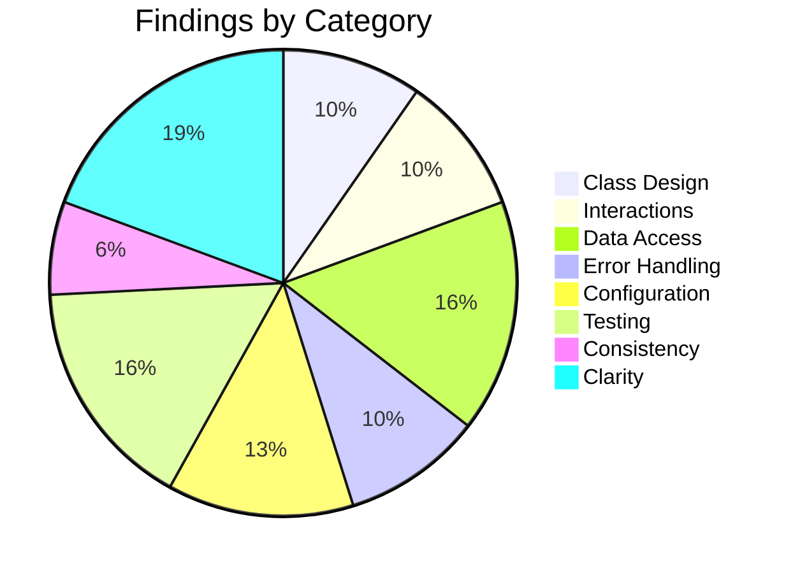

# Low-Level Design Review: GenHealth AI DME Order Management

**Document Reviewed:** `design/assessment-low-level-design.md`
**Requirements Reference:** `design/assessment-requirements.md`
**High-Level Design Reference:** `design/assessment-high-level-design.md`
**Review Date:** 2025-04-08
**Reviewer:** Claude (Automated Review)

---

## Executive Summary

The low-level design is comprehensive and well-structured, covering all 9 sections expected for implementation-readiness. The strongest areas are the repository pattern, error handling hierarchy, and testing strategy. The two blocking issues are: (1) the per-request service instantiation mechanism is described but not specified well enough for an implementer to code it, and (2) a `ValidationError` name collision between Marshmallow (used by Flask-Smorest) and the custom exception hierarchy will cause real import/handler conflicts. After resolving these, the design is ready for implementation.

**Overall Verdict:** Needs targeted fixes before proceeding

---

## Section Verdicts

| Review Area | Verdict | Findings |
|-------------|---------|----------|
| Package/Module Structure | Sufficient | 0 |
| Class/Type Design | Partially Addressed | 3 |
| Class Interactions & Workflows | Partially Addressed | 3 |
| Data Access Layer | Partially Addressed | 5 |
| Error Handling | Partially Addressed | 3 |
| Configuration & Wiring | Partially Addressed | 4 |
| Testing Completeness | Partially Addressed | 4 |
| Consistency with High-Level Design | Partially Addressed | 2 |
| Specification Clarity | Partially Addressed | 6 |

---

## 1. Package/Module Structure

### Current State

The backend uses a flat package structure with 9 packages under `app/` (config, extensions, models, schemas, repositories, routes, services, middleware, utils). The frontend uses a standard React structure with api/, components/, pages/, hooks/, context/, types/, and utils/. A Mermaid dependency graph documents both.

### Strengths

- Clean unidirectional dependency flow: routes → services → repositories → models
- No circular dependencies
- Middleware is isolated from business logic
- Frontend graph separates state management (context, hooks) from presentation (pages, components) correctly
- Repository layer is an explicit addition over the requirements' proposed structure — justified by the user's Phase 2 decision and improves testability

### Gaps and Recommendations

No findings in this section. The package structure is sound and well-documented.

### Verdict: **Sufficient**

---

## 2. Class/Type Design

### Current State

The design defines 5 ORM models, 5 repository classes with an abstract base, 4 service classes, 13 Marshmallow schemas, 4 Flask-Smorest blueprints with MethodView classes, and a frontend component hierarchy. Class diagrams are provided in Mermaid for all layers.

### Strengths

- Models map 1:1 to the HLD entity model with proper field types
- Repository pattern provides clean testable abstractions with explicit transaction control
- Service layer owns business logic with no leakage into routes
- Marshmallow schemas distinguish load_only/dump_only explicitly
- Frontend uses standard React patterns (Context for auth, TanStack Query for server state)

### Gaps and Recommendations

| ID | Gap | Class/Type | Priority | Recommendation |
|----|-----|------------|----------|----------------|
| CLASS-1 | `AuthService` depends on the JWT extension (`create_access_token()`, `create_refresh_token()`) to generate tokens, but the class diagram only shows dependencies on `UserRepository` and `RefreshTokenRepository`. This missing dependency means an implementer won't know how AuthService obtains JWT functionality. | `AuthService` | Should Address | Add `jwt` (Flask-JWT-Extended extension) or a `TokenFactory` as an explicit dependency in the AuthService class diagram, and show it in the constructor. |
| CLASS-2 | `BaseRepository` is annotated `<<abstract>>` but all its methods are concrete generic CRUD. It's not truly abstract in the Python `ABC` sense — no abstract methods require subclass override. This is misleading for an implementer who might create an ABC with `@abstractmethod`. | `BaseRepository` | Consider | Either remove the `<<abstract>>` annotation (it's a concrete base class) or specify a `model_class` abstract property that subclasses must set, which also resolves DAL-2. |
| CLASS-3 | `OrderQuerySchema.sort_by` accepts a String, but without validation, an attacker could pass arbitrary column names. While SQLAlchemy prevents SQL injection, passing an invalid column name would cause a 500 error rather than a clean 422. | `OrderQuerySchema` | Consider | Add a `validate=OneOf(["created_at", "patient_last_name"])` constraint to the `sort_by` field, and document the allowed values. |

### Verdict: **Partially Addressed**

---

## 3. Class Interactions & Workflows

### Current State

The LLD documents 8 sequence diagrams: registration, login, token refresh, order create, order list, document upload + extraction, deletion cascade, and activity logging. Each diagram maps to FR-x.x.x requirements and includes error path descriptions for the complex flows.

### Gaps and Recommendations

| ID | Gap | Workflow | Priority | Recommendation |
|----|-----|----------|----------|----------------|
| INTERACT-1 | The extraction sequence diagram (Section 4.6) shows a fresh upload flow but does not cover the **re-upload/retry** scenario from the state machine (`failed → processing`). The HLD (Section 4.3) specifies "a new upload replaces the existing document record." When an order already has a document, the extraction flow needs to: (a) delete the old Document record and file, (b) create a new Document. Without this, the implementer must invent the replacement behavior. | Document re-upload | Should Address | Add a conditional block to the upload sequence diagram showing: check for existing document → delete old file + document record → proceed with new upload. This mirrors the deletion cascade logic and prevents orphaned documents. |
| INTERACT-2 | The Token Refresh diagram (Section 4.3) includes `UserRepo as UserRepository` as a participant, but UserRepository is never called in the sequence. | Token Refresh | Consider | Remove the unused `UserRepo` participant from the diagram, or add a user existence check (`UserRepo.get_by_id()`) to verify the user hasn't been deleted since the refresh token was issued. |
| INTERACT-3 | No sequence diagrams for `GET /api/v1/auth/me` (get current user) or `PUT /api/v1/orders/{id}` (update order). These are documented API endpoints in the requirements (Section 4.1, 4.2) and while simple, their absence leaves minor ambiguity about which schema and service method each route calls. | Auth /me, Order update | Consider | Add brief sequence diagrams for these two endpoints, or at minimum add a table mapping each API endpoint to its route class → schema → service method chain. |

### Missing Workflow Coverage

| Requirement | Workflow Documented? | Notes |
|-------------|---------------------|-------|
| FR-3.1.1 | Yes | Section 4.1 (Registration) |
| FR-3.1.2 | Yes | Section 4.2 (Login) |
| FR-3.1.3 | Yes | Section 4.3 (Refresh) |
| FR-3.1.4 | Partial | Covered by route conventions (jwt_required decorator) but no explicit diagram |
| FR-3.2.1 | Yes | Section 4.4 (Create order) |
| FR-3.2.2 | Yes | Section 4.5 (List orders) |
| FR-3.2.3 | No | No get-by-id diagram (simple flow) |
| FR-3.2.4 | No | No update diagram |
| FR-3.2.5 | Yes | Section 4.7 (Deletion cascade) |
| FR-3.3.1–3.3.5 | Yes | Section 4.6 (Upload + extraction) |
| FR-3.4.1 | Yes | Section 4.8 (Activity logging) |
| FR-3.4.2 | No | No activity log query diagram (simple flow) |

### Verdict: **Partially Addressed**

---

## 4. Data Access Layer

### Current State

The design uses a repository pattern with a concrete `BaseRepository` providing generic CRUD, 5 subclass repositories, and explicit transaction control (services call `commit()`). Connection management uses Flask-SQLAlchemy's scoped session with WAL mode enabled via event listener. A migration strategy is defined using Flask-Migrate (Alembic) with initial table creation and index definitions.

### Gaps and Recommendations

| ID | Gap | Priority | Recommendation |
|----|-----|----------|----------------|
| DAL-1 | `BaseRepository.create(attrs: dict)` accepts a generic dict but the base class has no `model_class` attribute or type parameter to know which model to instantiate. The implementer must infer that each subclass should define something like `model_class = User`. | Should Address | Add a `model_class` class attribute to `BaseRepository` (or a constructor parameter), and show each subclass setting it: `class UserRepository(BaseRepository): model_class = User`. |
| DAL-2 | `ActivityLogRepository.log_request()` is documented as using a "separate session scope for non-blocking behavior" (Section 5.1) and committing independently. But all repositories receive `db.session` from the Flask context. How is this separate session created? If it uses the same session, a logging failure during commit will roll back the main request's work. | Should Address | Specify the mechanism: either `db.session.begin_nested()` (savepoint), or `db.engine.connect()` to create a new connection for the log INSERT, or a separate `Session()` factory call. The choice affects behavior on failure. |
| DAL-3 | The initial index list (Section 5.4) includes `order.status`, `order.created_at`, `order.patient_last_name`, etc., but omits a **unique index on `user.email`**. FR-3.1.1 requires email uniqueness, and `UserRepository.email_exists()` queries by email. Without the unique index, uniqueness is enforced only at the application level (race condition possible). | Should Address | Add `user.email` as a UNIQUE index in the initial migration index list. |
| DAL-4 | `OrderRepository.list_paginated()` filters by `patient_last_name` using "LIKE" matching, but the LIKE pattern isn't specified. Is it prefix match (`name%`), contains match (`%name%`), or exact match? | Consider | Specify the pattern, e.g., "contains match (`%value%`), case-insensitive via SQLAlchemy `ilike()`." |
| DAL-5 | `RefreshToken.token_hash` is indexed (Section 5.4) but not specified as UNIQUE. Since each hash maps to exactly one token, a UNIQUE constraint prevents accidental duplicates and improves lookup performance. | Consider | Specify `refresh_token.token_hash` as a UNIQUE index/constraint. |

### Verdict: **Partially Addressed**

---

## 5. Error Handling

### Current State

The design defines a 7-class exception hierarchy (`AppError` base → `ValidationError`, `AuthenticationError`, `NotFoundError`, `ConflictError`, `ExtractionError`, `RateLimitError`, `DatabaseError`) with HTTP status mappings, error codes, and a standard error envelope format. Retry strategies are documented for Claude API calls and SQLite BUSY timeouts.

### Strengths

- Clean hierarchy with each error carrying `code`, `message`, and `details`
- Consistent error envelope matches requirements Section 4.5
- Retry strategies clearly distinguish retryable from non-retryable operations
- Error handler registration is centralized via `register_error_handlers(app)`

### Gaps and Recommendations

| ID | Gap | Priority | Recommendation |
|----|-----|----------|----------------|
| ERR-1 | **Name collision:** Flask-Smorest internally catches Marshmallow's `marshmallow.ValidationError` and returns 422 automatically. The custom `app.utils.errors.ValidationError` also maps to 422. These are two different classes with the same name and overlapping status codes. If a Flask error handler is registered for the custom one, it may inadvertently interfere with Flask-Smorest's built-in Marshmallow error handling, or imports may collide (`from marshmallow import ValidationError` vs. `from app.utils.errors import ValidationError`). | Must Address | Rename the custom class to `BusinessValidationError` (or `BusinessRuleError`) to avoid the name clash. Document that Marshmallow schema validation errors are handled by Flask-Smorest (422 with field details), while `BusinessValidationError` handles service-layer rule violations (password complexity, business invariants). |
| ERR-2 | Flask's `RequestEntityTooLarge` exception (raised when `MAX_CONTENT_LENGTH` is exceeded) returns 413, but this Werkzeug exception isn't in the custom hierarchy. The integration test `test_upload_file_too_large` expects 413, so the error handler must handle it. | Should Address | Add a Flask error handler for `werkzeug.exceptions.RequestEntityTooLarge` that returns the standard error envelope with code `"FILE_TOO_LARGE"`. Mention this alongside the custom hierarchy. |
| ERR-3 | SQLite `SQLITE_BUSY` is listed as retryable (Section 6.3, 3 attempts, 100ms delay), but the retry mechanism location isn't specified. Does the retry happen in the repository `commit()` method? In a middleware wrapper? In the service? | Consider | Specify that `BaseRepository.commit()` wraps the `db.session.commit()` in a retry loop catching `sqlalchemy.exc.OperationalError` with "database is locked" message. |

### Verdict: **Partially Addressed**

---

## 6. Configuration & Wiring

### Current State

The design documents a Flask app factory (`create_app()`) with a 9-step startup sequence shown in a Mermaid flowchart. Extensions are initialized via `init_app(app)`. Services are created per-request in route handlers. 18 configuration parameters are documented with types, defaults, and sources.

### Strengths

- Clear startup sequence with correct initialization order
- Per-request service instantiation correctly addresses SQLite thread-safety
- Extension singletons pattern is standard Flask idiom
- Configuration parameter table is comprehensive

### Gaps and Recommendations

| ID | Gap | Priority | Recommendation |
|----|-----|----------|----------------|
| CONF-1 | The startup sequence says "Determines config class from `FLASK_ENV` env var," but `FLASK_ENV` is **deprecated** since Flask 2.3 (released 2023). Flask now uses `FLASK_DEBUG` for debug mode, but provides no built-in mechanism for config class selection. | Should Address | Use a custom env var (e.g., `APP_CONFIG` or `FLASK_CONFIG`) with values `development`, `testing`, `production` that maps to the corresponding config class. Update the startup description and config parameter table. |
| CONF-2 | No startup validation for required configuration parameters (`SECRET_KEY`, `JWT_SECRET_KEY`, `ANTHROPIC_API_KEY`). If missing, the app starts but fails at runtime — e.g., the first JWT creation attempt, or the first extraction call. | Should Address | The `create_app()` function SHALL validate that all required env vars are present at startup and raise a clear `ConfigurationError` with the names of missing variables. This is a one-line check that prevents confusing runtime failures. |
| CONF-3 | `UPLOAD_FOLDER` defaults to `./uploads` (relative path). On Azure App Service, the CWD can vary. The HLD specifies `/home/site/uploads/` as the production path. | Consider | Default to a relative path for development, but the `ProductionConfig` class SHALL set `UPLOAD_FOLDER` to an absolute path (`/home/site/uploads/`). |
| CONF-4 | `CORS_ORIGINS` is documented as "comma-separated" in the env var, but the parsing mechanism isn't specified. Flask-CORS accepts a list of strings. | Consider | Specify in the config class: `CORS_ORIGINS = os.environ.get("CORS_ORIGINS", "http://localhost:3000").split(",")` and note that each origin is stripped of whitespace. |

### Verdict: **Partially Addressed**

---

## 7. Testing Completeness

This is the most critical section of the low-level design review.

### 7.1 Unit Test Assessment

| ID | Gap | Class | Requirement | Priority | Recommendation |
|----|-----|-------|-------------|----------|----------------|
| TEST-1 | No unit test verifying that `ActivityLogRepository.log_request()` commits independently without affecting the caller's session. This is the critical non-blocking guarantee for Section 4.8 (activity logging). | `ActivityLogRepository` | FR-3.4.1 | Should Address | Add a unit test that: (a) starts a service transaction, (b) calls `log_request()`, (c) forces the log commit to fail, (d) asserts the service's transaction is unaffected. |
| TEST-2 | The mock Anthropic Claude response used in extraction tests isn't defined anywhere. The test infrastructure section says "Returns canned JSON responses" but doesn't specify the response payload schema. An implementer cannot write the extraction tests without knowing the expected mock response structure. | `ExtractionService` | FR-3.3.3 | Consider | Define the mock Claude response fixture in the test infrastructure section, including the JSON schema with all extracted fields (patient name, DOB, insurance, etc.) and example values. |

### 7.2 Integration Test Assessment

| ID | Gap | Requirement | Priority | Recommendation |
|----|-----|-------------|----------|----------------|
| TEST-3 | The `test_token_refresh_flow` integration test verifies new tokens are issued, but doesn't explicitly verify that the **old** refresh token is invalidated. Token rotation is a security-critical property (FR-3.1.3). | FR-3.1.3 | Should Address | Extend the test or add `test_token_refresh_invalidates_old_token`: after refreshing, attempt to use the old refresh token again and assert 401. |
| TEST-4 | No integration test for `GET /api/v1/auth/me`. This is a documented API endpoint (requirements Section 4.1) with no test coverage at all. | FR-3.1.2 | Should Address | Add `test_get_current_user` integration test: authenticate, GET /auth/me, assert 200 with correct user data matching the authenticated user. |

### 7.3 Requirements Traceability Gaps

Requirements with insufficient or missing test coverage:

| Requirement | Unit Tests? | Integration Tests? | Gap | Recommendation |
|-------------|-------------|-------------------|-----|----------------|
| FR-3.1.1 (password complexity) | Yes (`test_register_weak_password`) | No specific integration test | The unit test covers weak passwords, but no integration test validates the specific complexity rules (8+ chars, uppercase, lowercase, digit) in the full request cycle. | Add `test_register_password_complexity` integration test that sends passwords failing each rule individually and asserts 422 with field-level error details. |
| FR-3.2.4 (update 404) | Yes (`test_get_order_not_found`) | No | No integration test for `PUT /api/v1/orders/{nonexistent-id}` returning 404. | Add `test_update_order_not_found` integration test. |

### 7.4 Test Infrastructure Assessment

| ID | Gap | Priority | Recommendation |
|----|-----|----------|----------------|
| TEST-5 | No specification of how the mock Anthropic client is injected. The test infrastructure mentions `unittest.mock.patch` but doesn't specify the patch target — is it `anthropic.Anthropic`, `app.services.extraction_service.anthropic`, or a service-level dependency injection? This affects test reliability (patching the wrong target is a common test bug). | Consider | Specify the exact mock target, e.g., "Patch `app.services.extraction_service.anthropic.Anthropic` to return a mock client whose `messages.create()` returns the canned response fixture." |

### Verdict: **Partially Addressed**

---

## 8. Consistency with High-Level Design

### Alignment Check

| High-Level Element | Low-Level Correspondence | Status | Notes |
|-------------------|-------------------------|--------|-------|
| Flask Application (HLD 3.1) | `app/` package with factory | Aligned | |
| Route Layer (HLD 3.1) | `app.routes` with Flask-Smorest Blueprints | Aligned | |
| JWT Auth Middleware (HLD 3.1) | `@jwt_required()` decorator on routes | Aligned | Middleware file dropped in favor of decorator — correct for Flask-JWT-Extended |
| Activity Log Middleware (HLD 3.1) | `app.middleware.logging_middleware` | Aligned | |
| Service Layer (HLD 3.1) | `app.services` with 4 service classes | Aligned | |
| SQLAlchemy ORM (HLD 3.1) | `app.models` + `app.repositories` | Aligned | Repository layer is an addition over HLD |
| React SPA (HLD 3.2) | `frontend/src` with pages, components, hooks | Aligned | |
| SQLite Database (HLD 3.3) | WAL mode, Flask-SQLAlchemy, migrations | Aligned | |
| Anthropic Claude (HLD 3.4) | `ExtractionService._call_llm()` | Aligned | |
| Application Insights (HLD 3.5) | `azure-monitor-opentelemetry` in config | Aligned | |
| User entity (HLD 4.1) | `User` model (no role field) | Aligned | |
| Order entity (HLD 4.1) | `Order` model with error_message | Aligned | |
| Document entity (HLD 4.1) | `Document` model | Aligned | |
| ActivityLog entity (HLD 4.1) | `ActivityLog` model | Aligned | |
| RefreshToken (HLD 7.1) | `RefreshToken` model | Aligned | Introduced in HLD security section, properly in LLD models |
| Registration flow (HLD 5.1) | LLD Section 4.1 | Aligned | |
| Login flow (HLD 5.1) | LLD Section 4.2 | Aligned | |
| Token Refresh flow (HLD 5.1) | LLD Section 4.3 | Aligned | |
| Order CRUD (HLD 5.2) | LLD Section 4.4, 4.5 | Aligned | |
| Upload + Extraction (HLD 5.3) | LLD Section 4.6 | Partially | Re-upload/document replacement from HLD 4.3 not in LLD extraction diagram |
| Deletion Cascade (HLD 5.6) | LLD Section 4.7 | Aligned | |
| Activity Logging (HLD 5.5) | LLD Section 4.8 | Aligned | |
| Security Headers (HLD 9, Flask-Talisman) | Not in LLD | Missing | See CONSIST-2 |

### Gaps and Recommendations

| ID | Gap | Priority | Recommendation |
|----|-----|----------|----------------|
| CONSIST-1 | HLD Section 9 lists **Flask-Talisman** (or manual middleware) for security headers (HSTS, X-Content-Type-Options, X-Frame-Options, CSP). The LLD's extension list (`db`, `jwt`, `migrate`, `limiter`, `smorest_api`, `cors`) does not include Flask-Talisman, and security header configuration is not mentioned anywhere in the LLD. Requirements NFR-6.1 mandates these headers. | Should Address | Add Flask-Talisman to the extensions list in Section 2.2 and 7.2. Add its initialization to the startup sequence. Add a configuration parameter for CSP policy (since Flask-Talisman's default CSP blocks inline scripts, which may conflict with the React SPA). |
| CONSIST-2 | HLD Section 8.1 backend structure includes `middleware/auth_middleware.py`, but the LLD drops it. This is the correct decision (Flask-JWT-Extended's `@jwt_required()` decorator replaces a manual middleware), but the deviation isn't noted. | Consider | Add a brief note in Section 2.3 or the route conventions explaining why `auth_middleware.py` was removed: "JWT authentication is handled via Flask-JWT-Extended's `@jwt_required()` decorator applied to individual route methods, replacing the `auth_middleware.py` file from the HLD project structure." |

### Verdict: **Partially Addressed**

---

## 9. Specification Clarity

### Items Requiring Clarification

| ID | Item | Section | Issue | Question |
|----|------|---------|-------|----------|
| UNCLEAR-1 | Service instantiation pattern | Section 7.2 | **Ambiguous mechanism** — the most important wiring detail. The document says "Services are instantiated per-request using repository instances created from the current `db.session`" but doesn't show HOW. Does each route handler manually create repos and services? Is there a factory function? A helper in routes/__init__.py? This is the bridge between the dependency graph and actual runtime behavior, and every route handler needs it. | Must Address — SHALL provide a code-level pattern showing how a route handler creates its service, e.g., a `get_order_service()` factory function or inline construction in the MethodView. Show one concrete example. |
| UNCLEAR-2 | LLM prompt structure | Section 3.3, 4.6 | **Undefined contract** — `ExtractionService._call_llm(text: str)` sends text to Claude, but the system prompt, user prompt template, expected JSON response schema, and response parsing logic are not specified. FR-3.3.3 requires "a structured prompt with explicit JSON output formatting instructions." Without this, the implementer must design the prompt from scratch. | Should Address — SHALL specify at minimum: (a) the system prompt instructing Claude to extract structured data, (b) the expected JSON response schema with field names matching the Order model, (c) how missing/uncertain fields are represented in the response. |
| UNCLEAR-3 | OrderUpdateSchema relationship to OrderCreateSchema | Section 3.4 | **Ambiguous inheritance** — the document says "share field definitions" and "marks all fields as optional (partial update semantics via `partial=True`)" but doesn't specify whether this is via class inheritance, a shared mixin, or `Meta.partial = True`. | Consider — specify: "OrderUpdateSchema inherits from OrderCreateSchema with `class Meta: partial = True`" or "OrderUpdateSchema is a separate class with the same fields, all marked `marshmallow.fields.String(required=False)`." |
| UNCLEAR-4 | Pagination envelope implementation | Section 3.4, Open Question 1 | **Deferred core behavior** — the pagination response body format is required by requirements Section 4.5, but Open Question 1 defers the implementation strategy ("custom decorator, response hook, or manual construction"). | Consider — resolve by specifying: "Each list endpoint route handler constructs the pagination envelope manually after calling the service, wrapping the items list and pagination metadata dict into the response body." This is the simplest approach and matches how the services already return `(items, total)` tuples. |
| UNCLEAR-5 | Axios refresh queue pattern | Open Question 2 | **Deferred concurrency** — multiple concurrent 401s triggering simultaneous refresh attempts is a real bug in SPAs. The pattern is well-established. | Consider — specify: "The Axios response interceptor maintains a `refreshPromise: Promise or null` variable. On 401, if `refreshPromise` is null, it starts a refresh and stores the promise. Subsequent 401s await the existing promise. On success, retry all queued requests with the new token." |
| UNCLEAR-6 | File upload schema for Flask-Smorest | Section 3.5 | **Undefined** — the route conventions say `OrderUploadView.post` uses `location="files"` for multipart, but no upload schema is defined in Section 3.4. Flask-Smorest requires a schema for `@blp.arguments()` even for file uploads. | Consider — add an `UploadSchema` (or note that Flask-Smorest's `MultipartFileField` or a custom file argument is used) and specify how the PDF file is extracted from the multipart request. |

### Verdict: **Partially Addressed**

---

## Summary of Recommendations

### Must Address (Blocking — resolve before implementation)

1. **ERR-1:** Rename custom `ValidationError` to `BusinessValidationError` to avoid name collision with Marshmallow's `ValidationError` (used internally by Flask-Smorest). The collision will cause import confusion and potential handler interference.
2. **UNCLEAR-1:** Specify the concrete service instantiation pattern — show how a route handler creates its service with repository dependencies. One code-level example closes the gap between the dependency graph and actual runtime wiring.

### Should Address (High Priority)

1. **CLASS-1:** Add JWT extension as an explicit dependency of AuthService in the class diagram.
2. **INTERACT-1:** Add document replacement logic to the extraction sequence diagram for the re-upload/retry scenario.
3. **DAL-1:** Add a `model_class` attribute to BaseRepository so `create()` knows which model to instantiate.
4. **DAL-2:** Specify the separate session mechanism for ActivityLogRepository non-blocking commits.
5. **DAL-3:** Add a unique index on `user.email` to the migration index list.
6. **ERR-2:** Add a Flask error handler for Werkzeug's `RequestEntityTooLarge` (413) to return the standard error envelope.
7. **CONF-1:** Replace deprecated `FLASK_ENV` with a custom config selection env var.
8. **CONF-2:** Add startup validation for required configuration parameters.
9. **TEST-1:** Add a unit test proving ActivityLogRepository commits independently.
10. **TEST-3:** Add integration test verifying old refresh token is invalidated after rotation.
11. **TEST-4:** Add integration test for `GET /api/v1/auth/me`.
12. **UNCLEAR-2:** Specify the LLM prompt structure and expected response JSON schema.
13. **CONSIST-1:** Add Flask-Talisman to the extensions list and startup sequence for security headers.

### Consider (Medium Priority)

1. **CLASS-2:** Clarify BaseRepository as concrete base (not abstract) or add `model_class` abstract property.
2. **CLASS-3:** Add `validate=OneOf(...)` whitelist to `OrderQuerySchema.sort_by`.
3. **DAL-4:** Specify the LIKE pattern for patient_last_name filtering.
4. **DAL-5:** Mark `refresh_token.token_hash` index as UNIQUE.
5. **ERR-3:** Specify where SQLite BUSY retry logic lives (BaseRepository.commit).
6. **CONF-3:** Set absolute UPLOAD_FOLDER path in ProductionConfig.
7. **CONF-4:** Specify CORS_ORIGINS comma-separated parsing.
8. **TEST-2:** Define the mock Claude response fixture payload.
9. **TEST-5:** Specify the exact mock patch target for Anthropic client.
10. **INTERACT-2:** Fix unused UserRepo participant in token refresh diagram.
11. **INTERACT-3:** Add diagrams or mapping table for /auth/me and order update endpoints.
12. **CONSIST-2:** Note the intentional removal of auth_middleware.py.
13. **UNCLEAR-3:** Specify OrderUpdateSchema inheritance from OrderCreateSchema.
14. **UNCLEAR-4:** Resolve pagination envelope implementation (recommend manual construction).
15. **UNCLEAR-5:** Specify Axios refresh queue pattern.
16. **UNCLEAR-6:** Define file upload schema for Flask-Smorest.

---

## Findings Summary

| Area | Verdict | Must | Should | Consider |
|------|---------|------|--------|----------|
| Package/Module Structure | Sufficient | 0 | 0 | 0 |
| Class/Type Design | Partially Addressed | 0 | 1 | 2 |
| Interactions & Workflows | Partially Addressed | 0 | 1 | 2 |
| Data Access Layer | Partially Addressed | 0 | 3 | 2 |
| Error Handling | Partially Addressed | 1 | 1 | 1 |
| Configuration & Wiring | Partially Addressed | 0 | 2 | 2 |
| Testing Completeness | Partially Addressed | 0 | 3 | 2 |
| HLD Consistency | Partially Addressed | 0 | 1 | 1 |
| Specification Clarity | Partially Addressed | 1 | 1 | 4 |
| **Total** | | **2** | **13** | **16** |

---

## Untested Requirements

| Requirement | Description | Why It Matters |
|-------------|-------------|----------------|
| FR-3.1.1 (password rules) | Password complexity rules (8+ chars, uppercase, lowercase, digit) | Unit test exists for "weak password" but no integration test validates each specific rule — implementer may miss a rule without noticing. |
| FR-3.2.4 (update 404) | Update non-existent order returns 404 | Existing test covers GET 404 but not PUT 404 — different code path through OrderService.update_order(). |
| `GET /auth/me` | Get current user profile | Documented API endpoint with zero test coverage (unit or integration). |
